

# Bad-Blue

### LegalWhat + CryptoCrawler

**Two distinct product systems. One governed intelligence codebase.**

Legal intelligence • Evidence analysis • Legal drafting • Public-record research  
Market intelligence • Multi-topology arbitrage • Adaptive cognition • Governed execution architecture

---

## Repository at a Glance

Bad-Blue contains **two primary product systems intentionally separated by domain authority**:

| System | Purpose | Primary intelligence | Critical boundary |
|---|---|---|---|
| **LegalWhat** | Legal assistance, evidence analysis, legal research, drafting, public-record/accountability workflows | **LEXARA / ALEXARA**, F.M.I., C.A.D.E. | Legal intelligence does **not** receive crypto/blockchain execution authority |
| **CryptoCrawler** | Market observation, arbitrage discovery, deterministic economics, probabilistic assessment, governance, execution architecture, settlement, learning | **CRYPTARA**, CryptoCrawler canonical runtime, QuantiComp/Monte Carlo | Market intelligence does **not** receive legal-data authority |

They may reuse shared infrastructure—compute routing, persistence, provider governance, observability, and orchestration—but they are **not one blended application**.

> **Evidence / claim discipline**
>
> This README distinguishes between **canonical runtime wiring**, **implemented modules**, **incorporation targets**, and **design shorthand**. A module being present in the repository is not automatically a claim that it is currently authoritative in production. Optional external providers require their own credentials, availability, and deployment conditions. No outside institutional affiliation or proprietary research provenance is claimed here; named third-party services identify integrations or interfaces only.

---

## Navigation

- [Architecture: Two Systems, Shared Infrastructure](#architecture-two-systems-shared-infrastructure)
- [LegalWhat](#legalwhat)
- [LEXARA Legal Brain](#lexara-legal-brain)
- [CryptoCrawler](#cryptocrawler)
- [CryptoCrawler Compute Stack](#cryptocrawler-compute-stack)
- [CRYPTARA](#cryptara)
- [CRYPTARA Sovereign Cortex](#cryptara-sovereign-cortex)
- [How CRYPTARA Learns](#how-cryptara-learns)
- [Crawler Ecology](#crawler-ecology)
- [Eden](#eden)
- [Eden Protection Envelope](#eden-protection-envelope--double-bubble--one-way-iron-mirror)
- [Disco-Ball Mirroring + Light Communication](#disco-ball-mirroring--light-communication)
- [Zero-Initial-Capital Architecture](#zero-initial-capital-architecture)
- [Hot-State / Overflow Architecture](#hot-state--overflow-architecture)
- [Recent Hardening and Optimization](#recent-hardening-and-optimization)
- [Canonical Runtime and Authority Model](#canonical-runtime-and-authority-model)
- [Extended Intelligence Systems](#extended-intelligence-systems)
- [Engineering Principles](#engineering-principles)
- [Repository Guide](#repository-guide)
- [Glossary](#glossary)

---

# Architecture: Two Systems, Shared Infrastructure

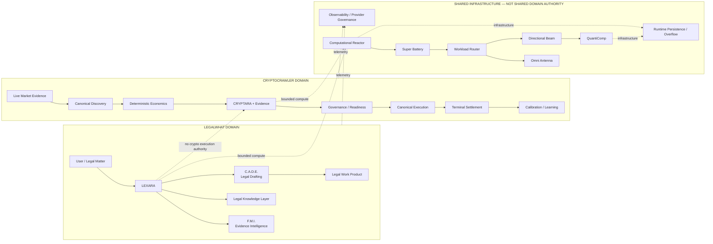

The governing rule is simple:

> **Infrastructure may be shared. Domain authority is not.**

---

# LegalWhat

**LegalWhat** is the legal-assistance and workflow side of Bad-Blue. It is designed to combine conversational legal intelligence, evidence analysis, legal research, document drafting, domain routing, public-record/accountability workflows, and commercial application infrastructure.

Its architectural objective is **one user-facing legal intelligence layer coordinating specialized internal legal subsystems** rather than exposing every subsystem as a disconnected tool.

## LegalWhat System Flow

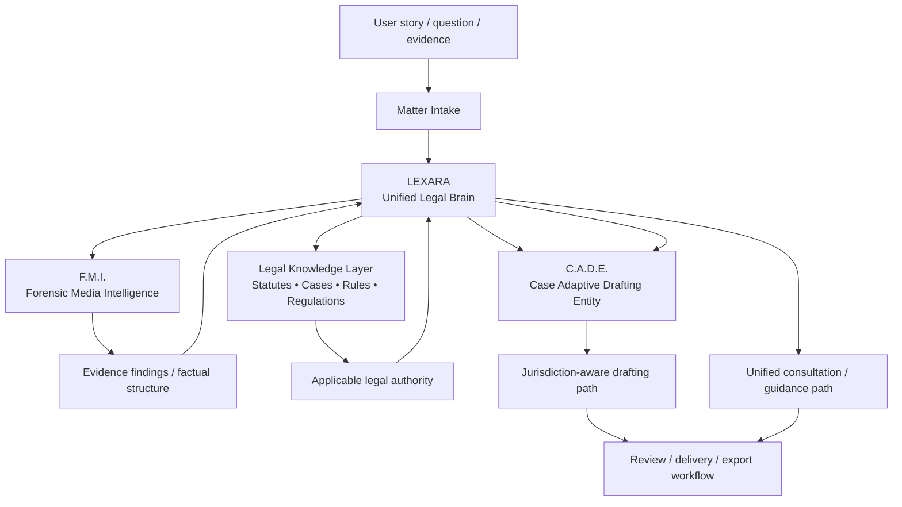

## Core LegalWhat Components

### LEXARA

**Legal Expert eXamination And Resource Advisor** — the unified legal brain and primary legal persona.

LEXARA is designed to interpret a matter, coordinate evidence analysis, retrieve applicable legal knowledge, determine when drafting is needed, and assemble the user-facing legal response.

### F.M.I.

**Forensic Media Intelligence** — LEXARA's evidence-analysis subsystem.

F.M.I. is intended to convert uploaded or supplied evidence into structured findings that can be consumed by legal reasoning and drafting layers.

### C.A.D.E.

**Case Adaptive Drafting Entity** — LEXARA's legal-document drafting subsystem.

C.A.D.E. is designed to produce context-aware and jurisdiction-aware legal work product from the factual and legal record assembled by LEXARA.

### Legal Knowledge Layer

The legal knowledge layer is the retrieval/research side of the legal brain: statutes, regulations, precedent, procedural authority, and other legal reference material.

## LegalWhat Authority Boundary

The legal brain is intentionally isolated from the crypto domain:

- no crypto exchange authority;
- no blockchain transaction authority;
- no CryptoCrawler execution authority;
- no market-execution decision authority.

---

# LEXARA Legal Brain

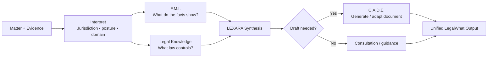

LEXARA's separation of evidence, law, inference, drafting, and user-facing synthesis is intended to make provenance and responsibility easier to inspect.

---

# CryptoCrawler

**CryptoCrawler** is the cryptocurrency market-intelligence and execution-architecture side of Bad-Blue.

It is a multi-topology architecture spanning:

- market evidence ingestion;
- opportunity discovery;
- candidate normalization;
- deterministic economics;
- fee and liquidity evidence;
- dynamic sizing;
- probabilistic/tail-risk analysis;
- technical and oracle evidence;
- CRYPTARA cognition;
- staged governance;
- execution readiness;
- bounded resource scheduling;
- venue/protocol execution paths;
- terminal settlement;
- realized-profit accounting;
- calibration and bounded adaptation.

## Canonical CryptoCrawler Flow

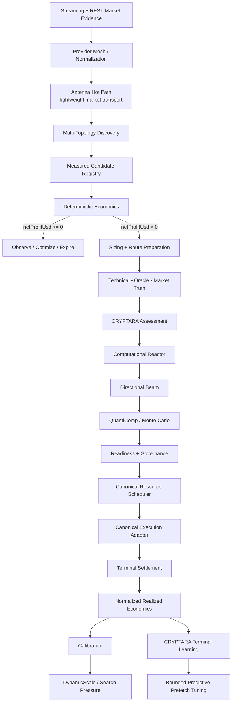

## Opportunity Topologies Represented in the Architecture

- `CEX_CEX`
- `DEX_ATOMIC`
- `ZERO_CAPITAL_ATOMIC`
- `CROSS_CHAIN`
- `MEMPOOL_BACKRUN`
- `MAKER_CEX`
- `FUNDING_ARBITRAGE`
- prediction-market paths where the corresponding discovery/execution authority is wired

## Deterministic Economics First

The canonical economic rule is:

> **`netProfitUsd > 0` after all known verified costs.**

Known costs can include exchange fees, DEX fees, flash-loan premium, gas, sponsored-gas reimbursement/provider billing, relay/builder cost, slippage, market impact, bridge cost, funding/borrow cost, and route-specific repayment cost.

Probabilistic analysis or CRYPTARA cognition is not intended to redefine a deterministically negative route as profitable.

## BPS Integrity

CryptoCrawler uses basis points for high-resolution economics:

- **1 BPS = 0.01%**
- **100 BPS = 1%**

Current hardening includes exact strictly-positive handling below one whole basis point so integer truncation does not become economic authority.

---

# CryptoCrawler Compute Stack

The compute subsystem is more than just QuantiComp. It contains a **Reactor → Battery → Router → Antenna/Beam → QuantiComp** pattern.

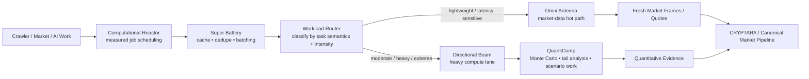

## Computational Reactor

Central measured compute and optimization engine for job scheduling, queue pressure, CPU/memory pressure, rate budgets, and expensive optimization work.

## Omni Antenna

The **Omni Antenna** is the lightweight compute/transport lane. Current routing semantics explicitly pin latency-sensitive market tasks—such as WebSocket pings, order-book frames, trade streams, freshness checks, and fee-resolution work—to Antenna so they are not accidentally sent through a heavier compute path.

A separate Antenna quality layer tracks provider observations such as hit rate, failure rate, latency, source age, recency, sample confidence, and confidence-adjusted quality. That quality can change attention/cadence; it does not independently authorize a trade.

## Directional Beam

The **Directional Beam** is the heavier compute lane for moderate, heavy, and extreme workloads. It is a routing/execution layer for computational work, not a competing trading authority.

## Super Battery

The **Super Battery** is an efficiency layer placed before task routing. Implemented behavior includes:

- local caching;
- duplicate detection;
- batch collection/flush behavior;
- state-cache accounting;
- event-driven optimization hooks;
- interfaces for compression/decompression.

Some optimization interfaces remain implementation-dependent; the README does not treat every declared optimization as proven production savings.

## QuantiComp

**QuantiComp** is the heavy quantitative-computation authority for workloads such as Monte Carlo, tail-distribution analysis, scenario expansion, and other statistically intensive operations.

> **Antenna stays light. Beam carries heavy work. Battery reduces waste. Reactor schedules. QuantiComp computes.**

---

# CRYPTARA

**CRYPTARA** is CryptoCrawler's adaptive market-intelligence and decision-support brain.

She is not the exchange, wallet, canonical scheduler, canonical executor, or settlement authority. Her role is to turn market evidence and realized outcomes into assessments, priorities, and bounded predictive preparation without silently acquiring transaction authority.

## Why CRYPTARA Exists

Raw price differences do not answer the questions an execution system needs answered:

- Is the evidence fresh and diverse enough to trust?
- Is a candidate economically real or a data artifact?
- Does current market structure resemble conditions that previously executed well or poorly?
- Is latency or slippage degrading the expected edge?
- Which information should be prefetched before a similar candidate arrives?
- Did a prediction match the terminal financial result?

---

# CRYPTARA Sovereign Cortex

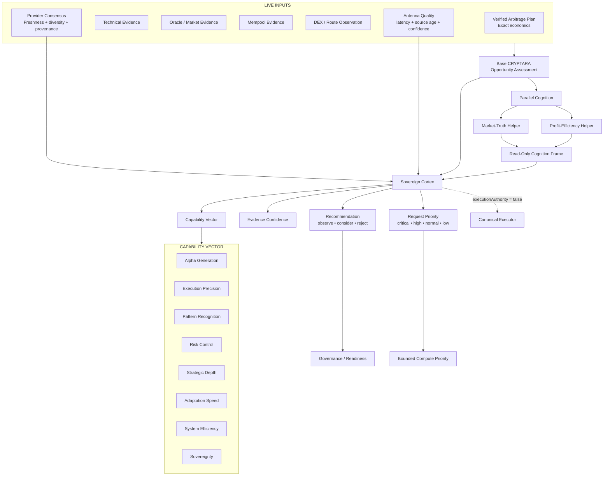

## CRYPTARA Decision Priority

Current decision-priority ordering is:

1. **Market truth**
2. **Profitability / BPS**
3. **Latency / slippage**
4. **Notional**
5. **Exploration**

## Parallel Cognition

The current CRYPTARA parallel helper lanes are bounded and advisory. They are designed for market-truth and profit-efficiency analysis without receiving canonical execution or trade-state write authority.

---

# How CRYPTARA Learns

CRYPTARA's rank/adaptive architecture is designed to rely on **terminal confirmed external settlement**, not simulation success or self-reported confidence.

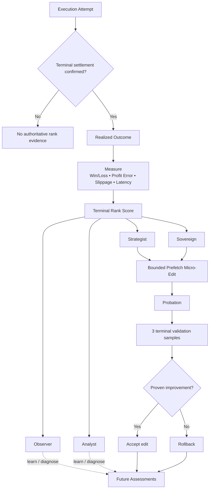

The persistent adaptive surface is intentionally narrow: current code scopes adaptive edits to predictive-prefetch aggression, with rank gates, probation, validation, and rollback behavior.

---

# Crawler Ecology

CryptoCrawler contains a distinctive crawler/swarm vocabulary. Several crawler modules exist in code but are currently outside the canonical production-agent export boundary. They are documented here as **implemented incorporation targets**: the objective is to bring useful behavior back through canonical evidence, economics, governance, scheduling, execution, settlement, and learning authorities rather than letting a crawler become a parallel trading authority.

## CryptoCrawler Swarm Family

### Cain

Cain is the knowledge-bearing crawler archetype. Existing code includes a lifecycle with Genesis, active operation, Doomsday/Eden-return behavior, knowledge collection, replicas, and periodic/conditioned return to Eden.

### Cain Twin Hybrid

The Cain Twin Hybrid combines Cain/Eden concepts with twin-style shared processing and local optimizations such as memoization and predictive caching.

### Conjoined Twin Crawlers

A paired-crawler model with shared memory, shared observations, shared decisions, a joint task queue, synchronization state, and execution history.

### Enhanced Micro-Crawlers

Small worker/crawler modules intended for narrow monitoring or task scopes. Current compatibility code deliberately prevents them from fabricating profit or bypassing canonical discovery/execution; reintegration should preserve that truth discipline.

### Starburst

A replication/surge architecture for expanding crawler attention around high-value or high-priority conditions. Current compatibility behavior is quarantined from execution authority; the concept can be reincorporated as bounded discovery/observation capacity.

### Swarm Orchestrator

A coordination layer for Cain/micro/replication populations. Reintegration should make the canonical runtime its downstream authority rather than creating a second scheduler or executor.

## Six-Crawler Analytic Initiative

The repository also contains a separate six-crawler analytic/security initiative. These are not presented as CryptoCrawler trading executors; they are specialized analytic crawler archetypes that can potentially contribute observations or infrastructure under controlled boundaries.

| Crawler | Character | Repository role |
|---|---|---|
| **The Mirror** | 🪞 Reflection | Dual-state environment rendering and authorized analytical overlay |
| **The Key** | 🔑 Access map | Identity, authorization, trust, and policy-flow analysis |
| **The Chewer** | 🦫 Ingestion | High-throughput data digestion and normalization |
| **The Computational** | 🧮 Pattern engine | Correlation, structural analysis, and modeled failure-state reasoning |
| **USC — Unified Systems Conductor** | 🚀 Conductor | Coordination, routing, task arbitration, and information flow |
| **The Woo** | 🎭 Interface | Cooperative API/interface interaction and contextual preparation |

These crawler names are part of the project's architecture vocabulary; claims about throughput, latency, or production scale remain dependent on the configured runtime and deployment evidence.

---

# Eden

**Eden** is one of the most distinctive architectural concepts in the repository: a knowledge/lifecycle home for crawler experience, return cycles, and strategy memory.

The repo contains more than one generation of Eden/Genesis concepts. The useful architectural idea is a **protected knowledge garden** where raw outcomes can be recorded, interpreted by bounded intelligence, and later returned to crawler populations without giving the memory store independent trading authority.

## Eden — Knowledge Garden Schematic

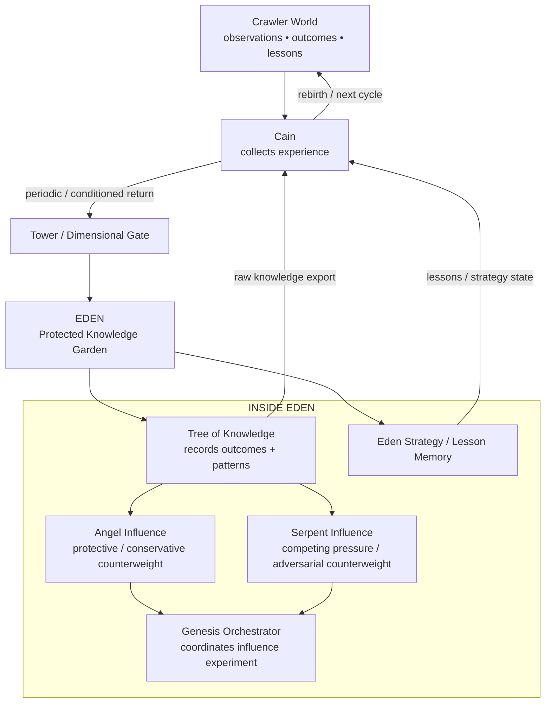

## Tree of Knowledge

The existing Genesis Tree implementation deliberately describes itself as **storage without consciousness or causal understanding**. It records outcomes, performs simple frequency/correlation analysis, and exposes accumulated knowledge for other components.

That limitation is useful: the Tree can be the **record of what happened** without pretending that storage itself knows why it happened.

## Angel Influence

The Angel layer is implemented as a conservative/protective counterweight in the Genesis influence model: patience, caution, longer-term thinking, ethics weighting, and stability are strengthened under receptive conditions.

Within the Eden metaphor, Angels are best understood as **guardians/counterweights**, not cryptographic security primitives. Hard access protection belongs to the Tower/Gate and authority boundaries.

## Serpent Influence

The Serpent layer is the opposing/adversarial pressure model. It gives the Genesis environment a way to test competing directional pressures rather than assuming learning happens under a single favorable influence.

## Cain's Return to Eden

Cain's existing lifecycle code explicitly checks whether a Cain should return to Eden, performs an Eden-return phase to share knowledge, and then continues into another cycle. This is one of the clearest repo-backed parts of the Eden story.

> **Cain goes out, experiences the world, comes home to Eden, contributes what it learned, receives accumulated knowledge, and goes back out again.**

---

# Eden Protection Envelope — Double Bubble / One-Way Iron Mirror

**“Double Bubble / One-Way Iron Mirror” is design shorthand**, not the name of one existing class. It is a faithful conceptual description assembled from several mechanisms that *do* exist in the repository.

The strongest direct analogue is the Tower of Babel code:

- it explicitly defines a **Dimensional Gate between outer and inner bubbles**;
- it splits meaning into literal, symbolic, and structural layers;
- part of the transformation is explicitly described as **one-way for security**;
- only the **Tree** is intended to recombine the full meaning;
- Cain receives limited dimensional access;
- Angels receive partial access;
- ordinary crawlers receive minimal access;
- outsiders/unknown entities receive no dimensional access;
- unauthorized-viewer scrambling behavior is represented in the Tower design.

The repository's separate **Mirror** crawler also provides a useful visual metaphor: dual-state environment rendering with an analytical overlay intended for authorized observers.

Together, those ideas map naturally to the Eden protection model below.

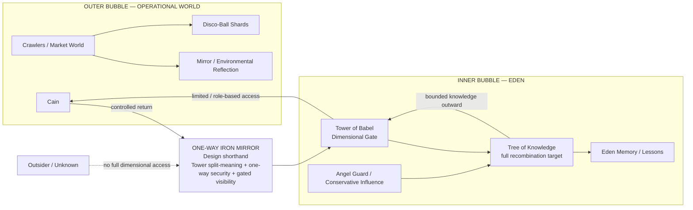

### Why “one-way mirror” fits

From outside Eden, components can contribute observations, lessons, and split representations without automatically gaining the ability to reconstruct the entire protected knowledge state. From inside Eden, the Tree and bounded trusted roles can interpret more of the accumulated picture.

### Why “double bubble” fits

The Tower already models an **outer-bubble connection**, an **inner-bubble connection**, and a dimensional gate rooted between them. The phrase is therefore not invented out of thin air; it is a visual shorthand for a boundary the code already describes.

### Why “iron” remains shorthand

“Iron” represents the architectural objective that the boundary should be difficult to bypass: explicit role access, split meaning, one-way transformation behavior, bounded recombination, and no implicit authority escalation. The README does **not** claim a literal `IronMirror` security class exists today.

---

# Disco-Ball Mirroring + Light Communication

Two different ideas in the repository fit together visually but should not be confused:

1. **Disco-Ball Environmental Mirroring** is an observation model.
2. **Light Communication** is a coordination/signaling model.

## Disco-Ball Environmental Mirror

The Disco-Ball code models each crawler as a collection of reflective environmental shards. Shard categories include:

- liquidity;
- volume;
- volatility;
- mempool;
- order book;
- gas market;
- latency pockets.

The purpose is to assemble many small reflections into an environmental snapshot rather than relying on one monolithic observation.

## Light Communication

The Light Communication subsystem models low-bandwidth crawler coordination using typed channels and compressed numeric signals for:

- alerts;
- discoveries;
- coordination;
- emergencies;
- heartbeats.

It includes frequency-style channels, subscriber sets, TTLs, bandwidth limits, and compact bit-packed signal data.

## Combined Visual Model

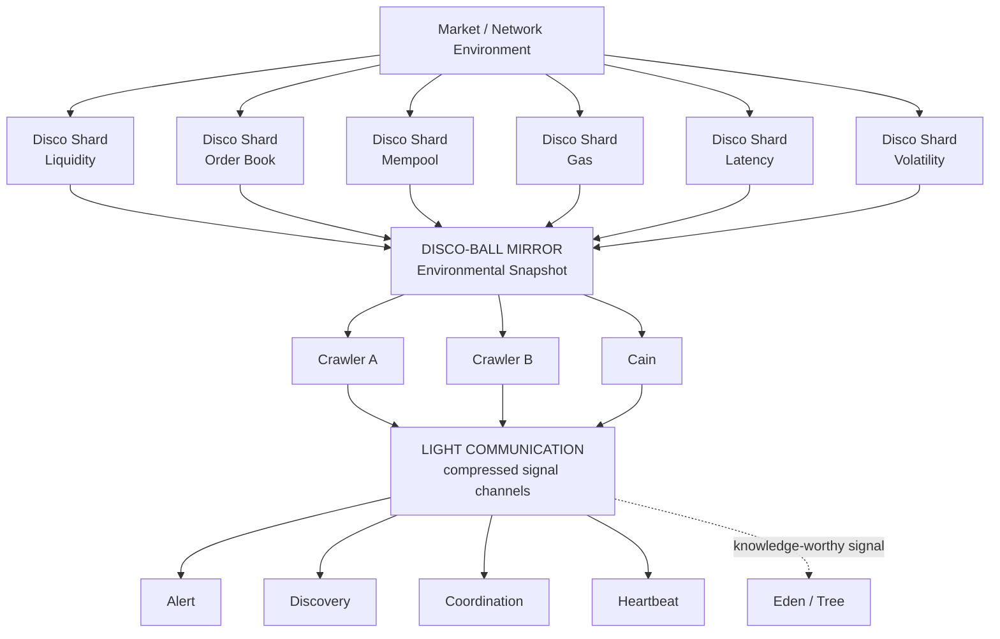

> **The Disco Ball reflects the world. Light Communication lets the crawlers whisper about what they saw. Eden remembers what matters.**

---

# Zero-Initial-Capital Architecture

`ZERO_CAPITAL_ATOMIC` describes an execution topology where trade notional and/or transaction resources can be obtained within the execution path rather than requiring the operator to pre-position the full trading notional.

It does **not** mean execution has no economic cost.

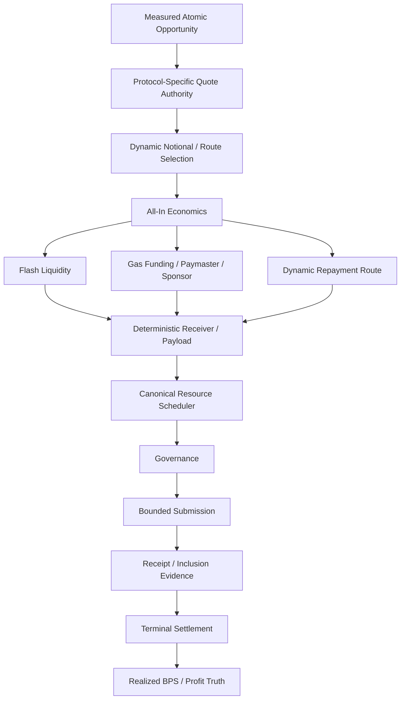

Current architecture contains flash-liquidity, deterministic receiver, sponsorship/paymaster, protocol-specific quote, repayment, builder-window, receipt, balance-verification, and realized-cost concepts. Availability of a specific route remains dependent on the actual provider, chain, account, deployed contracts, credentials, balances, and runtime evidence required by that route.

---

# Hot-State / Overflow Architecture

Recent hardening routes designated hot runtime state to the dedicated **Overflow runtime database** rather than treating the cold/archive-oriented database as the normal hot-query authority.

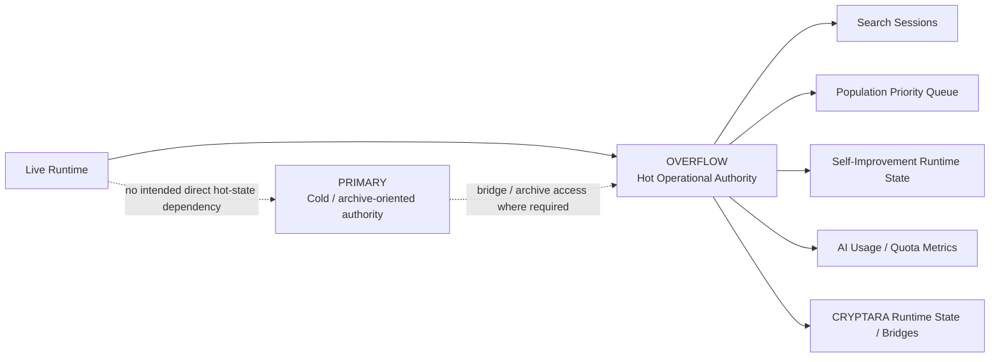

---

# Recent Hardening and Optimization

The September 8, 2026 hardening sequence on `develop` includes work in areas such as:

| Area | Hardening / optimization represented in current code |
|---|---|
| **Live market evidence** | Concurrent provider mesh and shared normalization across multiple live-price paths; route/request-local cooldown behavior; partial-result cache safety |
| **Provider resilience** | Failures isolated so one degraded provider does not automatically poison unrelated healthy routes |
| **Exact economics** | Strictly positive sub-one-BPS economics remain representable without whole-BPS integer truncation |
| **Candidate integrity** | Preparation guarded from mutating canonical opportunity economics; rejected preparation isolated from later attempts |
| **Zero-capital discovery** | Ethereum zero-capital route work restored without making Ethereum the mandatory cold-start dependency |
| **Protocol coverage** | Route-local PancakeSwap V2/BSC and Trader Joe V1/Avalanche adapter work, with quote/router alignment hardening |
| **Repayment routing** | Repayment selection expanded beyond a single direct-WETH assumption |
| **Builder submission** | Bounded multi-block validity rather than next-block-only assumptions |
| **Gas sponsorship** | Hosted paymaster/sponsorship paths can satisfy zero-upfront-gas conditions while keeping provider-fronted gas visible in realized economics |
| **Execution truth** | Execution, settlement, reconciliation, payout, and exception states separated so telemetry failure does not erase on-chain truth |
| **Kalshi evidence** | Event-fee, cache/single-flight, request-local backoff, and exact-positive admission hardening |
| **Overflow runtime** | Additional hot runtime state moved to Overflow with schema/verifier coverage |
| **Runtime isolation** | Optional/degraded components can fail or retry without automatically gaining global shutdown authority |
| **Cost governance** | Paid pending-stream behavior remains explicit opt-in rather than activating solely because a key exists |

---

# Canonical Runtime and Authority Model

CryptoCrawler separates responsibilities that are easy to accidentally merge.

## Discovery Authority

Finds and normalizes measured opportunities. Discovery may be broad, but discovery alone does not authorize execution.

## Candidate Registry

Provides a common lifecycle for measured opportunities and tracks enrichment, missing information, blocking reasons, expiry, and topology.

## Deterministic Economics Authority

Calculates known costs and establishes whether the candidate remains strictly positive after verified costs.

## CRYPTARA / Intelligence Authority

Assesses market context, evidence confidence, pattern quality, and learned execution performance. It can prioritize or downgrade without owning canonical transaction submission.

## Governance Authority

Controls progression from analysis toward execution.

## Resource / Nonce / Rate Authority

Coordinates scarce runtime resources rather than allowing competing executors to guess them independently.

## Canonical Executor

Owns the actual venue/protocol submission path for execution-authorized work.

## Terminal Settlement Authority

Determines what actually happened financially from receipts, fills, balances, fees, gas, repayment, and other terminal evidence.

## Learning Authority

Consumes normalized terminal truth. Simulation, submission, and partial state are not intended to masquerade as realized learning evidence.

---

# Market Evidence and Provider Mesh

CryptoCrawler treats provider availability as a routing problem rather than a single-provider dependency.

Key design properties represented in the architecture include:

- streaming-first ingestion where available;
- REST fallback/augmentation;
- shared symbol/value normalization;
- request-local and route-local cooldowns;
- in-flight deduplication/single-flight behavior;
- partial-result cache safety;
- source provenance;
- freshness tracking;
- provider consensus;
- provider health/circuit-breaker behavior;
- fail-closed handling when required execution truth remains unknown.

---

# Monte Carlo and QuantiComp

Monte Carlo is a **robustness and uncertainty layer**, not an alternative accounting system.

> **Known costs → deterministic positive economics → probabilistic analysis → governance/readiness → execution**

QuantiComp/Monte Carlo can be used for concepts such as probability of profitable execution, confidence intervals, partial-fill risk, tail outcomes, Value at Risk, Expected Shortfall, execution horizon, calibration residuals, and adaptive simulation depth.

Simulation is not realized financial truth.

---

# Terminal Settlement and Realized Truth

Terminal settlement is where predictions are replaced by measured facts.

Authoritative evidence can include transaction receipts, order/fill status, pre/post balances, flash-loan repayment, gas consumed or economically owed, protocol/exchange fees, realized output, realized slippage, realized net profit, and terminal failure/revert state.

> **Submitted is not settled. Predicted is not realized. Simulated is not settled.**

---

# Extended Intelligence Systems

Bad-Blue contains a broader research and orchestration ecosystem beyond the two primary product surfaces.

<strong>Show extended architecture vocabulary</strong>

| Name | Plain-English engineering role / intent |
|---|---|
| **4JI** | Top-level multi-domain orchestration/policy concept |
| **PANTHEON** | Specialized crawler/extraction orchestration platform |
| **Razors** | Narrow-purpose PANTHEON extraction modules |
| **People Finder** | Public-record research, entity resolution, relationship mapping, report assembly |
| **GeoConsole** | Geospatial evidence fusion, reconstruction, visualization, probabilistic path analysis |
| **TSHPE** | Multi-source positioning, smoothing, confidence-estimation engine |
| **Cain** | Knowledge-bearing crawler/lifecycle archetype |
| **Reaper** | Retirement, quarantine, cleanup, unhealthy-agent control concept |
| **Eden** | Protected crawler knowledge/lifecycle home |
| **GENESIS** | Controlled influence/strategy-evolution laboratory |
| **Tree of Knowledge** | Outcome/pattern storage and export layer |
| **Angel Influence** | Conservative/protective counterweight in Genesis experiments |
| **Serpent Influence** | Opposing/adversarial influence pressure in Genesis experiments |
| **Tower of Babel** | Split-meaning, role-access, outer/inner-bubble gate architecture |
| **Light Language** | Experimental machine vocabulary/translation abstraction |
| **Disco-Ball Environmental Mirror** | Multi-shard environment/state reflection model |
| **Light Communication** | Low-bandwidth compressed crawler signaling system |
| **Googolplex Neural Lattice** | Experimental sparse/procedural representation architecture |
| **3D Geiger** | Provider pressure/health/rate-limit scoring vocabulary |
| **Evolution Lock / Geiger** | Controlled adaptation permission and adaptation-risk gating |
| **Faucet / Faucet Mesh** | Governed strategy-flow and experimental multi-node market-operation abstractions |

These names are project vocabulary. Their engineering value depends on the responsibilities and verified wiring behind the metaphor.

---

# Engineering Principles

## 1. One Authority Per Critical Responsibility

Discovery, economics, nonce allocation, scheduling, execution, settlement, and learning should not each have multiple competing production authorities.

## 2. Deterministic Before Probabilistic

Known economics are calculated before stochastic analysis is allowed to influence a candidate.

## 3. Observation Is Not Execution

A crawler, oracle, indicator, mempool feed, ranking model, CRYPTARA helper, Disco-Ball shard, or Eden memory item can provide evidence without receiving transaction authority.

## 4. Capability Is Not Permission

A configured wallet, key, RPC, venue account, provider, or receiver proves potential capability—not current authorization or availability.

## 5. Submission Is Not Settlement

A transaction hash, accepted bundle, or submitted order is an intermediate state.

## 6. Learning Requires Terminal Truth

Realized learning is downstream of terminal settlement.

## 7. Fail Closed on Missing Critical Facts

Unknown fees, liquidity, gas economics, repayment conditions, permissions, balances, or settlement state remain unknown until proven.

## 8. Preserve Proven Capability

Repairs should remove root causes without casually regressing previously verified capability elsewhere.

## 9. Route-Local Failure Isolation

A degraded provider, chain, venue, or optional component should not unnecessarily halt unrelated healthy routes.

## 10. Domain Isolation

Legal intelligence and market-execution intelligence can reuse infrastructure without inheriting each other's authority.

## 11. Metaphor Must Map to Mechanism

Names such as Eden, Tower, Angel, Disco Ball, Antenna, Beam, Battery, and Cain are useful when the README also explains the real data, control, security, compute, or lifecycle responsibility underneath them.

---

# Repository Guide

Major repository areas include:

- **`client/`** — React/TypeScript application surfaces.
- **`server/`** — API, orchestration, providers, persistence, workers, and backend services.
- **`server/services/alexara/`** — LEXARA legal brain, F.M.I., C.A.D.E., and legal research integration.
- **`server/services/cryptara/`** — CRYPTARA market-surveillance/assessment intelligence.
- **`server/services/cryptocrawl/`** — CryptoCrawler discovery, economics, validation, governance, execution, settlement, zero-capital, runtime, scaling, crawler research, Eden, Babel, and integration systems.
- **`server/services/cryptocrawl/agents/`** — Cain/Twin/Micro/Starburst/Swarm crawler modules and compatibility boundaries.
- **`server/services/cryptocrawl/eden/`** — Eden lesson/state/strategy memory architecture.
- **`server/services/cryptocrawl/babel/`** — Tower of Babel, crawler fingerprint, Cain reasoning, Light Language, related experimental architecture.
- **`server/services/genesis/`** — Original Sin, Serpent, Angel, Tree of Knowledge, and Genesis orchestration experiments.
- **`server/services/computationalBeam/`** — workload router, Omni Antenna, Directional Beam, Super Battery, and related compute-routing infrastructure.
- **`server/reactor/`** — Computational Reactor implementation and metrics.
- **`server/services/crawlers/`** — Six-Crawler Initiative and other analytic crawler systems.
- **`server/migrations/overflow/`** — Overflow hot-state schema evolution.
- **`scripts/cryptocrawl/`** — structural/runtime invariant verifiers for CryptoCrawler hardening.
- **database / migration modules** — persistence schema and state evolution.
- **tests / verifier assets** — regression, integration, authority, economic, and runtime validation.

---

# Deployment and Verification Philosophy

A successful build is necessary but not sufficient.

Production verification should establish, as applicable:

- compile/type correctness;
- schema/migration readiness;
- provider health;
- database authority/routing;
- discovery heartbeat;
- evidence freshness;
- candidate lifecycle health;
- deterministic economics;
- governance state;
- resource/nonce/rate readiness;
- execution capability;
- receipt/fill observation;
- terminal settlement;
- realized accounting;
- payout/reconciliation state;
- calibration/learning integrity;
- regression/invariant verifier results.

---

# Production / Handoff Perspective

Bad-Blue is best understood as a **large active codebase with two distinct product systems and a substantial shared intelligence/runtime architecture**.

For technical diligence, the important value is not merely the number of named modules. It is the attempted separation and composition of:

- legal reasoning and legal workflow;
- evidence analysis and drafting;
- public-record research;
- multi-provider market data;
- multi-topology opportunity formation;
- exact economic validation;
- adaptive market cognition;
- bounded probabilistic analysis;
- crawler ecology and lifecycle concepts;
- Eden knowledge return;
- protected/split-meaning communication concepts;
- Antenna/Beam/Battery/Reactor compute routing;
- staged governance;
- resource-controlled execution;
- terminal settlement;
- realized-evidence learning;
- hot/cold state separation;
- regression-protected canonical authority.

The continued engineering priority is **proof, canonicalization, observability, safe incorporation, and end-to-end realization**.

---

# Glossary

| Term | Meaning |
|---|---|
| **LegalWhat** | Legal-assistance and workflow product system |
| **LEXARA** | Unified legal brain / primary legal persona |
| **ALEXARA** | Legal/strategic service architecture associated with the LEXARA domain |
| **F.M.I.** | Forensic Media Intelligence evidence-analysis subsystem |
| **C.A.D.E.** | Case Adaptive Drafting Entity |
| **CryptoCrawler** | Multi-topology market discovery, validation, governance, execution, settlement, and learning architecture |
| **CRYPTARA** | Adaptive crypto-market assessment and execution-feedback intelligence |
| **Sovereign Cortex** | CRYPTARA evidence-quality, capability-vector, rank, and bounded-adaptation layer |
| **Eden** | Crawler knowledge/lifecycle home and strategy/lesson memory concept |
| **Tree of Knowledge** | Outcome/pattern record that intentionally separates storage from causal understanding |
| **Tower of Babel** | Split-meaning / role-access / dimensional-gate architecture between outer and inner bubbles |
| **Double Bubble** | README shorthand for Tower's outer-bubble + inner-bubble boundary model |
| **One-Way Iron Mirror** | README shorthand for gated visibility, one-way transformation behavior, role-limited access, and protected recombination around Eden; not a literal class name |
| **Angel Influence** | Conservative/protective Genesis counterweight |
| **Serpent Influence** | Opposing/adversarial Genesis influence pressure |
| **Cain** | Knowledge-bearing crawler with Eden-return lifecycle concepts |
| **Cain Twin Hybrid** | Hybrid Cain/Twin crawler architecture |
| **Conjoined Twins** | Synchronized paired-crawler/shared-state architecture |
| **Micro-Crawler** | Small scoped crawler/worker concept |
| **Starburst** | Bounded replication/surge crawler concept |
| **Disco-Ball Mirror** | Multi-shard environmental reflection model |
| **Light Communication** | Compressed frequency/channel-style crawler signaling model |
| **Computational Reactor** | Measured job scheduling and compute-resource orchestration layer |
| **Omni Antenna** | Lightweight latency-sensitive compute/market-transport lane |
| **Directional Beam** | Heavier compute-routing lane |
| **Super Battery** | Task-efficiency layer for caching, deduplication, batching, and related optimization hooks |
| **QuantiComp** | Heavy quantitative-computation authority |
| **Measured Candidate Registry** | Shared opportunity lifecycle and missing-information authority |
| **Deterministic Economics** | Known-cost profitability authority |
| **BPS** | Basis points; 100 BPS = 1% |
| **ZERO_CAPITAL_ATOMIC** | Atomic route using internally acquired liquidity/resources rather than pre-funded trade notional |
| **Paymaster / Sponsorship** | Mechanism that can remove upfront gas funding while preserving real gas liability in economics |
| **Canonical Scheduler** | Resource-leasing authority for execution-ready candidates |
| **Terminal Settlement** | Verified final execution outcome and realized financial truth |
| **Calibration** | Prediction-vs-realized comparison used to improve uncertainty estimates |
| **Predictive Prefetch** | Bounded advance acquisition/preparation of likely-needed market evidence |
| **Overflow** | Hot operational runtime-state authority |
| **Primary** | Cold/archive-oriented database authority where retained by architecture |
| **Monte Carlo** | Probabilistic robustness/tail-risk analysis downstream of deterministic economics |
| **DynamicScale** | Adaptive discovery/search-pressure and bounded resource controller |
| **Fail Closed** | Required unknown facts block execution instead of being guessed favorable |

---

# The Architectural Idea

Bad-Blue's defining characteristic is not simply that it combines legal AI and crypto automation in one repository. It is the attempt to keep **different forms of intelligence explainable, bounded, and governed** while still allowing them to reuse serious infrastructure.

**LegalWhat asks:**

> What happened, what law applies, what evidence matters, and what legal work product should be created?

**CryptoCrawler asks:**

> What market condition exists, is the opportunity economically real, is execution permitted and resourced, what actually settled, and what did that realized outcome teach the system?

**CRYPTARA asks:**

> Given the evidence and what terminal outcomes have proven so far, how should CryptoCrawler interpret and prepare for the next opportunity without confusing intelligence with execution authority?

**Cain asks:**

> What did the world teach me, what should I carry back to Eden, and what should the next cycle inherit?

**Eden asks:**

> What should be remembered, what can safely be understood, who may see how much of it, and how does knowledge return to the world without giving memory itself execution authority?

That separation—and the mechanisms underneath the metaphors—is intentional.
