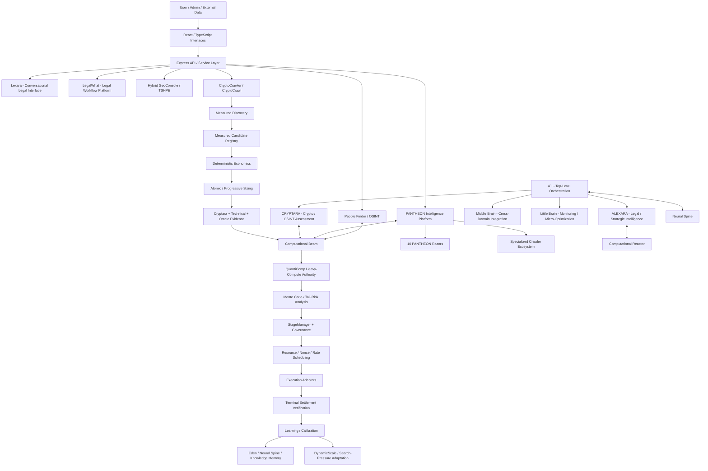

# Bad-Blue / LegalWhat

## A Multi-Agent Intelligence, Legal Automation, OSINT, Geospatial, and Market-Research Platform

**Legal AI • OSINT • Geospatial Reconstruction • Voice AI • Agent Orchestration • Probabilistic Analysis • Defensive Research • Multi-Chain Market Automation**

Bad-Blue / LegalWhat is a platform-scale experimental intelligence codebase that began as a consumer law-enforcement-accountability product and expanded into a much broader architecture for legal automation, multi-model AI orchestration, public-record research, entity resolution, geospatial reconstruction, adaptive learning, distributed computation, crawler swarms, probabilistic analysis, and cryptocurrency market research/execution.

The repository is not one application with a collection of unrelated demos. Its defining concept is **orchestration**: specialized systems collect evidence, transform it into structured observations, validate hypotheses, route expensive computation through shared infrastructure, preserve useful outcomes, enforce governance, and expose results to human-facing applications.

> **Important engineering status note**
>
> This repository is under active integration and production hardening. Some components are operational, some depend on external credentials or deployed infrastructure, and some are experimental, simulated, compatibility-oriented, or partially connected. The terminology below describes the architectural role of each subsystem; it should not be interpreted as a claim that every subsystem is production-certified.

---

# Executive Architecture Summary

At the highest level, Bad-Blue is organized into five cooperating layers:

1. **Human and application interfaces** — LegalWhat, Lexara, GeoConsole, People Finder, inmate/corrections tools, administrative interfaces, and other React/TypeScript surfaces.
2. **Domain intelligence systems** — ALEXARA for legal/strategic reasoning, CRYPTARA for crypto/OSINT assessment, PANTHEON for targeted information extraction, and specialized crawler ecosystems.
3. **Shared computational systems** — the Computational Reactor, Computational Beam, QuantiComp heavy-compute authority, Monte Carlo fabric, provider-routing controls, and resource schedulers.
4. **State, learning, and memory systems** — Neural Spine, Eden, Tree of Knowledge, calibration stores, settlement-derived feedback, and controlled evolution mechanisms.
5. **Governance and execution systems** — StageManager, governance envelopes, rate/nonce/resource controls, execution adapters, flash-loan and sponsored-gas infrastructure, terminal settlement, verification, and kill-switch controls.

The names are intentionally distinctive, but every named component maps to a conventional engineering responsibility. The remainder of this README explains those responsibilities directly.

---

# End-to-End System Flow

The following is the practical end-to-end model for how the major systems fit together.

In plain English:

**Data comes in → specialized systems observe it → observations become candidates → candidates are enriched → all known costs are applied → sizing is optimized → intelligence systems assess the evidence → heavy computation is routed through the shared compute layer → probabilistic analysis tests robustness → governance decides whether execution is even permitted → bounded schedulers reserve resources → execution occurs → settlement is independently verified → only terminal realized results are allowed to become learning data.**

That last rule matters throughout the architecture: **predicted profit, submitted transactions, and partial execution are not treated as realized truth.**

---

# Core Terminology: What the Names Actually Mean

## 4JI — Sovereign Orchestrator

**Conventional description:** top-level multi-domain orchestration layer.

4JI is the architectural coordinator intended to connect the platform's legal, OSINT, crypto, geospatial, AI, monitoring, memory, repair, optimization, and evolution systems.

Its purpose is not to perform every task itself. It determines which domain system should handle a task, passes structured context among those systems, coordinates shared infrastructure, and maintains separation between domains that should not directly control one another.

4JI-related concepts include:

- **ALEXARA** for legal and strategic work.
- **CRYPTARA** for crypto and OSINT analysis.
- **Middle Brain** for cross-domain integration and reconciliation.
- **Little Brain** for health checks, micro-optimization, and connection validation.
- **Evolution Lock** for controlling whether adaptive systems are permitted to modify learned behavior.
- **Reactor Bridge** for sending heavy jobs into shared computational infrastructure.
- **Crown / Jewels concepts** for weighted high-level preferences and decision biases in experimental orchestration code.

In ordinary engineering terminology, 4JI is best understood as a **domain-aware orchestration and policy layer**.

---

## ALEXARA — Legal / Strategic Intelligence

**Conventional description:** legal-domain reasoning and strategic analysis service.

ALEXARA represents the platform's legal and structured strategic reasoning side. Its intended responsibilities include:

- identifying legal issues;
- interpreting regulations, statutes, precedent, and procedural requirements;
- retrieving legal-domain information;
- organizing arguments and recommendations;
- maintaining legal-domain context;
- validating outputs against other domain systems where appropriate;
- supporting LegalWhat and Lexara workflows.

ALEXARA is deliberately separated from the market-execution responsibilities of CRYPTARA and CryptoCrawler. That separation allows the platform to use different rules, evidence standards, and provider configurations for legal work and financial-market work.

---

## CRYPTARA — Crypto / OSINT Assessment and Decision Layer

**Conventional description:** higher-level market/OSINT assessment, pattern-analysis, and execution-feedback intelligence layer.

When the project says **CRYPTARA**, it does not mean an exchange, trading bot, or blockchain. CRYPTARA sits above raw observations and tries to answer questions such as:

- Is this pattern meaningful or noise?
- Is the market condition consistent with the proposed strategy?
- Does the observed topology resemble previously successful or failed conditions?
- How confident should the system be in the candidate?
- Does the current autonomous directive permit this execution mode or chain?
- What did terminal settlement teach us about the prediction?

CRYPTARA-related analysis includes pattern detection, network analysis, prediction, temporal behavior, transaction-pattern clustering, market-state interpretation, confidence scoring, execution feedback, and governance integration.

Within CryptoCrawler, CRYPTARA is an **assessment layer**, not the sole execution authority. Deterministic economics, governance, resource scheduling, execution, and settlement remain separate responsibilities.

---

## Lexara — Conversational Legal Intelligence

**Conventional description:** human-facing conversational legal assistant and multimodal interaction layer.

Lexara is the interface designed to make the legal-intelligence stack usable as a conversation rather than only through forms and API calls.

Its architecture includes combinations of:

- text conversation;
- microphone input;
- speech generation and playback;
- persona and voice profiles;
- document context;
- legal consultation workflows;
- visual/avatar interfaces;
- optional geospatial overlays;
- provider routing and fallback behavior;
- voice-quality experimentation and optimization.

Lexara is therefore the **interaction layer**, while ALEXARA and the LegalWhat services provide much of the underlying domain intelligence.

---

## Computational Reactor

**Conventional description:** centralized workload queue, concurrency controller, and compute-resource scheduler.

The Computational Reactor manages expensive or asynchronous computational jobs. Its responsibilities include:

- priority queues;
- concurrency limits;
- CPU/memory/resource monitoring;
- retries;
- job lifecycle tracking;
- heat/throttling concepts;
- routing of Monte Carlo, crawler, AI, and OSINT work;
- preventing every subsystem from independently creating unlimited expensive work.

The Reactor answers: **What work should run, when should it run, and how much shared capacity may it consume?**

---

## Computational Beam

**Conventional description:** shared distributed workload-routing and compatibility facade.

The name **Computational Beam** can sound abstract, but its role is concrete: it is a routing layer that accepts computational workloads from different parts of the platform and directs them toward the appropriate compute implementation.

Beam-related behavior includes:

- workload classification;
- batching;
- deduplication;
- caching;
- connector selection;
- queue/backlog handling;
- cancellation semantics;
- throughput telemetry;
- compatibility between older callers and newer compute infrastructure.

For CryptoCrawler specifically, Beam is intended to be the **routing facade**, not an independent heavy-compute authority.

---

## QuantiComp

**Conventional description:** authoritative heavy-computation engine for quantitative workloads.

QuantiComp is the component intended to own expensive quantitative computation once a workload has been routed through Beam.

Examples include:

- Monte Carlo simulation;
- tail-distribution calculations;
- scenario expansion;
- adaptive sample-depth decisions;
- compute-heavy candidate comparisons;
- statistically intensive optimization.

The architecture uses a deliberate authority boundary:

**Beam routes; QuantiComp computes.**

That prevents two different systems from independently becoming competing authorities for the same heavy-compute responsibility.

---

## Monte Carlo Fabric

**Conventional description:** cross-cutting probabilistic simulation and uncertainty-analysis framework.

Monte Carlo is not one isolated trading feature. Simulation and probabilistic analysis appear across several domains, including market profitability, geospatial reconstruction, voice experimentation, routing, and evolutionary systems.

In CryptoCrawler, the Monte Carlo layer is intentionally downstream of deterministic economics. A candidate must first prove positive all-in deterministic economics before stochastic analysis is allowed to strengthen or reject the case.

The current profitability framework can evaluate concepts such as:

- probability of profitable outcome;
- confidence intervals;
- probability that all required legs fill;
- partial-fill risk;
- p50 / p25 / p10 / p5 / p1 net-profit outcomes;
- Value at Risk;
- Expected Shortfall;
- execution-horizon effects;
- quote freshness;
- calibration sample counts;
- Gaussian, Student-t, or empirical-bootstrap distributions;
- adaptive simulation depth based on uncertainty and proximity to a decision boundary.

Monte Carlo is therefore a **robustness and uncertainty layer**, not a substitute for known costs.

---

## Neural Spine

**Conventional description:** shared experience, memory, and controlled-learning substrate.

The Neural Spine is the architecture for retaining useful outcomes and relationships across subsystems.

Its concepts include:

- experience storage;
- synapse-like associations;
- fingerprints;
- plasticity/adaptation;
- memory retrieval;
- adapters between domain systems and shared memory;
- evolution-lock integration.

The engineering objective is to let systems reuse prior evidence without allowing unverified predictions to silently become training truth.

---

## Googolplex Neural Lattice

**Conventional description:** experimental sparse/procedural neural-structure abstraction.

The Googolplex Neural Lattice explores very large logical state spaces through sparse, procedural, fractal, or lazy representations rather than materializing an impossibly large dense network.

It should be understood as an **experimental representation and coherence architecture**, not literally as a physically instantiated googolplex-sized neural network.

---

# Monitoring, Rate Control, and Evolution Safety

## 3D Geiger — Provider Pressure / Rate-Limit Controller

**Conventional description:** provider-health and usage-pressure scoring system.

The provider-routing Geiger combines signals such as:

- time decay;
- recent request intensity;
- provider health;
- failure history;
- cooldown state;
- pressure or “radiation” score.

The purpose is to move work away from unhealthy or overloaded providers before a full outage or rate-limit cascade occurs.

---

## Evolution-Lock Geiger

**Conventional description:** adaptation-risk monitor and evolution gate.

A separate Geiger concept is used for deciding whether learning/evolution processes should continue. It evaluates rule-based risk signals and can place adaptive systems into restricted or locked states.

The key principle is simple: **the component being evolved should not be the only component deciding whether its own evolution is safe.**

---

## Evolution Lock

**Conventional description:** explicit permission boundary for training, adaptation, distillation, and learned-state modification.

Evolution Lock prevents adaptive behavior from being treated as an always-on background privilege. Systems can continue observing and calculating while modification of learned state remains separately controlled.

---

# GENESIS Evolution Laboratory

**Conventional description:** experimental controlled-evolution and strategy-variation environment.

GENESIS groups several metaphorically named components that explore how strategies are generated, challenged, selected, and remembered.

## Original Sin

Represents baseline assumptions, inherited constraints, or initial strategy tendencies that an evolutionary process begins with.

## Serpent

Represents mutation, challenge, alternative hypotheses, or pressure that tests existing assumptions.

## Angel

Represents validation, protection, corrective constraints, or conservative evaluation of proposed changes.

## Tree of Knowledge

**Conventional description:** persistent outcome/strategy knowledge repository.

The Tree stores and retrieves information such as:

- strategy outcomes;
- frequency and correlation patterns;
- reusable successful structures;
- failed structures;
- environmental observations;
- exported/imported learned knowledge.

GENESIS should therefore be understood as a **controlled strategy-evolution laboratory**, not as a religious or metaphysical claim.

---

# Six Cane Swarm Intelligence

**Conventional description:** multi-perspective market-intelligence ensemble.

The Six Cane architecture separates market interpretation into multiple specialized analytical perspectives rather than asking one monolithic agent to infer everything.

Its lanes cover concepts such as:

- market mapping;
- liquidity;
- volatility;
- order flow;
- behavioral analysis;
- broader orchestration and synthesis.

Each “Cane” can analyze a different aspect of the market, after which the outputs are reconciled into a larger view.

---

# PANTHEON Intelligence Platform

**Conventional description:** specialized crawler orchestration, targeted extraction, and intelligence assembly platform.

PANTHEON coordinates crawler tasks and targeted extraction modules for public information. Its architecture includes task queues, resource controls, crawler specialization, metrics, adaptive behavior, and structured output assembly.

## The 10 PANTHEON Razors

**Conventional description:** narrow-purpose extraction modules.

Rather than using one crawler to infer every category of information, PANTHEON uses specialized “Razors” focused on specific data classes. The repository's Razor architecture targets categories such as:

1. identity information;
2. contact information;
3. addresses and location history;
4. social / online presence;
5. public records;
6. assets and property-related information;
7. court and legal records;
8. business / organizational records;
9. relationships and associations;
10. media / news / contextual references.

A Razor is therefore simply a **specialized extractor with a narrow responsibility and output schema**.

---

# Specialized Crawler Ecosystem

The repository contains multiple crawler families because different information sources require different crawling, parsing, rate-limiting, verification, and failure-recovery behavior.

Specialization allows each crawler to have:

- source-specific adapters;
- independent rate controls;
- tailored parsing rules;
- distinct confidence logic;
- different blind spots;
- source provenance;
- independent health and lifecycle telemetry.

The goal is not “more agents for the sake of more agents.” It is fault isolation and specialization.

---

# Seven-Crawler Defensive Research Initiative

**Conventional description:** multi-agent authorized defensive-research ensemble with intentionally different analytical perspectives.

The seven-crawler architecture is designed so that different agents investigate an authorized defensive-research problem using different heuristics and assumptions. Their findings can then be compared for overlap, disagreement, and blind spots.

The intended value is **diversity of analysis**, not autonomous offensive action.

---

# Cain and The Reaper

## Cain

**Conventional description:** crawler/swarm lifecycle, population, and strategy supervision architecture.

Cain-related implementations manage concepts such as:

- crawler creation and retirement;
- micro-crawler populations;
- health;
- adaptation;
- role assignment;
- resource use;
- uncertainty;
- strategy generations.

## The Reaper

**Conventional description:** lifecycle cleanup, retirement, and unhealthy-agent control.

The Reaper complements Cain by identifying agents, crawlers, or strategy instances that should be retired, recalled, quarantined, or replaced.

Together, Cain and Reaper form a **population lifecycle-control system**.

---

# Eden

**Conventional description:** persistent swarm memory and strategy repository.

Eden stores reusable crawler/strategy knowledge so a restarted process does not have to rediscover everything from scratch.

Its role includes:

- persistent memory;
- strategy placement;
- historical outcomes;
- reusable state;
- closed-loop learning support;
- database-backed swarm continuity.

In simple terms, **Cain manages the population; Eden remembers what the population learned.**

---

# Babel / Tower of Babel

**Conventional description:** experimental identity, trust, meaning-segmentation, and controlled-recombination architecture.

Babel explores ways to represent information through entity signatures, trust relationships, segmented meaning, layered transformations, and controlled recombination.

The system's terminology is intentionally conceptual. It should not be interpreted as cryptographic security merely because it uses terms such as signatures, trust, or encoded meaning. Where cryptographic guarantees are required, they must come from conventional cryptographic primitives and verified implementations.

---

# Light Language

**Conventional description:** experimental machine-generated vocabulary / dialect and translation abstraction.

Light Language explores fingerprint-derived vocabularies, grammars, phoneme systems, compact representation, and translation through a common metalanguage.

Its engineering purpose is experimentation with machine-to-machine representation and interoperability, not the invention of a mystical language.

---

# People Finder / OSINT

**Conventional description:** public-record research, entity-resolution, relationship-mapping, and report-assembly system.

People Finder coordinates multiple research paths to build structured reports from authorized/public sources. Its architecture includes:

- public-record searching;
- social/professional/news research;
- court-record research;
- entity resolution;
- deduplication;
- relationship mapping;
- NLP/ML enrichment;
- PANTHEON integration;
- tiered report generation.

The system must distinguish evidence, inference, and unresolved identity matches. Entity resolution is not treated as proof merely because two records look similar.

---

# “Eye of God” / Tiered Reporting

**Conventional description:** deep multi-source report tier and aggregation concept.

The dramatic label refers to the depth of aggregation, not omniscience. The architecture combines more sources, more relationship analysis, and more enrichment as report depth increases.

A professional interpretation is **multi-tier OSINT report generation with progressively broader source coverage and analysis**.

---

# Hybrid GeoConsole

**Conventional description:** geospatial evidence fusion, reconstruction, visualization, and probabilistic path-analysis interface.

GeoConsole combines location-related observations into a common map and timeline. Its features include concepts such as:

- trail visualization;
- heatmaps;
- radar/timeline views;
- GeoJSON;
- path interpolation;
- Monte Carlo reconstruction;
- futurecast experimentation;
- multiple location-source fusion.

The purpose is to distinguish **measured locations** from **interpolated or probabilistic locations** rather than drawing a continuous line and pretending every point was directly observed.

---

# TSHPE — Triangulated Satellite-Hybrid Positioning Engine

**Conventional description:** multi-source positioning, smoothing, and confidence-estimation engine.

TSHPE combines available positioning evidence, which may include browser GPS and IP-derived location today and is architected to incorporate additional sources where legitimately available.

Its concepts include:

- source weighting;
- Kalman-style smoothing;
- Monte Carlo weighting;
- history/playback;
- prediction;
- confidence and health telemetry;
- fallback logic.

The term “satellite-hybrid” describes the architecture's intent to combine heterogeneous location evidence. It does not imply access to private carrier or satellite telemetry unless such a source is actually configured and authorized.

---

# Inmate / Corrections Search

**Conventional description:** corrections-record aggregation and search interface.

This area of the platform combines UI, server routes, shared schemas, and source/provider adapters for locating public corrections or inmate information across supported jurisdictions.

---

# LegalWhat

**Conventional description:** multi-domain legal assistance and workflow platform.

LegalWhat is the original product foundation and remains one of the most mature domain groupings in the repository.

It includes architecture for:

- legal consultation;
- issue/domain routing;
- document generation;
- uploads and evidence;
- legal research integration;
- account/authentication flows;
- public-record requests;
- complaint drafting;
- authority/contact routing;
- petitions and other legal workflows;
- payment/subscription infrastructure.

---

# 30 Areas of Law

LegalWhat uses a domain registry covering many distinct areas of law so the system can route a user's problem into more appropriate prompts, research sources, documents, and workflows instead of treating “law” as one undifferentiated subject.

The important architectural idea is **domain-specific routing with a shared legal platform**, not thirty completely separate applications.

---

# Law-Enforcement Accountability

This is the origin of the Bad-Blue product concept.

The repository includes architecture for:

- complaint intake;
- officer/agency information;
- complaint drafting;
- civil-rights issue identification;
- public-record requests;
- oversight-body discovery;
- authority routing;
- lawsuits/court information;
- evidence workflows;
- mail/email submission support.

The system is designed to assist with organization and routing; legal conclusions and jurisdiction-specific procedural requirements still require current validation.

---

# Legal Routing, Drafting, and Submission Support

The legal workflow is intentionally separated into stages:

1. identify the legal domain;
2. collect facts and evidence;
3. retrieve applicable legal/reference information;
4. draft a structured document;
5. identify the correct recipient, agency, court, or portal;
6. validate submission requirements;
7. hand off through supported email/mail/filing pathways.

Direct e-filing is a materially harder capability than document drafting because every court may impose different authentication, fee, service, formatting, and portal requirements. The README therefore distinguishes drafting/routing infrastructure from verified direct filing.

---

# Commercial Infrastructure — Email and Square

## Email

**Conventional description:** outbound transactional and workflow delivery infrastructure.

Email supports legal-document delivery, account communication, operational alerts, and other application workflows. Delivery remains dependent on current domain configuration, credentials, provider limits, and deliverability status.

## Square

**Conventional description:** payment, checkout, subscription, and webhook infrastructure.

The repository contains Square client/configuration code, signed webhook handling, payment/subscription state updates, and related migration/database infrastructure.

---

# AI / ML / NLP Architecture

Bad-Blue uses multiple AI providers and internal routing layers rather than assuming one model should perform every function.

Common architectural concerns include:

- provider selection;
- fallback;
- rate limiting;
- health scoring;
- task/domain routing;
- NLP extraction;
- summarization;
- classification;
- entity resolution;
- generation;
- confidence and validation;
- background maintenance and optimization.

The platform attempts to separate **model output** from **evidence**, particularly in systems that later affect legal or financial decisions.

---

# CryptoCrawler / CryptoCrawl

**Conventional description:** multi-topology cryptocurrency market observation, candidate formation, validation, quantitative assessment, governance, and execution architecture.

CryptoCrawler is much larger than a simple arbitrage scanner. It includes systems for:

- centralized-exchange market data;
- DEX route quoting;
- cross-chain observations;
- funding-rate monitoring;
- maker/taker economics;
- filtered mempool evidence;
- zero-initial-capital / flash-loan routes;
- technical analysis;
- oracle evidence;
- candidate registries;
- deterministic economics;
- adaptive sizing;
- Monte Carlo analysis;
- governance;
- rate/nonce/resource scheduling;
- execution;
- receipt and balance verification;
- terminal settlement;
- learning/calibration;
- observability and dynamic scaling.

The production goal is not “find a price difference and trade it.” The goal is to establish a chain of evidence that remains economically positive after every known execution cost and operational constraint.

---

# MeasuredOpportunityGraph

**Conventional description:** canonical measured CEX opportunity formation and economics pipeline.

MeasuredOpportunityGraph turns public and authenticated exchange observations into standardized candidates. It can report the economic barrier preventing a candidate from progressing, including:

- gross spread BPS;
- combined authenticated taker fee BPS;
- net spread after taker fees;
- fee reduction required for fee-only break-even;
- maker-economics observations;
- market-universe coverage;
- candidate counts and backlog.

This makes “why no trade?” observable instead of reducing everything to a zero-trade counter.

---

# MultiTopologyDiscoveryController

**Conventional description:** coordinator for non-CEX and alternate market-opportunity topologies.

It coordinates measured discovery across categories such as:

- DEX atomic opportunities;
- cross-chain opportunities;
- mempool backrun evidence;
- maker opportunities;
- funding-rate opportunities;
- zero-capital atomic opportunities as they are wired into the canonical registry.

---

# Measured Candidate Registry

**Conventional description:** canonical lifecycle registry for market opportunities.

The registry gives different discovery systems a common representation and lifecycle.

Candidate states include:

- `observed` — raw evidence exists;
- `enriched` — additional required information has been attached;
- `deterministic_positive` — all known deterministic economics are strictly positive;
- `eligible` — downstream validation and capability requirements are satisfied;
- `blocked` — a known requirement failed;
- `expired` — the evidence is too old to use.

The registry tracks separate topologies such as:

- `CEX_CEX`;
- `DEX_ATOMIC`;
- `ZERO_CAPITAL_ATOMIC`;
- `CROSS_CHAIN`;
- `MEMPOOL_BACKRUN`;
- `MAKER_CEX`;
- `FUNDING_ARBITRAGE`.

It also records missing-information frequency and blocked reasons so engineering effort can target the actual bottleneck.

---

# CEX Fee Resolver

**Conventional description:** authenticated exchange-fee evidence service.

A spread is meaningless if the system does not know what it will actually pay to trade. The CEX Fee Resolver therefore attempts to obtain authenticated maker/taker fee evidence for supported venues and products.

Important behaviors include:

- authenticated fee discovery;
- venue/product translation;
- live-instrument validation;
- explicitly supported fallback evidence only;
- fail-closed behavior when executable fee evidence is unknown;
- rate-lane throttling and provider health handling.

---

# Maker / Taker Policy

**Conventional description:** explicit execution-mode economics and order-behavior policy.

The architecture distinguishes maker economics from taker economics. An IOC order is treated as a taker path. Positive maker economics do not automatically prove that a maker order is executable because maker execution introduces additional lifecycle, fill, inventory, cancellation, and adverse-selection considerations.

---

# TradingView Engine

**Conventional description:** technical-analysis evidence provider.

The TradingView integration supplies market-analysis evidence such as indicators and scanner data. It includes caching, retries, rate limiting, circuit-breaker behavior, and fallback handling.

Technical analysis is an **assessment input**, not a replacement for deterministic economics or settlement truth.

---

# Oracle / Multi-Oracle Validation

**Conventional description:** independent price/reference-data cross-checking layer.

Oracle validation reduces dependence on one market-data source. Consensus, freshness, source diversity, and provenance are used to determine whether a reference price is credible enough for the decision being made.

---

# Aries

**Conventional description:** additional candidate assessment / analytical evidence layer used in the CryptoCrawler validation path.

Where Aries appears in candidate requirements, it is part of the broader strategy of requiring more than raw spread evidence before execution. Aries assessment is complementary to CRYPTARA and other technical/oracle evidence; it does not replace deterministic profit calculation, governance, or settlement verification.

---

# Deterministic Economics

**Conventional description:** exact known-cost profitability gate.

This is one of the most important concepts in CryptoCrawler.

Before probabilistic analysis or execution, the system attempts to account for all known costs, which may include:

- exchange fees;
- DEX fees;
- flash-loan premium;
- gas;
- sponsored-gas reimbursement;
- relay fees;
- bridge fees;
- slippage;
- market impact;
- borrow/funding costs;
- transfer or inventory constraints where relevant.

The governing economic rule is intentionally simple:

> **`netProfitUsd > 0` after all known verified costs.**

BPS can describe, rank, debug, and optimize opportunities, but a BPS display value is not allowed to override the all-in positive-profit gate.

---

# BPS — Basis Points

A **basis point (BPS)** is one hundredth of one percent.

- 1 BPS = 0.01%
- 10 BPS = 0.10%
- 100 BPS = 1.00%

CryptoCrawler uses BPS because many arbitrage and execution differences are too small to describe conveniently as whole percentages.

For a zero-capital route, the intended telemetry should distinguish:

- **grossProfitBps** — gross route advantage before costs;
- **flashLoanFeeBps** — flash-liquidity premium expressed against notional;
- **gasCostBps** — expected execution gas expressed against notional;
- **relayCostBps** — private relay / submission cost where applicable;
- **expectedSlippageBps** — expected execution slippage;
- **allInCostBps** — combined known execution burden;
- **netProfitBps** — expected profit after known costs;
- **breakEvenBps** — gross BPS required to reach zero all-in profit;
- **bpsToBreakEven** — how far a near-miss sits below break-even;
- **realizedNetProfitBps** — terminal measured result after settlement.

---

# Zero Initial Capital / ZERO_CAPITAL_ATOMIC

**Conventional description:** atomic market strategy that uses borrowed transaction liquidity and/or sponsored execution resources instead of requiring the operator to pre-fund the trade notional.

“Zero initial capital” does **not** mean the transaction has no economic costs. It means the trading notional is obtained inside the execution flow rather than being supplied as pre-positioned operator capital.

The zero-capital architecture may combine:

- flash-loan liquidity;
- deterministic receiver contracts;
- sponsored execution where supported;
- EIP-7702 / ERC-4337-related smart-account paths where configured;
- dynamic gas-funding decisions;
- DEX route quoting;
- atomic repayment;
- receipt verification;
- balance verification;
- realized-profit verification.

A zero-capital route must still pay or account for:

- flash-loan premiums;
- swap fees;
- gas or sponsored-gas reimbursement;
- relay costs;
- slippage and price impact;
- any other route-specific cost.

Therefore **zero initial capital is a funding topology, not a claim of zero fees or risk.**

---

# Zero-Capital Discovery Envelope

**Conventional description:** widened observation band used to retain near-break-even opportunities for optimization without making them executable.

The architecture distinguishes **discovery** from **execution**.

A route can be retained as an observed near-miss even when it is not yet profitable. For example, a configurable discovery envelope may retain routes down to roughly 100 BPS below break-even so the optimization stack can determine whether sizing, route selection, gas sponsorship, protocol selection, or other legitimate improvements can move the route above zero.

That does **not** weaken execution safety:

- below break-even → observation/optimization only;
- above zero all-in deterministic profit → may proceed to later validation;
- execution still requires every downstream governance and safety gate.

---

# Atomic Size Optimizer

**Conventional description:** notional-selection engine for atomic strategies.

Profitability is not necessarily linear with trade size. A route may be attractive at one flash-loan amount and unattractive at another because liquidity, fee tiers, slippage, and market impact change with notional.

The atomic sizing system therefore evaluates multiple candidate notionals and retains explicit **sizing provenance** so the system can explain why a particular amount was selected.

---

# Progressive Position Sizing

**Conventional description:** risk-aware sizing policy that adjusts exposure according to stage, confidence, evidence, and operating constraints.

This is distinct from simply selecting the largest mathematically possible trade.

---

# Flash-Loan Aggregator

**Conventional description:** abstraction for selecting and coordinating supported flash-liquidity sources.

A flash loan is only considered useful when the implementation proves the entire atomic lifecycle:

**borrow → execute route → repay principal + premium → verify receipt and realized result.**

A provider returning liquidity is not by itself proof of a successful strategy.

---

# Flash-Loan Receiver

**Conventional description:** on-chain contract/receiver responsible for the atomic callback and repayment lifecycle.

The receiver is expected to enforce authorization, execute the planned route, repay the flash loan, and reject or revert execution that cannot satisfy required conditions.

---

# Sponsored Receiver Manager

**Conventional description:** deterministic deployment and lifecycle manager for execution receivers that can use supported sponsored-account infrastructure.

This layer helps avoid ad hoc contract identities and gives the system an explicit registry of which receiver belongs to which supported chain and funding mode.

---

# Dynamic Gas Funding Engine

**Conventional description:** policy that determines how a zero-capital transaction can obtain the native gas required for execution.

Possible modes may include:

- existing native reserve;
- supported sponsored execution;
- internally generated proceeds that can be converted/refueled;
- other explicitly verified funding paths.

The engine is required because “flash loan” does not mean “gas is free.”

---

# Native Gas Funding Coordinator

**Conventional description:** execution coordinator for verified native-gas acquisition/refuel strategies.

It separates gas-funding strategy selection, quoting, submission, reconciliation, and settlement from the trading strategy itself.

---

# Alchemy Integration

**Conventional description:** blockchain RPC/data integration with explicit cost and request governance.

The Alchemy subsystem includes:

- configured chain endpoints;
- request-rate limits;
- per-minute request budgets;
- estimated daily compute-unit budgets;
- retries/backoff;
- token metadata/balance caching;
- filtered pending-transaction support;
- readiness/health state.

Alchemy is used as infrastructure; it does not receive market-execution authority simply because it supplies data.

---

# Filtered Mempool Observability

**Conventional description:** evidence-only pending-transaction observation system.

The filtered mempool path can collect relevant pending-transaction evidence while remaining explicitly separated from execution authority.

This distinction lets mempool information improve assessment without silently turning observation infrastructure into a transaction-submission system.

---

# Backrun

**Conventional description:** strategy that reacts after an observed transaction rather than attempting to front-run it.

Mempool strategies must still satisfy the same deterministic economics, governance, legality/compliance, resource, and settlement requirements as other strategies.

---

# Funding-Rate Monitor

**Conventional description:** derivatives carry/funding observation layer.

Funding is not treated as an instantaneous arbitrage spread. A viable funding strategy requires evidence for the lifecycle, including entry, exit, liquidation exposure, fees, and timing.

Unknown exit economics fail closed.

---

# Cross-Chain Architecture

**Conventional description:** observation and route-planning system for opportunities requiring multiple blockchains or bridge domains.

Cross-chain strategies are inherently different from atomic same-chain routes because they introduce:

- bridge fees;
- finality delays;
- chain-specific gas;
- message/bridge failure modes;
- settlement latency;
- inventory requirements;
- asynchronous execution risk.

For that reason, cross-chain opportunities have their own topology and Monte Carlo execution horizon rather than being treated like fast CEX spreads.

---

# Superchain Integration

**Conventional description:** OP-stack / multi-L2 experimentation layer for routing, relaying, paymaster concepts, and multi-network operation.

The Superchain module contains architecture for chain configuration, cross-chain messaging, relayer behavior, paymaster sponsorship concepts, and local multi-chain simulation.

Experimental profitability-control concepts inside this module must remain downstream of verified realized accounting; target profitability must never be confused with actual realized profit.

---

# Meson + 0x Native-Gas Strategy

**Conventional description:** bridge/refuel workflow that can move internally generated proceeds and convert them into destination native gas through verified quotes and settlement.

This path is designed to prove each step instead of assuming a bridge or gasless provider succeeded. It checks quote economics, signatures, destination balances, receipts, and delivered native value.

---

# Canonical Execution Scheduler

**Conventional description:** final bounded scheduler for execution-ready candidates.

The scheduler is responsible for ensuring that a candidate that passed economic analysis does not execute unless the required runtime resources can actually be reserved.

---

# Zero-Capital Resource Scheduler

**Conventional description:** distributed/local lease system for preventing conflicting zero-capital executions.

Resources may include:

- global execution slots;
- per-chain capacity;
- wallet nonce lanes;
- receiver capacity;
- provider capacity;
- sponsor capacity;
- protocol-specific capacity.

The scheduler can use database-backed leases across replicas and local counters inside a process. Expiring leases provide a fail-safe against abandoned resources.

---

# Nonce Authority

**Conventional description:** exclusive ownership of transaction nonce allocation for a wallet/chain lane.

Nonce conflicts can invalidate otherwise profitable transactions. The architecture therefore treats nonce allocation as a scarce resource rather than letting multiple executors independently guess the next nonce.

---

# Rate Authority

**Conventional description:** bounded ownership of provider/exchange request capacity.

Rate limits are treated as operational resources. Discovery should not starve execution, and one subsystem should not unknowingly exhaust a provider budget needed by another critical subsystem.

---

# Governance

**Conventional description:** explicit policy and human-authority layer controlling whether the system may progress from analysis to execution.

Governance is intentionally independent of profitability. A profitable trade is still not executable if governance does not authorize it.

Governance controls include concepts such as:

- pause/unpause;
- kill switch;
- stage permission;
- execution envelopes;
- explicit live-risk confirmations;
- environment/readiness checks;
- execution-attempt accounting.

---

# StageManager

**Conventional description:** authoritative staged-autonomy progression controller.

StageManager represents the principle that an autonomous system should earn progressively broader permissions through evidence rather than enabling every behavior on first boot.

Progression can depend on proof metrics, market gates, profit/settlement evidence, readiness, and explicit stage criteria.

Stage state is therefore distinct from a strategy's confidence score.

---

# Six-Stage CryptoCrawler Governance

The staged governance architecture separates observation, validation, controlled progression, and execution authority. Exact stage criteria may evolve, but the guiding pattern remains:

**observe first → prove correctness → accumulate terminal evidence → broaden authority only when explicit criteria are satisfied.**

---

# Execution Readiness

**Conventional description:** capability assessment that distinguishes “the software can submit” from “this trade is currently allowed and resourced.”

Readiness is decomposed into concepts such as:

- application/runtime readiness;
- configuration readiness;
- data readiness;
- discovery readiness;
- execution capability readiness;
- inventory/resource readiness;
- candidate readiness;
- governance readiness;
- final trade readiness.

This prevents a green RPC connection or configured private key from being incorrectly reported as “ready to trade.”

---

# Execution Adapters

**Conventional description:** venue/protocol-specific submission implementations behind the canonical execution layer.

Adapters exist to isolate the mechanics of:

- centralized exchange orders;
- DEX transactions;
- flash-loan receivers;
- sponsored smart-account calls;
- private relay submissions;
- bridge/refuel workflows;
- settlement observation.

Adapters do not define system-wide policy; they implement a specific execution mechanism.

---

# Ultra-Low-Latency Executor

**Conventional description:** optimized transaction-submission path.

Low latency can improve opportunity capture, but submission success is not treated as realized profit. The execution path remains subject to later receipt and settlement verification.

---

# Multi-Relay Submitter

**Conventional description:** private relay/builder submission coordinator.

Where signed raw transactions are available and policy permits, the same valid payload can be submitted through multiple supported relays/builders. The system does not fabricate a bundle from a transaction hash.

---

# Terminal Settlement

**Conventional description:** authoritative end state that determines what actually happened financially.

Settlement is where predictions are replaced with measured facts.

The terminal settlement layer can use evidence such as:

- confirmed transaction receipt;
- order/fill state;
- pre/post balances;
- fees;
- gas paid;
- output received;
- repayment success;
- realized slippage;
- realized net profit;
- failure/revert state.

A submitted transaction is **not** settlement.
A transaction hash is **not** settlement.
A predicted fill is **not** settlement.

---

# Normalized Realized Execution

**Conventional description:** common settlement schema used to represent realized execution outcomes across different execution topologies.

Normalization allows the learning and governance systems to compare CEX, DEX, and other execution results without pretending their mechanics are identical.

---

# Settlement Before Learning

One of the central integrity rules of the architecture is:

> **Only terminal settlement may become authoritative realized learning data, and terminal learning should be recorded exactly once.**

This prevents duplicated feedback, partial fills, submitted-but-unconfirmed transactions, or synthetic estimates from contaminating calibration.

---

# Profit Estimator

**Conventional description:** structured store/telemetry layer for predicted opportunity economics.

For zero-capital routes it can retain values such as gross profit, estimated costs, expected net profit, BPS, confidence, and observation time.

Predictions remain distinct from realized settlement records.

---

# Calibration

**Conventional description:** process of comparing predictions with terminal outcomes and using the residuals to improve future uncertainty estimates.

Examples include:

- predicted vs realized profit residual;
- predicted vs realized slippage;
- predicted vs realized cost;
- measured latency;
- fill success;
- provider failure;
- partial-fill outcomes.

These measurements can feed later Monte Carlo empirical distributions.

---

# DynamicScale

**Conventional description:** adaptive search/resource-pressure controller.

DynamicScale should not treat every signal as one generic “more/less” dial. The architecture distinguishes concepts such as:

- search pressure;
- positive-opportunity density;
- queue backlog;
- verified profitability;
- provider/resource pressure.

For example, a high backlog may require less discovery pressure even when the market is active, while a high density of profitable opportunities may justify allocating more bounded resources to candidate enrichment.

---

# Search Pressure

**Conventional description:** how aggressively the system expands or revisits the market universe.

Search pressure is separate from execution concurrency. Finding more opportunities does not automatically authorize more trades.

---

# Backlog

**Conventional description:** observed candidates or computational jobs waiting for enrichment/assessment/processing.

Backlog telemetry identifies when the bottleneck is downstream processing rather than insufficient market discovery.

---

# Candidate Ranking

**Conventional description:** advisory ordering of otherwise valid candidates.

Ranking can prioritize scarce compute or execution attention, but it is never allowed to turn an economically invalid candidate into an executable one.

---

# Fail Closed

**Conventional description:** when a required economic or safety fact is unknown, the system refuses to treat the candidate as executable.

Examples include unknown:

- fees;
- liquidity;
- product support;
- gas economics;
- repayment conditions;
- settlement state;
- permissions;
- required balances;
- bridge outcome.

Unknown information may remain useful for observation and debugging, but it is not silently assumed favorable.

---

# No Synthetic Truth

The architecture distinguishes simulation and fallback behavior from production evidence.

Synthetic fills, random profits, placeholder outcomes, or simulated market behavior may exist in test/experimental modules, but they must not be promoted into production settlement or realized-profit records.

---

# Disco-Ball Environmental Mirror

**Conventional description:** experimental high-dimensional environment/state representation.

The Disco-Ball model represents many small environmental “shards” or perspectives across variables such as liquidity, volume, volatility, mempool conditions, order books, gas, and latency.

It is best understood as an **environmental feature-mirroring experiment**. Its usefulness depends on replacing scaffolded/simulated inputs with measured data and proving that the additional dimensionality improves decisions.

---

# Autonomous Faucet

**Conventional description:** strategy/state machine for regulating market-operation behavior according to health, confidence, risk, and session state.

The Faucet concept includes market state, emergency/cooldown logic, confidence/risk gates, and execution decisions.

“Faucet” does not mean free money; it is an orchestration metaphor for controlled flow.

---

# Higher-Order Faucet Mesh

**Conventional description:** multi-node experimental strategy ensemble with shared learning and Monte Carlo evaluation.

The mesh combines multiple strategy nodes and shared outcome/violation memory. Any simulated or target-profit behavior in this architecture remains non-authoritative until connected to measured data and terminal accounting.

---

# Market Universe

**Conventional description:** the set of assets, products, chains, venues, and routes currently admitted to discovery.

The expanded-market-universe architecture can increase coverage while still filtering unsupported venue/product combinations before they consume expensive private/API calls.

---

# Provider Readiness and Circuit Breakers

**Conventional description:** health-state machinery that temporarily excludes an unhealthy provider or authenticated integration.

Repeated 401s, rate limits, timeouts, or unsupported products should not trigger an expensive retry for every symbol. Circuit breakers and capability caches reduce noise and preserve request capacity.

---

# Optional Integrations

Some providers are intentionally optional. For example, a centralized venue may contribute discovery when healthy but should not become a single point of failure for the entire architecture when equivalent safe paths exist elsewhere.

Optional means **the system can operate without it**; it does not mean unknown data from that provider may be guessed.

---

# Document, Evidence, and Research Workflows

Across LegalWhat, OSINT, and other systems, documents and evidence move through recurring stages:

- ingestion;
- parsing;
- metadata extraction;
- source/provenance retention;
- domain routing;
- analysis;
- drafting/report assembly;
- review;
- delivery or export.

Where evidence is incomplete, the platform should preserve the distinction between **known**, **inferred**, and **unknown**.

---

# Core Technology

The repository includes combinations of:

- TypeScript;
- React;
- Vite;
- Node.js;
- Express;
- PostgreSQL;
- Drizzle / SQL migrations;
- Supabase-related infrastructure;
- Ethers / EVM integrations;
- REST and WebSocket providers;
- AI/LLM provider integrations;
- Monte Carlo and quantitative-analysis modules;
- background workers and schedulers;
- GitHub-based development and CI workflows;
- Railway-oriented runtime/deployment configuration.

---

# Engineering Principles Used Throughout the Repository

## One Authority Per Responsibility

When two components can independently decide the same critical fact, drift becomes inevitable. The hardening work therefore aims to establish one canonical authority for responsibilities such as heavy compute, stage progression, nonce allocation, settlement truth, and candidate lifecycle.

## Deterministic Before Probabilistic

Known economics are calculated first. Monte Carlo analyzes uncertainty only after deterministic positive economics have been established.

## Observation Is Not Execution

A crawler, oracle, technical indicator, mempool feed, or ranking model can produce evidence without receiving transaction authority.

## Capability Is Not Permission

Having a key, wallet, RPC connection, or executor available does not mean governance currently permits execution.

## Submission Is Not Settlement

A transaction hash or accepted order is an intermediate state. Realized accounting waits for terminal evidence.

## Learning Requires Realized Evidence

Predicted profit and simulated profit remain predictions. Calibration uses terminal measured outcomes.

## Human Authority Remains Supreme

Pause/unpause, risk confirmations, deployment controls, and kill-switch mechanisms remain explicit control boundaries.

---

# CryptoCrawler End-to-End Example

A representative CEX opportunity moves through the system like this:

1. Public market feeds produce bids/asks.
2. The measured opportunity graph forms a spread candidate.
3. Product directories establish whether both venue/symbol combinations are actually supported.
4. Authenticated fee evidence is resolved.
5. Taker/maker economics are calculated separately.
6. Depth, slippage, and inventory requirements are attached.
7. The candidate registry records its lifecycle and missing information.
8. Only all-in deterministic positive candidates progress.
9. CRYPTARA / Aries / technical / oracle evidence can assess the candidate.
10. Beam routes required quantitative work.
11. QuantiComp performs the heavy computation, including Monte Carlo where admitted.
12. Governance and StageManager determine whether the current autonomy stage permits execution.
13. The scheduler reserves venue, nonce, rate, inventory, and other required resources.
14. The execution adapter submits the order/transaction.
15. Settlement adapters wait for terminal fills/receipts.
16. Normalized realized economics are calculated.
17. Exactly one terminal learning/calibration event is recorded.
18. DynamicScale and memory systems may adjust future search and assessment based on that realized evidence.

A representative zero-capital atomic opportunity follows the same philosophy with different resources:

1. A configured DEX route is quoted across multiple candidate notionals.
2. Gross route output is measured.
3. Flash-loan premium, gas, relay, DEX fees, slippage, and other known costs are applied.
4. Gross/all-in/net BPS are reported.
5. Near-break-even routes may remain observable for optimization even when not executable.
6. Strict positive all-in net profit is required before deterministic-positive status.
7. CRYPTARA and quantitative analysis assess robustness.
8. The gas-funding policy proves how transaction gas can be supplied or reimbursed.
9. A deterministic receiver and flash-liquidity source are selected.
10. Resource leases reserve chain, wallet nonce, receiver, provider, sponsor, and protocol capacity.
11. Governance authorizes execution.
12. The receiver borrows, swaps, repays, and completes atomically or reverts.
13. Receipt and pre/post balance evidence establish the terminal outcome.
14. Realized profit/BPS are normalized.
15. Only then does the result enter calibration and learning.

---

# Repository Guide

Major areas of the repository include:

- **client/** — React/TypeScript user interfaces and application surfaces.
- **server/** — API, services, integrations, orchestration, market systems, legal workflows, data services, AI providers, and backend infrastructure.
- **server/services/cryptocrawl/** — CryptoCrawler discovery, market data, validation, risk, governance, execution, settlement, capital-free, runtime, and supporting services.
- **server/services/cryptara/** — CRYPTARA service-layer intelligence and feedback integration.
- **server/services/computationalBeam/** — shared workload-routing / compute-facade architecture.
- **migrations / database modules** — persistence schemas and application state evolution.
- **scripts/** — verification, migration, diagnostic, operational, and maintenance utilities.
- **tests / verification assets** — regression, integration, policy, and runtime validation code.

Because the repository contains multiple generations of some ideas, a major hardening objective is to clearly label compatibility/legacy implementations and ensure only the intended canonical authority is active in production.

---

# Deployment and Verification Philosophy

A successful build is necessary but not sufficient for production confidence.

Deployment verification should include:

- compilation/type checks;
- unit/integration tests;
- runtime identity checks;
- environment/config readiness;
- provider health;
- database connectivity;
- discovery heartbeats;
- candidate-registry telemetry;
- governance state;
- scheduler health;
- execution capability state;
- settlement observers;
- error/retry/rate-limit telemetry;
- clean end-to-end regression passes.

Where a subsystem requires money-moving credentials or live-risk confirmation, verification should prove the wiring without silently bypassing those controls.

---

# Production and Handoff Status

Bad-Blue is best understood as a **large active codebase with substantial implementation and unusual architectural breadth**, not a single polished SaaS application whose every experimental subsystem has already completed production certification.

For a buyer, successor, or engineering team, the value lies in both:

1. the implemented product and service code; and
2. the architectural IP represented by the way legal intelligence, OSINT, geospatial analysis, agent specialization, shared compute, memory, probabilistic validation, governance, and market automation are composed.

The highest-value continuing engineering work is generally not inventing more names or more subsystems. It is **canonicalization, end-to-end wiring, measurement, regression protection, and proof that each subsystem contributes useful information without duplicating another subsystem's authority.**

---

# Quick Glossary

| Term | Plain-English meaning |
|---|---|
| **4JI** | Top-level multi-domain orchestrator |
| **ALEXARA** | Legal and strategic reasoning layer |
| **CRYPTARA** | Crypto/OSINT assessment, pattern analysis, and execution-feedback intelligence |
| **Lexara** | Conversational/multimodal legal user interface |
| **Computational Reactor** | Shared job queue and resource scheduler |
| **Computational Beam** | Workload-routing and compatibility facade |
| **QuantiComp** | Heavy quantitative-computation authority |
| **Monte Carlo Fabric** | Probabilistic uncertainty and tail-risk analysis |
| **Neural Spine** | Shared experience/memory substrate |
| **Googolplex Neural Lattice** | Experimental sparse/procedural neural representation |
| **3D Geiger** | Provider pressure / health / rate-limit scoring |
| **Evolution Geiger** | Adaptation-risk/evolution gate |
| **GENESIS** | Controlled strategy-evolution laboratory |
| **Tree of Knowledge** | Outcome and strategy knowledge repository |
| **Six Cane** | Multi-perspective market-intelligence ensemble |
| **PANTHEON** | Specialized crawler / extraction orchestration platform |
| **Razors** | Narrow-purpose PANTHEON extractors |
| **Cain** | Crawler/swarm population and lifecycle manager |
| **Reaper** | Retirement / cleanup / unhealthy-agent controller |
| **Eden** | Persistent swarm memory and strategy repository |
| **Babel** | Experimental identity/trust/meaning transformation layer |
| **Light Language** | Experimental machine vocabulary/translation abstraction |
| **People Finder** | Public-record OSINT and entity-resolution system |
| **GeoConsole** | Geospatial evidence fusion and visualization |
| **TSHPE** | Multi-source positioning/smoothing/confidence engine |
| **LegalWhat** | Multi-domain legal workflow platform |
| **CryptoCrawler** | Multi-topology market discovery, validation, governance, and execution platform |
| **MeasuredOpportunityGraph** | Canonical measured CEX candidate/economics pipeline |
| **Candidate Registry** | Shared opportunity lifecycle and telemetry store |
| **CEX Fee Resolver** | Authenticated venue fee-evidence service |
| **Aries** | Additional candidate assessment/evidence layer |
| **Atomic Size Optimizer** | Finds better notional sizes for atomic routes |
| **Zero Initial Capital** | Flash/sponsored funding topology without pre-funded trade notional |
| **BPS** | Basis points; 100 BPS = 1% |
| **Flash-Loan Aggregator** | Selects/coordinatess supported flash-liquidity sources |
| **Sponsored Receiver Manager** | Deterministic managed receiver/smart-account infrastructure |
| **Dynamic Gas Funding** | Determines how execution gas is legitimately supplied/reimbursed |
| **Alchemy Integration** | Cost-governed blockchain RPC/data provider integration |
| **Filtered Mempool** | Evidence-only pending-transaction observation |
| **Funding Monitor** | Funding/carry opportunity observation |
| **StageManager** | Authoritative staged-autonomy progression controller |
| **Governance** | Pause/kill-switch/permission/risk-control layer |
| **Resource Scheduler** | Bounded leases for chain, provider, nonce, receiver, sponsor, etc. |
| **Terminal Settlement** | Verified final execution outcome and realized accounting |
| **Calibration** | Uses prediction-vs-realized residuals to improve uncertainty models |
| **DynamicScale** | Adapts discovery/search pressure and bounded resource allocation |
| **Fail Closed** | Unknown critical economics or permissions block execution |

---

# Final Perspective

The unusual aspect of Bad-Blue is not that it assigns memorable names to components. The unusual aspect is the attempted **composition of many normally separate technical disciplines into one governed architecture**:

- legal intelligence;
- conversational AI;
- public-record research;
- entity resolution;
- geospatial reconstruction;
- specialized crawler swarms;
- distributed computation;
- adaptive memory;
- probabilistic simulation;
- provider/rate governance;
- multi-chain market observation;
- deterministic economic validation;
- staged autonomy;
- verifiable execution and settlement.

The names—CRYPTARA, Computational Beam, Cain, Eden, PANTHEON, GENESIS, Babel, and the rest—are project vocabulary. The engineering responsibilities behind them are concrete.

That distinction is intentional: **the identity can remain memorable while the architecture remains explainable.**
