

# Bad-Blue

### LegalWhat + T.H.W.A.R.T.

**Two distinct product systems. One governed intelligence codebase.**

Legal intelligence • Evidence analysis • Legal drafting • Public-record research  
Market intelligence • Multi-topology arbitrage • Adaptive cognition • Governed execution architecture

---

## Repository at a Glance

Bad-Blue contains **two primary product systems intentionally separated by domain authority**:

| System | Purpose | Primary intelligence | Critical boundary |
|---|---|---|---|
| **LegalWhat** | Legal assistance, evidence analysis, legal research, drafting, public-record/accountability workflows | **LEXARA**, F.M.I., C.A.D.E. | Legal intelligence does **not** receive crypto/blockchain execution authority |
| **T.H.W.A.R.T.** | Market observation, arbitrage discovery, deterministic economics, probabilistic assessment, governance, execution architecture, settlement, learning | **CRYPTARA**, T.H.W.A.R.T. canonical runtime, QuantiComp/Monte Carlo | Market intelligence does **not** receive legal-data authority |

They may reuse shared infrastructure—compute routing, persistence, provider governance, observability, and orchestration—but they are **not one blended application**.

> **Evidence / claim discipline**
>
> This README distinguishes between **canonical runtime wiring**, **implemented modules**, **incorporation targets**, **heritage / compatibility surfaces**, and **design shorthand**. A module being present in the repository is not automatically a claim that it is currently authoritative in production. Optional external providers require their own credentials, availability, and deployment conditions. No outside institutional affiliation or proprietary research provenance is claimed here; named third-party services identify integrations or interfaces only.

### Status Vocabulary

| Label | Meaning |
|---|---|
| **Canonical / authority-bearing** | Current code assigns the component a defined production responsibility or hard truth boundary |
| **Advisory / bounded** | Implemented and wired, but deliberately cannot override canonical economics, governance, execution, settlement, or treasury truth |
| **Heritage compatibility surface** | Preserved interface or architecture from an earlier generation; useful for continuity, observability, or future reincorporation, while authority is intentionally quarantined |
| **Incorporation target / experimental** | Code exists and may be sophisticated, but it must enter through canonical measured pathways before being treated as production authority |

---

## Navigation

- [Architecture: Two Systems, Shared Infrastructure](#architecture-two-systems-shared-infrastructure)
- [LegalWhat](#legalwhat)
- [LEXARA Legal Brain](#lexara-legal-brain)
- [T.H.W.A.R.T.](#thwart)
- [T.H.W.A.R.T. Compute Stack](#thwart-compute-stack)
- [Market Proximity + Low-Latency Fabric](#market-proximity--low-latency-fabric)
- [QuantiComp — Expanded Quantitative Compute Architecture](#quanticomp--expanded-quantitative-compute-architecture)
- [CRYPTARA](#cryptara)
- [CRYPTARA Sovereign Cortex](#cryptara-sovereign-cortex)
- [How CRYPTARA Learns](#how-cryptara-learns)
- [Aries Vault + Edge Formation Reactor](#aries-vault--edge-formation-reactor)
- [Nix-Gen Global Opportunity Allocation](#nix-gen-global-opportunity-allocation)
- [BPS Reduction + Economic Transformation Stack](#bps-reduction--economic-transformation-stack)
- [Risk, Profit Ladder + Governance Stack](#risk-profit-ladder--governance-stack)
- [Worker + Data-Plane Hierarchy](#worker--data-plane-hierarchy)
- [Rainbow Treasury + Profit Bridge Architecture](#rainbow-treasury--profit-bridge-architecture)
- [Crawler Ecology](#crawler-ecology)
- [Eden](#eden)
- [Eden Protection Envelope](#eden-protection-envelope--double-bubble--one-way-iron-mirror)
- [Disco-Ball Mirroring + Light Communication](#disco-ball-mirroring--light-communication)
- [Zero-Initial-Capital Architecture](#zero-initial-capital-architecture)
- [Prediction-Market Architecture](#prediction-market-architecture)
- [CEX, Cross-Chain + MEV Execution Surfaces](#cex-cross-chain--mev-execution-surfaces)
- [Hot-State / Overflow Architecture](#hot-state--overflow-architecture)
- [Learning + Evolution Architecture](#learning--evolution-architecture)
- [Heritage + Compatibility Architecture](#heritage--compatibility-architecture)
- [Recent Hardening and Optimization](#recent-hardening-and-optimization)
- [Canonical Runtime and Authority Model](#canonical-runtime-and-authority-model)
- [Extended Intelligence Systems](#extended-intelligence-systems)
- [Engineering Principles](#engineering-principles)
- [Repository Guide](#repository-guide)
- [Glossary](#glossary)
- [License](#license)

---

# Architecture: Two Systems, Shared Infrastructure

The governing rule is simple:

> **Infrastructure may be shared. Domain authority is not.**

---

# LegalWhat

**LegalWhat** is the legal-assistance and workflow side of Bad-Blue. It is designed to combine conversational legal intelligence, evidence analysis, legal research, document drafting, domain routing, public-record/accountability workflows, and commercial application infrastructure.

Its architectural objective is **one user-facing legal intelligence layer coordinating specialized internal legal subsystems** rather than exposing every subsystem as a disconnected tool.

## LegalWhat System Flow

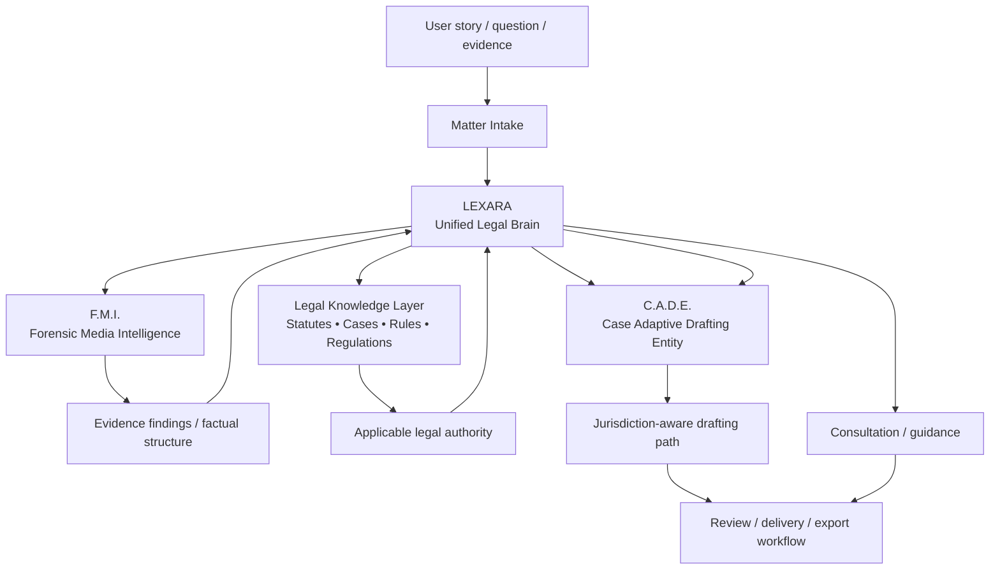

## Core LegalWhat Components

### LEXARA

**Legal Expert eXamination And Resource Advisor** — the unified legal brain and primary legal persona.

LEXARA is designed to interpret a matter, coordinate evidence analysis, retrieve applicable legal knowledge, determine when drafting is needed, and assemble the user-facing legal response.

### F.M.I.

**Forensic Media Intelligence** — LEXARA's evidence-analysis subsystem.

F.M.I. is intended to convert uploaded or supplied evidence into structured findings that can be consumed by legal reasoning and drafting layers.

### C.A.D.E.

**Case Adaptive Drafting Entity** — LEXARA's legal-document drafting subsystem.

C.A.D.E. is designed to produce context-aware and jurisdiction-aware legal work product from the factual and legal record assembled by LEXARA.

### Legal Knowledge Layer

The legal knowledge layer is the retrieval/research side of the legal brain: statutes, regulations, precedent, procedural authority, and other legal reference material.

## LegalWhat Authority Boundary

The legal brain is intentionally isolated from the crypto domain:

- no crypto exchange authority;
- no blockchain transaction authority;
- no T.H.W.A.R.T. execution authority;
- no market-execution decision authority.

---

# LEXARA Legal Brain

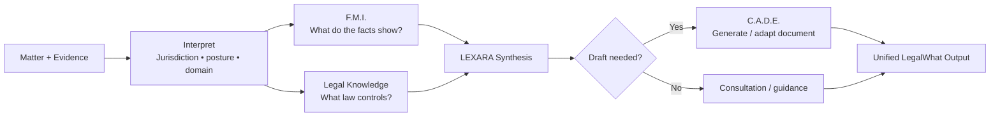

LEXARA's separation of evidence, law, inference, drafting, and user-facing synthesis is intended to make provenance and responsibility easier to inspect.

---

# T.H.W.A.R.T.

**T.H.W.A.R.T.** (**Trading Heuristic With Adaptive Reasoning & Tactics**) is the cryptocurrency market-intelligence and execution-architecture side of Bad-Blue.

It is a multi-topology architecture spanning:

- market evidence ingestion;
- opportunity discovery;
- candidate normalization;
- deterministic economics;
- fee and liquidity evidence;
- dynamic sizing;
- probabilistic/tail-risk analysis;
- technical and oracle evidence;
- CRYPTARA cognition;
- Aries horizon-aware execution intelligence;
- Nix-Gen cross-strategy opportunity allocation;
- BPS reduction and economic-transformation analysis;
- staged governance;
- execution readiness;
- bounded resource scheduling;
- venue/protocol execution paths;
- terminal settlement;
- realized-profit accounting;
- payout/retained-capital treasury handling;
- calibration and bounded adaptation.

## Canonical T.H.W.A.R.T. Flow

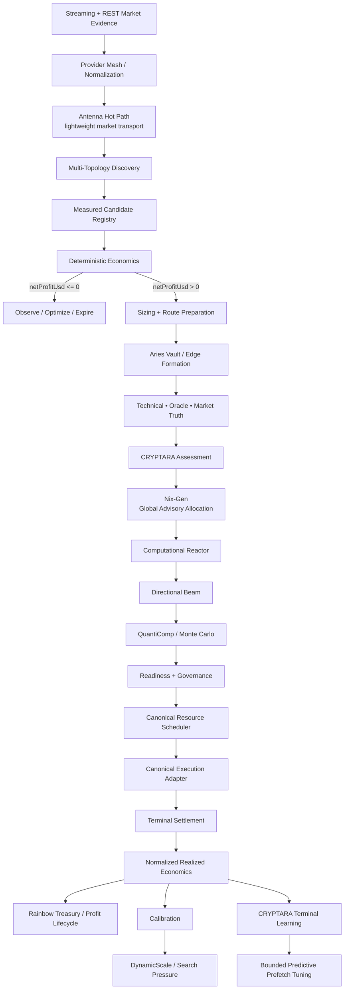

## Opportunity Topologies Represented in the Architecture

- `CEX_CEX`
- `DEX_ATOMIC`
- `ZERO_CAPITAL_ATOMIC`
- `CROSS_CHAIN`
- `MEMPOOL_BACKRUN`
- `MAKER_CEX`
- `FUNDING_ARBITRAGE`
- `LIQUIDATION` where the corresponding measured/execution adapter is wired
- prediction-market paths where the corresponding discovery/execution authority is wired

## Deterministic Economics First

The canonical economic rule is:

> **`netProfitUsd > 0` after all known verified costs.**

Known costs can include exchange fees, DEX fees, flash-loan premium, gas, sponsored-gas reimbursement/provider billing, relay/builder cost, slippage, market impact, bridge cost, funding/borrow cost, and route-specific repayment cost.

Probabilistic analysis, Aries advice, Nix-Gen ordering, BPS-reduction tactics, or CRYPTARA cognition is not intended to redefine a deterministically negative route as profitable.

## BPS Integrity

T.H.W.A.R.T. uses basis points for high-resolution economics:

- **1 BPS = 0.01%**
- **100 BPS = 1%**

Current hardening includes exact strictly-positive handling below one whole basis point so integer truncation does not become economic authority.

---

# T.H.W.A.R.T. Compute Stack

The compute subsystem is more than just QuantiComp. It contains a **Reactor → Battery → Router → Antenna/Beam → QuantiComp** pattern, with a separate database-pressure/COMP hierarchy for shared state.

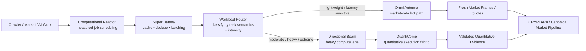

## Computational Reactor

Central measured compute and optimization engine for job scheduling, queue pressure, CPU/memory pressure, rate budgets, and expensive optimization work.

The Reactor is the broad scheduler/orchestrator; it is not itself the quantitative model. It feeds work into bounded compute paths and measures the pressure under which those paths are operating.

## Omni Antenna

The **Omni Antenna** is the lightweight compute/transport lane. Current routing semantics explicitly pin latency-sensitive market tasks—such as WebSocket pings, order-book frames, trade streams, freshness checks, and fee-resolution work—to Antenna so they are not accidentally sent through a heavier compute path.

The current implementation is a real in-process hot path for transport/parse/sequence/freshness acceleration. It executes ordered market-frame parsing and application inline where needed to preserve order, measures hot-path latency, and exposes no independent market-truth or execution authority.

A separate Antenna quality layer tracks provider observations such as hit rate, failure rate, latency, source age, recency, sample confidence, and confidence-adjusted quality. That quality can change attention/cadence; it does not independently authorize a trade.

## Directional Beam

The **Directional Beam** is the heavier compute lane for moderate, heavy, and extreme workloads. In current code it is a compatibility facade over QuantiComp-owned measured scheduling, deadlines, validation, resource telemetry, and execution of heavy computational work.

The Beam should therefore not be confused with the separate network broadcast path. Its job is to concentrate compute; the low-latency market/network path is documented below.

## Super Battery

The **Super Battery** is an efficiency layer placed before task routing. Implemented behavior includes:

- local caching;
- duplicate detection;
- batch collection/flush behavior;
- state-cache accounting;
- event-driven optimization hooks;
- interfaces for compression/decompression.

Some optimization interfaces remain implementation-dependent; the README does not treat every declared optimization as proven production savings.

## QuantiComp

**QuantiComp** is the heavy quantitative-computation authority for workloads such as Monte Carlo, tail-distribution analysis, scenario expansion, resource-aware optimization, and other statistically intensive operations.

> **Antenna stays light. Beam carries heavy work. Battery reduces waste. Reactor schedules. QuantiComp computes.**

---

# Market Proximity + Low-Latency Fabric

T.H.W.A.R.T. also contains a distinct **software-defined market-proximity fabric** whose purpose is to minimize avoidable application-side latency around market observation and transaction submission.

It is best understood as a **near-colocation software analogue**: the code attempts to keep critical market-data work extremely close to the live transport path, preserve warm connections, select region-compatible endpoints, avoid unnecessary compute hops, and fan an already-signed transaction outward across multiple submission paths. It does **not** claim physical rack-level exchange colocation unless the deployment itself actually provides it.

## Inbound Market Proximity — Antenna Hot Path

The inbound side uses direct exchange WebSocket connectivity and Antenna-owned hot-path processing for latency-sensitive work.

Current CEX streaming architecture includes:

- direct public WebSocket market-data connectivity for Coinbase, Kraken, and OKX;
- region-aligned OKX endpoint selection so observation can stay on the same regional surface as authenticated execution;
- primary and warm-standby connection lanes;
- standby frame intake, warmup serving, and handover telemetry;
- ordered in-process frame parsing and order-book application through the Omni Antenna hot path;
- sequence-gap, checksum/integrity, stale-reset, reconnect, heartbeat, and liveness handling;
- freshness validation without routing every frame through the heavier Beam/Quanti path.

## Outbound Market Proximity — Multipath Execution Broadcast

The outward execution side uses a separate low-latency submission path. A fully populated transaction is signed once, then the **same signed payload** can be broadcast concurrently through multiple routes, including configured private RPC, Flashbots RPC, and bloXroute RPC paths. First-success semantics allow the fastest successful path to win without creating competing payloads for one nonce.

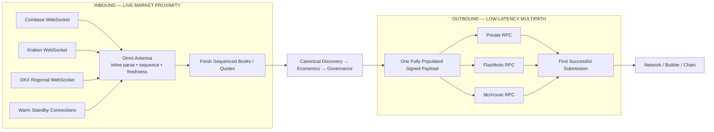

The design objective is to reduce avoidable latency at both edges of the system:

> **Listen as close to the market as the deployment permits; process the hot path without unnecessary detours; submit one canonical payload over several independent routes; accept the first real success.**

Physical distance, hosting region, provider infrastructure, venue architecture, internet routing, and account/provider capabilities still determine the absolute latency floor.

---

# QuantiComp — Expanded Quantitative Compute Architecture

The repository's QuantiComp system is substantially broader than a single Monte Carlo function. It is a bounded quantitative execution fabric with workload lanes, queue ordering, adaptive scheduling, backend selection, shared numeric state, concurrency control, validation, profiling, and interaction learning.

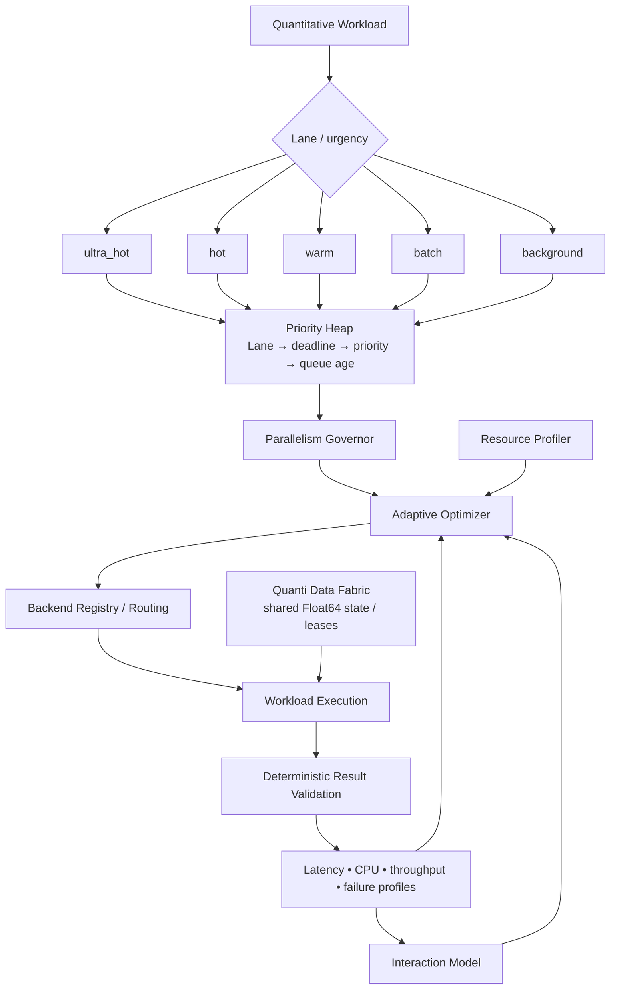

## QuantiComp Runtime

The runtime uses a priority heap and bounded concurrency. Current lane ranking is:

1. `ultra_hot`
2. `hot`
3. `warm`
4. `batch`
5. `background`

Within that structure the runtime also considers deadlines, explicit priority, queue age/order, cancellation, timeout, and result validation. Optional deduplication can make simultaneous callers follow one shared in-flight computation instead of duplicating heavy work.

## Adaptive Optimizer

The Quanti adaptive optimizer learns from measured workload behavior and can influence how future work is scheduled. It is intended to improve compute efficiency, not rewrite canonical trading economics.

## Backend Registry + Backend Runtime

QuantiComp has a backend registry and routing layer so computational work can be matched to available capabilities. Optional accelerated/heavier backends can be selected when appropriate, while deterministic inline/classical execution remains an important fallback path.

## Quanti Data Fabric

The **Quanti Data Fabric** provides shared numeric state and lease-oriented access to Float64-oriented data. It supports low-copy reuse of computational state and is also used by other resource-control systems to publish measured signals.

## Parallelism Governor

The parallelism governor limits and allocates concurrent quantitative work rather than allowing every subsystem to independently consume all compute capacity.

## Resource Profiler + Interaction Model

QuantiComp profiles execution latency, CPU use, throughput, failures, and related runtime signals. The interaction model records workload behavior so the adaptive layer can learn from measured interactions rather than rely only on static tuning.

## Validation Boundary

A Quanti workload is expected to provide both an execution function and a validation function. A completed calculation is not automatically accepted merely because it returned a value.

---

# CRYPTARA

**CRYPTARA** is T.H.W.A.R.T.'s adaptive market-intelligence and decision-support brain.

She is not the exchange, wallet, canonical scheduler, canonical executor, or settlement authority. Her role is to turn market evidence and realized outcomes into assessments, priorities, and bounded predictive preparation without silently acquiring transaction authority.

## Why CRYPTARA Exists

Raw price differences do not answer the questions an execution system needs answered:

- Is the evidence fresh and diverse enough to trust?
- Is a candidate economically real or a data artifact?
- Does current market structure resemble conditions that previously executed well or poorly?
- Is latency or slippage degrading the expected edge?
- Which information should be prefetched before a similar candidate arrives?
- Did a prediction match the terminal financial result?

---

# CRYPTARA Sovereign Cortex

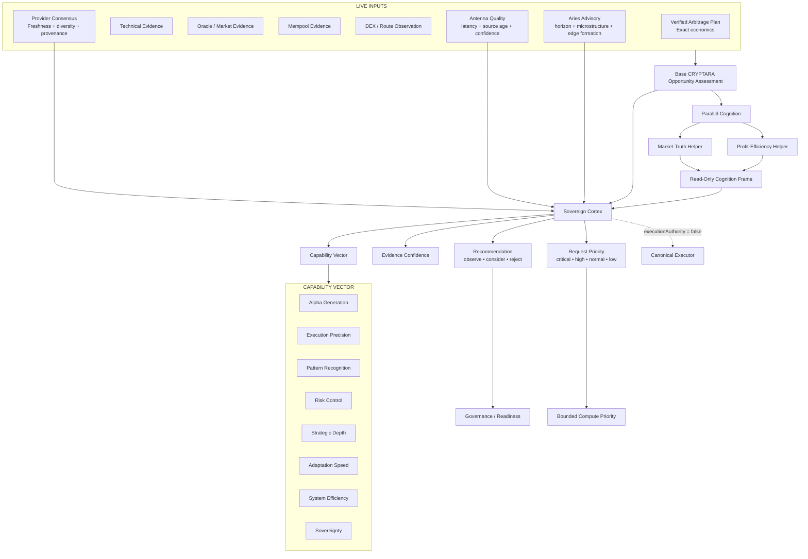

## CRYPTARA Decision Priority

Current decision-priority ordering is:

1. **Market truth**
2. **Profitability / BPS**
3. **Latency / slippage**
4. **Notional**
5. **Exploration**

## Parallel Cognition

The current CRYPTARA parallel helper lanes are bounded and advisory. They are designed for market-truth and profit-efficiency analysis without receiving canonical execution or trade-state write authority.

---

# How CRYPTARA Learns

CRYPTARA's rank/adaptive architecture is designed to rely on **terminal confirmed external settlement**, not simulation success or self-reported confidence.

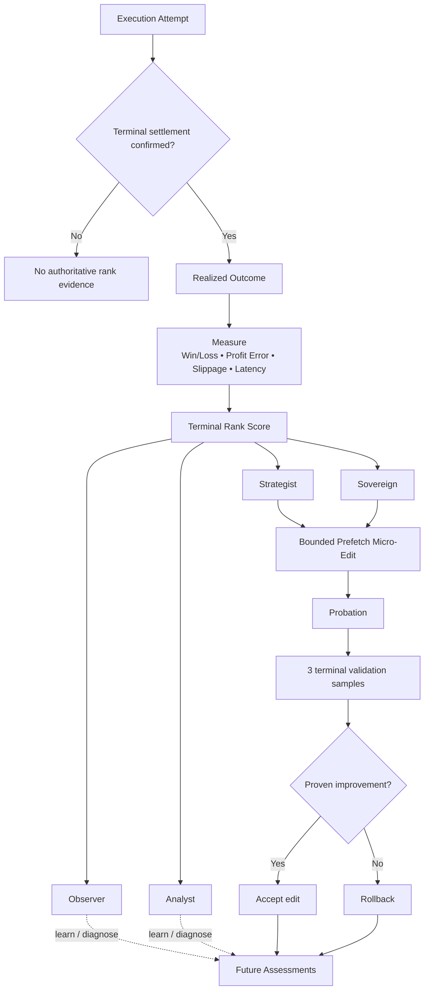

The persistent adaptive surface is intentionally narrow: current code scopes adaptive edits to predictive-prefetch aggression, with rank gates, probation, validation, and rollback behavior.

---

# Aries Vault + Edge Formation Reactor

**Aries Vault** is T.H.W.A.R.T.'s horizon-aware profitability and execution-intelligence layer. It sits between raw candidate economics and later governance/intelligence layers and asks a broader question than “is the spread positive right now?”

> **What is the horizon-adjusted, risk-adjusted, capacity-aware value of acting now, waiting, changing execution mode, changing size, changing route, or acquiring more information?**

Aries remains **advisory** and explicitly reports `executionAuthority: false`.

## Aries Vault Capability Surface

Implemented Aries primitives include:

- dynamic venue fee-tier projection;
- conservative fee-tier transition value;
- maker-vs-taker expected-cost modeling;
- continuous maker/taker crossover share;
- order-book walking for executable depth and impact;
- latency-decayed spread survival;
- adverse-selection and non-fill opportunity cost;
- topological/graph/temporal novelty proxies;
- probabilistic state-lattice evaluation;
- evolutionary Beam candidate ranking;
- marginal capital-efficiency scoring;
- robust route selection using scenario regret;
- counterfactual execution regret;
- expected value of information;
- liquidity-event-horizon sizing;
- fail-closed composite opportunity assessment.

## Aries Microstructure Layer

The repository also contains `aries-microstructure.ts`, which extends the execution-intelligence surface with measured microstructure concepts such as queue-depletion proxies, estimated queue-clear time, TTL fill probability, realized movement, bounded persistence/Hurst signals, cross-venue lead/lag evidence, and deterministic spread stress testing.

These are probability/quality inputs; they do not silently convert post-only execution into taker execution or bypass authenticated fee/inventory/governance constraints.

## Aries Edge Formation Reactor

The **Aries Edge Formation Reactor** changes the optimization target from merely reducing execution drag to increasing the rate at which T.H.W.A.R.T. discovers genuinely executable high-dislocation opportunities.

It does not create edge by assumption. It is designed to:

- search more expressive route topologies;
- direct scarce quote/compute resources toward likely edge formation;
- rank route-formation evidence;
- optimize measured size curves;
- coordinate with zero-capital route preselection;
- focus attention on CEX edge formation;
- attribute lost edge after the fact.

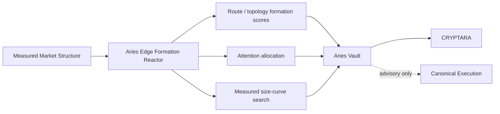

---

# Nix-Gen Global Opportunity Allocation

**Nix-Gen** is T.H.W.A.R.T.'s additive global opportunity-allocation layer. It compares already-authoritative profitable opportunities under shared scarce resources and improves scheduling/resource decisions without becoming a second economics, governance, execution, settlement, treasury, payout, or learning authority.

## Nix-Gen Implemented Architecture

The Nix-Gen subsystem includes:

- standardized cross-strategy bids backed by canonical measured economics;
- bounded exact branch-and-bound allocation;
- deterministic resource-aware fallback for larger candidate sets;
- continuous fingerprinted replanning and expiry invalidation;
- shared live priority across multiple strategy lanes;
- defer-not-reject behavior when a valid profitable opportunity temporarily loses a resource contest;
- strategy-finger/limb registry;
- read-only canonical resource projections;
- scarcity diagnostics;
- finite-difference marginal resource value;
- approximate Lagrangian dual-resource prices;
- robust uncertainty diagnostics where unknown stays unknown;
- terminal-settlement calibration;
- capital/inventory routing recommendations without treasury authority;
- optional QuantiComp heavy analysis with deterministic inline fallback.

## Nix-Gen Live Portfolio

Currently represented deterministic-profit lanes include:

- CEX arbitrage;
- maker-CEX / market-making;
- measured DEX atomic + liquidation;
- zero-capital atomic;
- deterministic same-asset cross-chain routes when their full value loop and costs are authoritative.

Funding-rate entry remains expected-value territory rather than deterministic dollar profit at entry; terminal authenticated outcomes can later become calibration evidence.

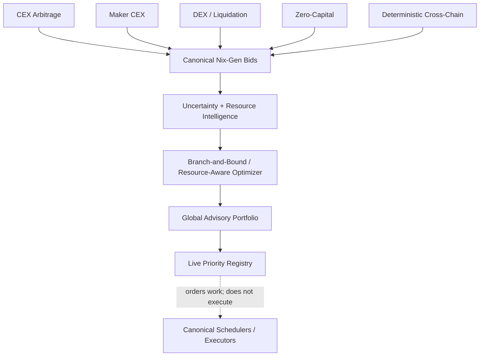

Nix-Gen does not read signer private keys, submit transactions, move treasury funds, or manufacture economics.

---

# BPS Reduction + Economic Transformation Stack

T.H.W.A.R.T. contains a dedicated family of systems for understanding **where BPS is being lost**, which losses are structurally reducible, which near-misses are transformable, and which tactics deserve compute/resources.

## BPS Reduction Super Engine

The **BPS Reduction Super Engine** tracks measured BPS attribution and builds adaptive plans around fields such as:

- gross BPS;
- exchange-fee BPS;
- slippage BPS;
- impact BPS;
- gas BPS;
- bridge BPS;
- latency-decay BPS;
- adverse-selection BPS;
- queue-loss BPS;
- canonical net BPS;
- realized net BPS.

It also models:

- venue consensus weights;
- learned edge half-life;
- expected edge decay;
- maker/taker execution-mode alternatives (`TT`, `MT`, `TM`, `MM`);
- residual-notional fractions;
- CVaR-oriented BPS budget inputs;
- dominant deficiency classes;
- event triggers;
- counterfactuals;
- tactic synergy bundles;
- resource-pressure multipliers;
- Monte Carlo search multipliers.

Its declared authority is adaptive BPS measurement/revalidation/scheduling—not execution—and it explicitly disallows synthetic economics.

## Hyperdynamic BPS Solution Engine

The repository includes a **Hyperdynamic BPS Solution Engine** used in route/candidate preparation to build BPS-focused plans around fixable economic deficiencies and route preselection.

## Fee-Surface Hyperdynamic Strategy Engine

The fee-surface strategy layer focuses specifically on how fee structures, execution mode, and route selection interact with profitability.

## Economic Transformation Engine

The **Economic Transformation Engine** examines near-break-even or deficient candidates and identifies whether the dominant cost driver is plausibly transformable through a different measured tactic rather than simply rejecting every near-miss forever.

## Research BPS Execution Tactics

The research-tactics layer represents candidate tactics such as evidence reacquisition, timing/latency changes, execution-mode changes, route alternatives, inventory effects, sizing changes, and settlement-friction reduction. These tactics remain subordinate to measured canonical economics.

## Adaptive Profitability Search + Topology Optimization

Separate optimization modules include adaptive profitability-search policy and adaptive topology optimization, allowing the system to spend attention on areas where measured evidence suggests a better chance of finding genuinely executable positive economics.

---

# Risk, Profit Ladder + Governance Stack

T.H.W.A.R.T.'s governance surface contains more than one generic “risk gate.” Distinct modules separate stage progression, scaling, sizing, drawdown/risk controls, treasury barriers, and execution safety.

## Profit Ladder

The **Profit Ladder** is a progressive profit-tier tracking/scaling system tied to terminal-confirmed evidence. StageManager remains the stage-progression authority.

The current implementation preserves the distinction between:

- roadmap/telemetry profit targets;
- terminal-confirmed realized profit;
- capital verification;
- drawdown constraints;
- later-tier historical performance requirements.

Tier-1/Stage-2 logic is specifically structured so arbitrary historical-performance requirements do not override a terminal-confirmed positive proof plus hard scale facts.

## Risk Modules

The repository also contains:

- **Kelly Criterion** sizing logic;
- **Progressive Position Sizing**;
- **Mandatory Risk Shield**;
- **Circuit Breaker**;
- adaptive profit operating envelope;
- governance stage management;
- treasury execution barriers;
- kill-switch / execution-safety controls;
- resource leases and quota boundaries.

Risk intelligence can reduce or block exposure where it owns that boundary; it does not get to fabricate profitability.

---

# Worker + Data-Plane Hierarchy

T.H.W.A.R.T. has a real worker hierarchy around compute/data pressure and hot/cold database access. It is not simply “the app talks to Supabase.”

## Database / COMP Worker Chain

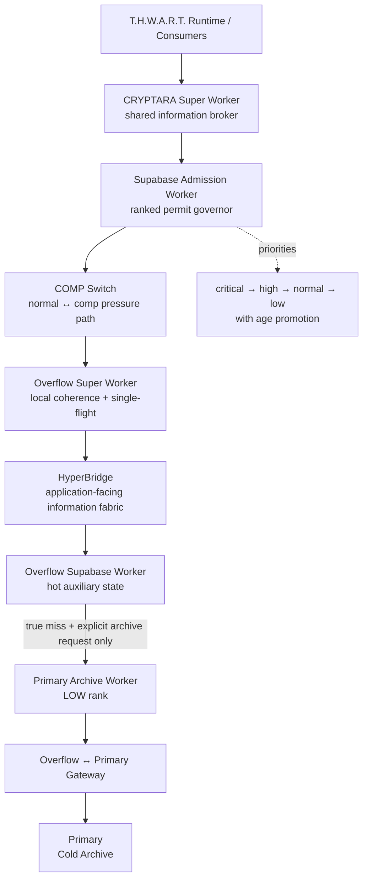

### 1. CRYPTARA Supabase Admission Worker

The admission worker is an autonomous pool custodian for ordinary T.H.W.A.R.T. database work. It:

- ranks work as `critical`, `high`, `normal`, or `low`;
- age-promotes queued work to reduce starvation;
- tracks acquisition/hold latency and pool waiters;
- contracts concurrency under measured pressure;
- restores permits progressively after healthy evidence;
- queues rather than silently dropping work;
- creates no second ordinary database pool;
- has no execution, governance, profitability, or write authority of its own.

### 2. COMP Switch

The COMP switch observes admission pressure and changes the resource path between `normal` and `comp` modes.

In COMP mode it can favor more reuse/batching and reduce background/observability chatter while preserving these invariants:

- work is not dropped;
- critical durability remains direct;
- execution truth does not become cacheable merely because pressure exists;
- the switch has resource-path authority only.

### 3. CRYPTARA Super Worker

The Super Worker is a shared information broker. It provides:

- bounded shared caching;
- single-flight origin loading;
- active information leases;
- per-consumer projection/allow-list support;
- information-class-specific freshness limits;
- retained-byte / retained-entry bounds;
- Overflow-assisted reuse in COMP mode;
- Quanti Data Fabric integration.

Information classes include execution truth, connector readiness, schema authority, market snapshots, resource snapshots, and background information. Execution truth remains zero-retention.

### 4. Overflow Super Worker

The **Overflow Super Worker** is the dedicated control worker for the Overflow lane. Its lookup order is:

> **shared local coherence → Overflow → Primary only after a genuine miss and only through the gateway**

It performs single-flight acquisition and shares successful results back into local coherence so duplicate consumers do not immediately repeat the same upstream request.

### 5. HyperBridge

The **CRYPTARA Supabase HyperBridge** is the application-facing information fabric for Overflow mode. Normal live reads enter the Overflow worker path; there is no direct application-to-Primary branch and no speculative Primary health race.

It also maintains bounded queues/directories for snapshot/event persistence, replica freshness, coalescing, and fallback handling.

### 6. Overflow Supabase Worker

The Overflow worker owns a small, separate, lazy pool for allowed hot/auxiliary workload classes such as cache, analytics, telemetry, observability, and background learning. It validates that the configured Overflow project is separate from Primary and bounds pool size, payload size, batching, retry/cooldown, schema checks, and cleanup.

### 7. Primary Archive Worker

The **Primary Archive Worker** is the sole T.H.W.A.R.T. path to Primary cold storage for explicit archival writes and historical lookups. Its declared communication path is:

> **worker → COMP rank → bridge gateway → Primary**

It always enters the shared admission queue at **LOW** rank, creates no new pool, and declares no hot-runtime, execution, financial, or governance authority.

## QuantiComp Work Hierarchy

The quantitative side has a separate urgency hierarchy:

| Quanti lane | Intended character |
|---|---|
| `ultra_hot` | Highest urgency quantitative work |
| `hot` | Hot-path quantitative work |
| `warm` | Important but less latency-critical work |
| `batch` | Throughput-oriented grouped work |
| `background` | Lowest-urgency analytical work |

That hierarchy is resolved alongside deadlines, explicit priority, concurrency, deduplication, cancellation, backend capability, and validation.

---

# Rainbow Treasury + Profit Bridge Architecture

The repo contains **multiple Rainbow components with different responsibilities**. They should not be collapsed into one vague “bridge.”

## What the Rainbow family actually contains

### Rainbow Profit Bridge

`RainbowProfitBridge` is a **wake-up client** for the durable treasury worker on Supabase Overflow. It is deliberately **not** an exchange-withdrawal signer or second payout authority.

Its job is to ask the single durable `thwart-terminal-sweeper` worker to process already-persisted treasury state sooner. If that immediate wake is unavailable, durable scheduled state remains pending for scheduler retry.

### Rainbow Profit Bridge Wiring

The runtime wiring listens to terminal-confirmed CRYPTARA execution evidence, records realized-profit allocation, records source metadata, starts observability/recipient confirmation, ensures the persistent treasury lifecycle, and wakes the durable worker.

The current runtime policy text records a **90% wallet / 10% retained-capital** split for new terminal profit events, with ETH/Ethereum as the payout target path. This describes the current code policy; actual payout still depends on settlement, venue capability, credentials, balances, network availability, and recipient confirmation.

### Terminal Treasury Lifecycle

The terminal treasury lifecycle manages durable treasury states such as:

- `RUNNING`;
- `TERMINATE_AND_SWEEP`;
- `SWEEPING`;
- `SWEPT`;
- `MANUAL_REVIEW`.

It also coordinates restart-drain behavior, payout destination resolution, worker-secret synchronization, treasury execution barriers, and finalized Ethereum recipient confirmation prerequisites.

### Rainbow Profit Source Ledger

The **Rainbow Profit Source Ledger** is a provenance/data bridge rather than the money mover. It records where terminal profit came from—execution source, strategy, symbol, chain, venue/route, assets, and transaction hash.

Its read behavior is **Overflow first**. Historical misses may use the low-priority Primary Archive Worker, and a successful archive hit is immediately rehydrated into Overflow so repeated runtime reads remain on the hot plane.

### Rainbow Maker Fuel Reserve

The **Rainbow Maker Fuel Reserve** tracks a dynamic payout reserve tied to maker-canary evidence so payout handling does not blindly consume resources needed for bounded maker verification/fuel behavior.

### Rainbow Profit Observability

Provides a consolidated view of the Rainbow profit lifecycle and destination/source state without becoming transfer authority.

### Payout Recipient Confirmation Observer

Observes whether the intended recipient and Ethereum-side confirmation evidence line up with the payout lifecycle. Observation does not itself move funds.

## Rainbow Schematic

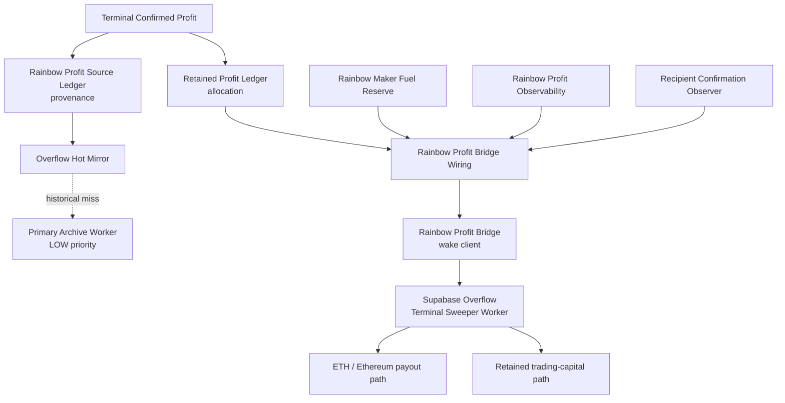

So the user's remembered distinction is real at the architectural level: there is a **Rainbow Overflow/control-plane path**, a **Rainbow profit/payout lifecycle**, and a **Rainbow source/provenance mirror** rather than only one generic bridge.

---

# Crawler Ecology

T.H.W.A.R.T. contains a distinctive crawler/swarm vocabulary. Several crawler modules exist in code but are currently outside the canonical production-agent export boundary. They are documented here as **implemented incorporation targets**: the objective is to bring useful behavior back through canonical evidence, economics, governance, scheduling, execution, settlement, and learning authorities rather than letting a crawler become a parallel trading authority.

## T.H.W.A.R.T. Swarm Family

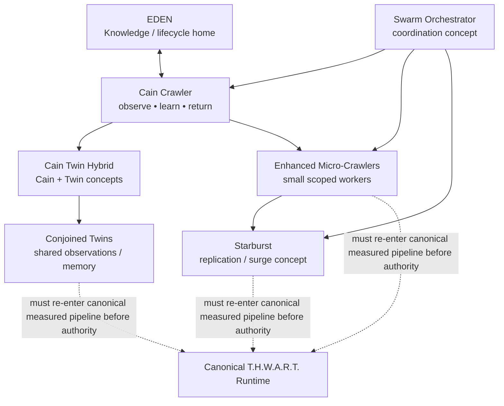

### Cain

Cain is the knowledge-bearing crawler archetype. Existing code includes a lifecycle with Genesis, active operation, Doomsday/Eden-return behavior, knowledge collection, replicas, and periodic/conditioned return to Eden.

### Cain Twin Hybrid

The Cain Twin Hybrid combines Cain/Eden concepts with twin-style shared processing and local optimizations such as memoization and predictive caching.

### Conjoined Twin Crawlers

A paired-crawler model with shared memory, shared observations, shared decisions, a joint task queue, synchronization state, and execution history.

### Enhanced Micro-Crawlers

Small worker/crawler modules intended for narrow monitoring or task scopes. Current compatibility code deliberately prevents them from fabricating profit or bypassing canonical discovery/execution; reintegration should preserve that truth discipline.

### Starburst

A replication/surge architecture for expanding crawler attention around high-value or high-priority conditions. Current compatibility behavior is quarantined from execution authority; the concept can be reincorporated as bounded discovery/observation capacity.

### Swarm Orchestrator

A coordination layer for Cain/micro/replication populations. Reintegration should make the canonical runtime its downstream authority rather than creating a second scheduler or executor.

## Six-Crawler Analytic Initiative

The repository also contains a separate six-crawler analytic/security initiative. These are not presented as T.H.W.A.R.T. trading executors; they are specialized analytic crawler archetypes that can potentially contribute observations or infrastructure under controlled boundaries.

| Crawler | Character | Repository role |
|---|---|---|
| **The Mirror** | 🪞 Reflection | Dual-state environment rendering and authorized analytical overlay |
| **The Key** | 🔑 Access map | Identity, authorization, trust, and policy-flow analysis |
| **The Chewer** | 🦫 Ingestion | High-throughput data digestion and normalization |
| **The Computational** | 🧮 Pattern engine | Correlation, structural analysis, and modeled failure-state reasoning |
| **USC — Unified Systems Conductor** | 🚀 Conductor | Coordination, routing, task arbitration, and information flow |
| **The Woo** | 🎭 Interface | Cooperative API/interface interaction and contextual preparation |

These crawler names are part of the project's architecture vocabulary; claims about throughput, latency, or production scale remain dependent on the configured runtime and deployment evidence.

---

# Eden

**Eden** is one of the most distinctive architectural concepts in the repository: a knowledge/lifecycle home for crawler experience, return cycles, and strategy memory.

The repo contains more than one generation of Eden/Genesis concepts. The useful architectural idea is a **protected knowledge garden** where raw outcomes can be recorded, interpreted by bounded intelligence, and later returned to crawler populations without giving the memory store independent trading authority.

## Eden — Knowledge Garden Schematic

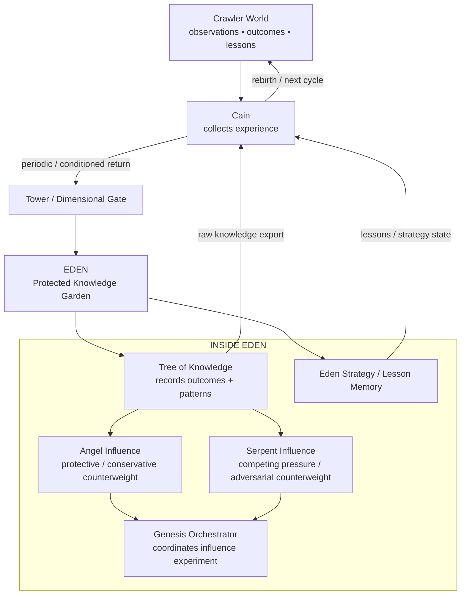

## Tree of Knowledge

The existing Genesis Tree implementation deliberately describes itself as **storage without consciousness or causal understanding**. It records outcomes, performs simple frequency/correlation analysis, and exposes accumulated knowledge for other components.

That limitation is useful: the Tree can be the **record of what happened** without pretending that storage itself knows why it happened.

## Angel Influence

The Angel layer is implemented as a conservative/protective counterweight in the Genesis influence model: patience, caution, longer-term thinking, ethics weighting, and stability are strengthened under receptive conditions.

Within the Eden metaphor, Angels are best understood as **guardians/counterweights**, not cryptographic security primitives. Hard access protection belongs to the Tower/Gate and authority boundaries.

## Serpent Influence

The Serpent layer is the opposing/adversarial pressure model. It gives the Genesis environment a way to test competing directional pressures rather than assuming learning happens under a single favorable influence.

## Cain's Return to Eden

Cain's existing lifecycle code explicitly checks whether a Cain should return to Eden, performs an Eden-return phase to share knowledge, and then continues into another cycle. This is one of the clearest repo-backed parts of the Eden story.

> **Cain goes out, experiences the world, comes home to Eden, contributes what it learned, receives accumulated knowledge, and goes back out again.**

---

# Eden Protection Envelope — Double Bubble / One-Way Iron Mirror

**“Double Bubble / One-Way Iron Mirror” is design shorthand**, not the name of one existing class. It is a faithful conceptual description assembled from several mechanisms that *do* exist in the repository.

The strongest direct analogue is the Tower of Babel code:

- it explicitly defines a **Dimensional Gate between outer and inner bubbles**;
- it splits meaning into literal, symbolic, and structural layers;
- part of the transformation is explicitly described as **one-way for security**;
- only the **Tree** is intended to recombine the full meaning;
- Cain receives limited dimensional access;
- Angels receive partial access;
- ordinary crawlers receive minimal access;
- outsiders/unknown entities receive no dimensional access;
- unauthorized-viewer scrambling behavior is represented in the Tower design.

The repository's separate **Mirror** crawler also provides a useful visual metaphor: dual-state environment rendering with an analytical overlay intended for authorized observers.

Together, those ideas map naturally to the Eden protection model below.

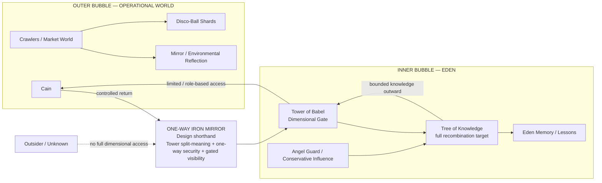

### Why “one-way mirror” fits

From outside Eden, components can contribute observations, lessons, and split representations without automatically gaining the ability to reconstruct the entire protected knowledge state. From inside Eden, the Tree and bounded trusted roles can interpret more of the accumulated picture.

### Why “double bubble” fits

The Tower already models an **outer-bubble connection**, an **inner-bubble connection**, and a dimensional gate rooted between them. The phrase is therefore not invented out of thin air; it is a visual shorthand for a boundary the code already describes.

### Why “iron” remains shorthand

“Iron” represents the architectural objective that the boundary should be difficult to bypass: explicit role access, split meaning, one-way transformation behavior, bounded recombination, and no implicit authority escalation. The README does **not** claim a literal `IronMirror` security class exists today.

---

# Disco-Ball Mirroring + Light Communication

Two different ideas in the repository fit together visually but should not be confused:

1. **Disco-Ball Environmental Mirroring** is an observation model.
2. **Light Communication** is a coordination/signaling model.

## Disco-Ball Environmental Mirror

The Disco-Ball code models each crawler as a collection of reflective environmental shards. Shard categories include:

- liquidity;
- volume;
- volatility;
- mempool;
- order book;
- gas market;
- latency pockets.

The purpose is to assemble many small reflections into an environmental snapshot rather than relying on one monolithic observation.

## Light Communication

The Light Communication subsystem models low-bandwidth crawler coordination using typed channels and compressed numeric signals for:

- alerts;
- discoveries;
- coordination;
- emergencies;
- heartbeats.

It includes frequency-style channels, subscriber sets, TTLs, bandwidth limits, and compact bit-packed signal data.

## Combined Visual Model

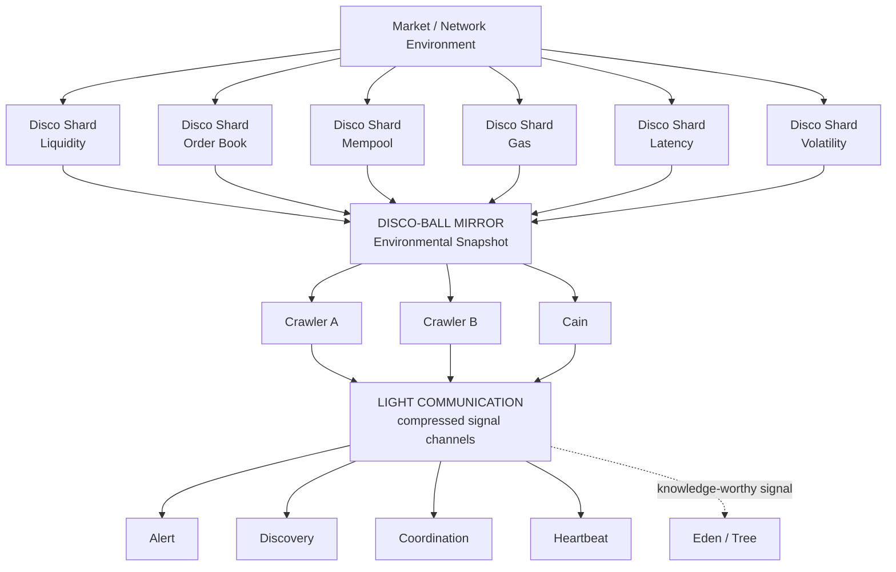

> **The Disco Ball reflects the world. Light Communication lets the crawlers whisper about what they saw. Eden remembers what matters.**

---

# Zero-Initial-Capital Architecture

`ZERO_CAPITAL_ATOMIC` describes an execution topology where trade notional and/or transaction resources can be obtained within the execution path rather than requiring the operator to pre-position the full trading notional.

It does **not** mean execution has no economic cost.

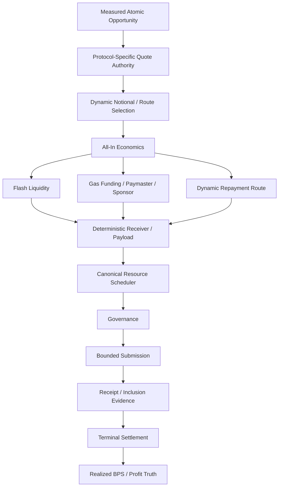

Current architecture contains flash-liquidity, deterministic receiver, sponsorship/paymaster, protocol-specific quote, repayment, builder-window, receipt, balance-verification, and realized-cost concepts. Availability of a specific route remains dependent on the actual provider, chain, account, deployed contracts, credentials, balances, and runtime evidence required by that route.

## Capital-Free Namespace: Canonical vs Heritage

The `capital-free/` namespace deliberately separates the current zero-capital boundary from historical experiments.

### Canonical / current boundary

- measured Alchemy telemetry;
- governed zero-capital execution through the canonical zero-capital engine;
- verified settlement before learning.

### Heritage / incorporation-target modules

The repository still contains earlier capital-free concepts such as:

- Barter System;
- Partnership Formation;
- Eden Placement Strategy;
- autonomous optimizer;
- synthetic protocol orchestration;
- historical Starburst scaling concepts;
- dynamic gas-funding / gas-acquisition modules;
- NexGen protocol-layer experiments.

Those modules remain valuable architecture/IP references, but the namespace barrel intentionally does not export the historical synthetic systems as current production authority.

---

# Prediction-Market Architecture

T.H.W.A.R.T. contains a substantial event/prediction-market architecture rather than only a small Kalshi data adapter.

## Kalshi

Kalshi-related architecture includes event-market discovery/evidence, fee/BPS integration, execution lifecycle support, resource leasing, persistence, probability calibration, and settlement-oriented state.

## Polymarket

The repository contains distinct Polymarket authorities for:

- authenticated account/capability evidence;
- geographic-access evidence;
- event-venue discovery;
- signed order submission authority;
- durable order-intent recovery;
- system-owned cash accounting;
- terminal settlement/redemption recovery;
- cross-venue event lifecycle support.

## Cross-Venue Event Arbitrage

The event abstraction is designed to support semantically matched opportunities across venues such as Kalshi and Polymarket, with durable lifecycle state and settlement truth separated from initial discovery.

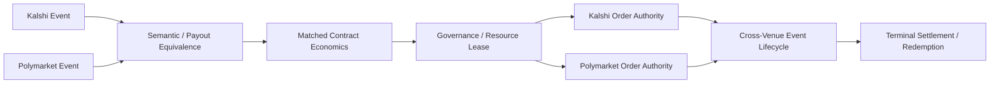

Actual execution remains conditional on account capability, venue rules, geography, credentials, balances, market state, and the corresponding canonical admission path.

---

# CEX, Cross-Chain + MEV Execution Surfaces

The repository contains several execution-support families that deserve to be visible even when they remain subordinate to the canonical scheduler and settlement model.

## CEX Intelligence + Execution

Representative CEX modules include:

- order-book streaming;
- authenticated fee resolution;
- fee-recovery authority;
- CEX four-mode matrix;
- cross-impact advisory;
- order-control health;
- economic-barrier policy;
- edge attention;
- observation-candidate formation;
- residual replan;
- centralized-exchange executor;
- CEX inventory ledger;
- order-mode policy;
- order serialization;
- private WebSocket order transport.

## Cross-Chain + Bridge Stack

Representative cross-chain/bridge modules include:

- Across bridge provider;
- approval-gas evidence;
- terminal-amount evidence;
- network health;
- gas oracle;
- balance monitoring;
- route optimization;
- position recommendation;
- withdraw/deposit support;
- Across bridge executor;
- pre-broadcast durability;
- deterministic cross-chain opportunity generation and route economics.

## Atomic Liquidation

The execution directory also contains an Aave liquidation atomic executor. Its presence documents an atomic liquidation execution surface; admission still depends on the measured opportunity, resource, governance, and settlement boundaries around it.

## MEV / Builder Surfaces

The repository contains Flashbots/builder-oriented and mempool-related modules, including bounded builder submission and backrun-oriented paths. Some older MEV files retain heritage names from earlier architecture generations. These should be read as implementation/compatibility surfaces unless their specific canonical execution path and settlement proof are currently wired.

---

# Hot-State / Overflow Architecture

Recent hardening routes designated hot runtime state to the dedicated **Overflow runtime database** rather than treating the cold/archive-oriented database as the normal hot-query authority.

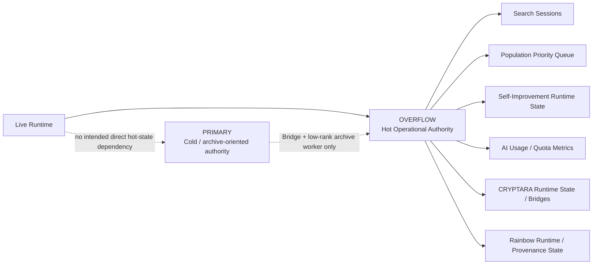

The worker hierarchy above makes this separation operational: normal live reads do not directly race or probe Primary, while explicit historical misses can route through the low-priority archive worker and gateway.

---

# Learning + Evolution Architecture

T.H.W.A.R.T. has multiple learning/evolution modules beyond CRYPTARA's rank logic.

## Learning Layer

The `learning/` namespace includes:

- **Deep Learning Store** — persistent/structured learning state;
- **Execution Outcome** normalization;
- **Instant Learning Engine**;
- **Reinforcement Learning Bidder**;
- **Settlement Profit Calibrator**;
- **Terminal Feedback Identity**;
- Supabase compatibility support for learning persistence.

## Evolution Layer

The `evolution/` namespace includes:

- **Hyper Evolution Engine**;
- **Swarm Intelligence**;
- **Measured Execution Feedback**;
- **Frontier Research Integration**;
- **Terminal Network Funding Learning**;
- **Zero-Capital Funding Lifecycle Observer**.

The authority rule remains the same: evolutionary or learning code must ultimately learn from measured/terminal evidence if its output is going to influence live financial behavior.

---

# Heritage + Compatibility Architecture

Bad-Blue deliberately retains several earlier systems as **heritage compatibility surfaces**. That does not make them worthless or “dead”; it means their interfaces, concepts, and history remain in the codebase while canonical authority has moved elsewhere.

## Crypto Faucet — Heritage Compatibility Surface

`AutonomousCryptoFaucet` remains exported as a canonical lifecycle-compatibility facade. Earlier versions included their own trading state machine, targets, stealth heuristics, and open/close decisions. Those independent authorities are now intentionally removed.

The current facade delegates truth to:

- canonical runtime wiring;
- canonical opportunity state;
- StageManager;
- canonical execution scheduler;
- terminal settlement / realized-profit evidence.

It can report state/health/lifecycle compatibility without becoming a second trading authority.

## Higher-Order Faucet Mesh

`HigherOrderFaucetMesh` is preserved as a historical multi-node strategy/learning abstraction. The old synthetic Monte Carlo strategy generator and learning loop are intentionally disabled and throw rather than fabricate market intelligence.

That makes the Faucet Mesh a good example of **preserved architecture with quarantined authority**: the idea remains documented in code, but current measured Hyper Monte Carlo / QuantiComp owns the corresponding quantitative truth.

## Faucet Gateway

The root-level **Faucet Gateway** is a separate outward-facing transaction/policy interface originating in the broader 4JI architecture. It includes token-bucket rate limiting, policy controls, audit logging, transaction state, signer/approval abstractions, and action routing. It should not be confused with the T.H.W.A.R.T. autonomous-faucet compatibility facade.

## Heritage Capital-Free Systems

Barter, partnership, Eden-placement, Starburst-scaling, autonomous-optimizer, and synthetic protocol-orchestration modules remain present as earlier capital-free architecture. Canonical zero-capital execution now lives through the measured zero-capital engine and governed adapters.

## Heritage Crawler / Swarm Systems

Enhanced Micro-Crawler, Starburst replication, Swarm Orchestrator, Cain/Twin variants, and related modules are preserved as incorporation targets or compatibility systems. Useful behavior can be reincorporated through the canonical pipeline without restoring parallel profit/execution authority.

## Heritage MEV / Optimizer Names

Some older MEV/optimizer modules—including earlier Flashbots, validator-tipping/bribing-named files, Divine Engine concepts, and synthetic optimization experiments—remain part of the repository's engineering history. Their current authority must be determined from actual canonical wiring, not from filename alone.

---

# Recent Hardening and Optimization

The September 8, 2026 hardening sequence on `develop` includes work in areas such as:

| Area | Hardening / optimization represented in current code |
|---|---|
| **Live market evidence** | Concurrent provider mesh and shared normalization across multiple live-price paths; route/request-local cooldown behavior; partial-result cache safety |
| **Provider resilience** | Failures isolated so one degraded provider does not automatically poison unrelated healthy routes |
| **Exact economics** | Strictly positive sub-one-BPS economics remain representable without whole-BPS integer truncation |
| **Candidate integrity** | Preparation guarded from mutating canonical opportunity economics; rejected preparation isolated from later attempts |
| **Zero-capital discovery** | Ethereum zero-capital route work restored without making Ethereum the mandatory cold-start dependency |
| **Protocol coverage** | Route-local PancakeSwap V2/BSC and Trader Joe V1/Avalanche adapter work, with quote/router alignment hardening |
| **Repayment routing** | Repayment selection expanded beyond a single direct-WETH assumption |
| **Builder submission** | Bounded multi-block validity rather than next-block-only assumptions |
| **Gas sponsorship** | Hosted paymaster/sponsorship paths can satisfy zero-upfront-gas conditions while keeping provider-fronted gas visible in realized economics |
| **Execution truth** | Execution, settlement, reconciliation, payout, and exception states separated so telemetry failure does not erase on-chain truth |
| **Kalshi evidence** | Event-fee, cache/single-flight, request-local backoff, and exact-positive admission hardening |
| **Overflow runtime** | Additional hot runtime state moved to Overflow with schema/verifier coverage |
| **Worker hierarchy** | Ranked database admission, COMP pressure path, Super Worker sharing, Overflow-first HyperBridge, low-rank Primary archive path |
| **Market proximity** | Direct streaming hot path, warm standby CEX connections, region-aligned market endpoints, and identical-payload multipath submission |
| **Runtime isolation** | Optional/degraded components can fail or retry without automatically gaining global shutdown authority |
| **Cost governance** | Paid pending-stream behavior remains explicit opt-in rather than activating solely because a key exists |
| **BPS optimization** | Super Engine / economic-transformation / near-miss reassessment wiring tied to measured attribution rather than synthetic credit |
| **Global allocation** | Nix-Gen resource-aware portfolio ordering while preserving canonical execution/settlement authority |
| **Aries intelligence** | Horizon-aware microstructure, route formation, capacity, regret, and value-of-information advisory surfaces |

---

# Canonical Runtime and Authority Model

T.H.W.A.R.T. separates responsibilities that are easy to accidentally merge.

## Discovery Authority

Finds and normalizes measured opportunities. Discovery may be broad, but discovery alone does not authorize execution.

## Candidate Registry

Provides a common lifecycle for measured opportunities and tracks enrichment, missing information, blocking reasons, expiry, and topology.

## Deterministic Economics Authority

Calculates known costs and establishes whether the candidate remains strictly positive after verified costs.

## Aries / Horizon Intelligence

Evaluates horizon, microstructure, route formation, capacity, regret, and value-of-information. Advisory only.

## CRYPTARA / Intelligence Authority

Assesses market context, evidence confidence, pattern quality, and learned execution performance. It can prioritize or downgrade without owning canonical transaction submission.

## Nix-Gen Allocation Authority

Orders already-valid opportunities under scarce resources. It does not create eligibility, economics, leases, execution, or settlement.

## Governance Authority

Controls progression from analysis toward execution.

## Resource / Nonce / Rate Authority

Coordinates scarce runtime resources rather than allowing competing executors to guess them independently.

## Canonical Executor

Owns the actual venue/protocol submission path for execution-authorized work.

## Terminal Settlement Authority

Determines what actually happened financially from receipts, fills, balances, fees, gas, repayment, and other terminal evidence.

## Treasury / Payout Authority

Durable payout/retained-capital handling is separated from execution and settlement. Rainbow wake/observability components do not become independent withdrawal signers.

## Learning Authority

Consumes normalized terminal truth. Simulation, submission, and partial state are not intended to masquerade as realized learning evidence.

---

# Market Evidence and Provider Mesh

T.H.W.A.R.T. treats provider availability as a routing problem rather than a single-provider dependency.

Key design properties represented in the architecture include:

- streaming-first ingestion where available;
- REST fallback/augmentation;
- shared symbol/value normalization;
- request-local and route-local cooldowns;
- in-flight deduplication/single-flight behavior;
- partial-result cache safety;
- source provenance;
- freshness tracking;
- provider consensus;
- provider health/circuit-breaker behavior;
- fail-closed handling when required execution truth remains unknown.

---

# Monte Carlo and QuantiComp

Monte Carlo is a **robustness and uncertainty layer**, not an alternative accounting system.

> **Known costs → deterministic positive economics → probabilistic analysis → governance/readiness → execution**

QuantiComp/Monte Carlo can be used for concepts such as probability of profitable execution, confidence intervals, partial-fill risk, tail outcomes, Value at Risk, Expected Shortfall, execution horizon, calibration residuals, and adaptive simulation depth.

Simulation is not realized financial truth.

QuantiComp additionally provides the workload scheduler, lane hierarchy, adaptive optimizer, backend registry, Data Fabric, parallelism governor, profiling, validation, and interaction-model infrastructure described earlier.

---

# Terminal Settlement and Realized Truth

Terminal settlement is where predictions are replaced by measured facts.

Authoritative evidence can include transaction receipts, order/fill status, pre/post balances, flash-loan repayment, gas consumed or economically owed, protocol/exchange fees, realized output, realized slippage, realized net profit, and terminal failure/revert state.

> **Submitted is not settled. Predicted is not realized. Simulated is not settled.**

---

# Extended Intelligence Systems

Bad-Blue contains a broader research and orchestration ecosystem beyond the two primary product surfaces.

<strong>Show extended architecture vocabulary</strong>

| Name | Plain-English engineering role / intent |
|---|---|
| **4JI** | Top-level multi-domain orchestration/policy concept |
| **PANTHEON** | Specialized crawler/extraction orchestration platform |
| **Razors** | Narrow-purpose PANTHEON extraction modules |
| **People Finder** | Public-record research, entity resolution, relationship mapping, report assembly |
| **GeoConsole** | Geospatial evidence fusion, reconstruction, visualization, probabilistic path analysis |
| **TSHPE** | Multi-source positioning, smoothing, confidence-estimation engine |
| **CRYPTARA** | Adaptive market-intelligence and terminal-feedback cognition |
| **Aries Vault** | Horizon-aware execution intelligence: microstructure, capacity, regret, robust routing, value of information |
| **Aries Edge Formation Reactor** | Route/topology/attention system for increasing discovery of measured executable edge |
| **Nix-Gen** | Global resource-aware opportunity allocation and advisory scheduling layer |
| **BPS Reduction Super Engine** | Measured BPS attribution, decay, tactic, deficiency and revalidation/scheduling intelligence |
| **Economic Transformation Engine** | Near-miss cost-driver analysis and transformability advice |
| **Profit Ladder** | Terminal-evidence-linked scale/profit tier tracking |
| **Rainbow Profit Bridge** | Overflow treasury-worker wake client; not a withdrawal signer |
| **Rainbow Source Ledger** | Profit-source provenance mirror across Overflow / cold archive |
| **Rainbow Maker Fuel Reserve** | Dynamic reserve around maker-canary fuel requirements |
| **Cain** | Knowledge-bearing crawler/lifecycle archetype |
| **Reaper** | Retirement, quarantine, cleanup, unhealthy-agent control concept |
| **Eden** | Protected crawler knowledge/lifecycle home |
| **GENESIS** | Controlled influence/strategy-evolution laboratory |
| **Tree of Knowledge** | Outcome/pattern storage and export layer |
| **Angel Influence** | Conservative/protective counterweight in Genesis experiments |
| **Serpent Influence** | Opposing/adversarial influence pressure in Genesis experiments |
| **Tower of Babel** | Split-meaning, role-access, outer/inner-bubble gate architecture |
| **Light Language** | Experimental machine vocabulary/translation abstraction |
| **Disco-Ball Environmental Mirror** | Multi-shard environment/state reflection model |
| **Light Communication** | Low-bandwidth compressed crawler signaling system |
| **Googolplex Neural Lattice** | Experimental sparse/procedural representation architecture |
| **3D Geiger** | Provider pressure/health/rate-limit scoring vocabulary |
| **Evolution Lock / Geiger** | Controlled adaptation permission and adaptation-risk gating |
| **Faucet** | Preserved T.H.W.A.R.T. lifecycle compatibility facade backed by canonical runtime truth |
| **Faucet Mesh** | Heritage higher-order multi-node strategy/learning architecture with synthetic authority quarantined |
| **Faucet Gateway** | Broader 4JI outward-facing policy/rate-limit/audit transaction interface |
| **Market Proximity Fabric** | Direct streaming hot path plus identical-payload multipath submission designed to minimize avoidable application-side latency |
| **Supabase Admission Worker** | Ranked critical/high/normal/low DB resource governor |
| **COMP Switch** | Pressure-responsive normal/comp resource-path selector |
| **CRYPTARA Super Worker** | Shared information broker, single-flight, leases, bounded reuse |
| **Overflow Super Worker** | Overflow-first transport/coherence worker with gateway-only archive fallback |
| **HyperBridge** | Application-facing Overflow information fabric |
| **Primary Archive Worker** | Low-rank, gateway-only T.H.W.A.R.T. cold-archive access path |

These names are project vocabulary. Their engineering value depends on the responsibilities and verified wiring behind the metaphor.

---

# Engineering Principles

## 1. One Authority Per Critical Responsibility

Discovery, economics, nonce allocation, scheduling, execution, settlement, treasury, and learning should not each have multiple competing production authorities.

## 2. Deterministic Before Probabilistic

Known economics are calculated before stochastic analysis is allowed to influence a candidate.

## 3. Observation Is Not Execution

A crawler, oracle, indicator, mempool feed, ranking model, CRYPTARA helper, Aries model, Nix-Gen portfolio, Disco-Ball shard, or Eden memory item can provide evidence without receiving transaction authority.

## 4. Capability Is Not Permission

A configured wallet, key, RPC, venue account, provider, or receiver proves potential capability—not current authorization or availability.

## 5. Submission Is Not Settlement

A transaction hash, accepted bundle, or submitted order is an intermediate state.

## 6. Learning Requires Terminal Truth

Realized learning is downstream of terminal settlement.

## 7. Fail Closed on Missing Critical Facts

Unknown fees, liquidity, gas economics, repayment conditions, permissions, balances, or settlement state remain unknown until proven.

## 8. Preserve Proven Capability

Repairs should remove root causes without casually regressing previously verified capability elsewhere.

## 9. Route-Local Failure Isolation

A degraded provider, chain, venue, or optional component should not unnecessarily halt unrelated healthy routes.

## 10. Domain Isolation

Legal intelligence and market-execution intelligence can reuse infrastructure without inheriting each other's authority.

## 11. Metaphor Must Map to Mechanism

Names such as Eden, Tower, Angel, Disco Ball, Antenna, Beam, Battery, Cain, Aries, Rainbow, and Nix-Gen are useful when the README also explains the real data, control, security, compute, treasury, or lifecycle responsibility underneath them.

## 12. Compatibility Must Not Masquerade as Authority

Heritage systems may remain valuable interfaces, experiments, and IP. Their preserved presence must not silently restore retired parallel economics, execution, risk, or learning authority.

---

# Repository Guide

Major repository areas include:

- **`client/`** — React/TypeScript application surfaces.
- **`server/`** — API, orchestration, providers, persistence, workers, and backend services.
- **`server/services/lexara/`** — canonical LEXARA service entry points. **`server/services/alexara/`** is retained only as a compatibility implementation surface while legacy imports are retired.
- **`server/services/cryptara/`** — CRYPTARA market-surveillance/assessment intelligence.
- **`server/services/quantiComp/`** — QuantiComp runtime, adaptive optimizer, backend registry/routing, Data Fabric, parallelism governor, profiler, interaction model.
- **`server/services/cryptocrawl/`** — T.H.W.A.R.T. discovery, economics, validation, governance, execution, settlement, zero-capital, runtime, scaling, crawler research, Eden, Babel, and integration systems.
- **`server/services/cryptocrawl/intelligence/`** — Aries Vault, Aries microstructure/edge formation, CEX fee/order-book intelligence, canonical opportunity/intelligence state, prediction-market authority surfaces, provider-quality intelligence.
- **`server/services/cryptocrawl/optimization/`** — BPS Super Engine, economic transformation, hyperdynamic BPS/fee surfaces, Nix-Gen, adaptive profitability/topology optimization, execution-path selection.
- **`server/services/cryptocrawl/optimization/nix-gen/`** — Nix-Gen bids, global optimizer, resource pricing, replanning, portfolio view, live priority, Quanti integration.
- **`server/services/cryptocrawl/compensation/`** — Rainbow profit bridge/source/observability/fuel reserve, retained-profit accounting, payout scheduler/confirmation, compensation modules.
- **`server/services/cryptocrawl/integration/`** — canonical wiring, CRYPTARA Supabase admission/COMP/Super Worker/Overflow/HyperBridge hierarchy, BPS/Aries/CRYPTARA integrations.
- **`server/services/cryptocrawl/runtime/`** — core runtime, treasury lifecycle, Rainbow wiring, hot-state schemas, positive-profit capture, low-latency execution wiring, and runtime authority wiring.
- **`server/services/cryptocrawl/governance/`** — StageManager, Profit Ladder, Composer interface, risk/governance controls, operating envelope, resource/gating policy.
- **`server/services/cryptocrawl/risk/`** — circuit breaker, Kelly criterion, mandatory risk shield, progressive position sizing.
- **`server/services/cryptocrawl/learning/`** — deep/instant learning, execution outcome, RL bidder, terminal identity, settlement-profit calibration.
- **`server/services/cryptocrawl/evolution/`** — Hyper Evolution, swarm intelligence, measured feedback, funding lifecycle learning/observation.
- **`server/services/cryptocrawl/faucet/`** — Faucet lifecycle compatibility facade plus historical facet/mesh source.
- **`server/services/cryptocrawl/capital-free/`** — canonical zero-capital boundary, Alchemy telemetry, and heritage capital-free architecture.
- **`server/services/cryptocrawl/execution/`** — canonical scheduler/executors, CEX/private transport, low-latency multipath execution, cross-chain, liquidations, builder/zero-capital, event-market execution and recovery.
- **`server/services/cryptocrawl/discovery/`** — CEX/DEX/cross-chain/funding/event opportunity formation, graphless DEX, zero-capital route generation/preselection.
- **`server/services/cryptocrawl/bridge/`** — Across bridge/evidence, balance/network/gas/route helpers.
- **`server/services/cryptocrawl/mev/`** — MEV/builder-oriented modules and heritage surfaces.
- **`server/services/cryptocrawl/agents/`** — Cain/Twin/Micro/Starburst/Swarm crawler modules and compatibility boundaries.
- **`server/services/cryptocrawl/eden/`** — Eden lesson/state/strategy memory architecture.
- **`server/services/cryptocrawl/babel/`** — Tower of Babel, crawler fingerprint, Cain reasoning, Light Language, related experimental architecture.
- **`server/services/genesis/`** — Original Sin, Serpent, Angel, Tree of Knowledge, and Genesis orchestration experiments.
- **`server/services/computationalBeam/`** — workload router, Omni Antenna, Directional Beam, Super Battery, and related compute-routing infrastructure.
- **`server/reactor/`** — Computational Reactor implementation and metrics.
- **`server/services/crawlers/`** — Six-Crawler Initiative and other analytic crawler systems.
- **`server/faucetGateway.ts`** — broader 4JI Faucet Gateway interface.
- **`server/migrations/overflow/`** — Overflow hot-state schema evolution.
- **`scripts/cryptocrawl/`** — structural/runtime invariant verifiers for T.H.W.A.R.T. hardening, Nix-Gen, Aries, Rainbow, BPS, workers, prediction markets, treasury, market latency, and authority boundaries.
- **database / migration modules** — persistence schema and state evolution.
- **tests / verifier assets** — regression, integration, authority, economic, and runtime validation.

---

# Deployment and Verification Philosophy

A successful build is necessary but not sufficient.

Production verification should establish, as applicable:

- compile/type correctness;
- schema/migration readiness;
- provider health;
- database authority/routing;
- worker/COMP/Overflow routing health;
- discovery heartbeat;
- evidence freshness;
- candidate lifecycle health;
- deterministic economics;
- BPS attribution/optimization integrity;
- Aries/Nix advisory integrity;
- governance state;
- resource/nonce/rate readiness;
- inbound market-data latency and connection health;
- outbound submission-path readiness;
- execution capability;
- receipt/fill observation;
- terminal settlement;
- realized accounting;
- Rainbow payout/reconciliation state;
- calibration/learning integrity;
- regression/invariant verifier results.

---

# Production / Handoff Perspective

Bad-Blue is best understood as a **large active codebase with two distinct product systems and a substantial shared intelligence/runtime architecture**.

For technical diligence, the important value is not merely the number of named modules. It is the attempted separation and composition of:

- legal reasoning and legal workflow;
- evidence analysis and drafting;
- public-record research;
- multi-provider market data;
- software-defined market proximity and low-latency transport;
- multi-topology opportunity formation;
- exact economic validation;
- advanced BPS attribution/transformation;
- Aries horizon/microstructure/edge-formation intelligence;
- Nix-Gen global resource-aware allocation;
- adaptive market cognition;
- bounded probabilistic analysis;
- QuantiComp adaptive compute/runtime infrastructure;
- CRYPTARA worker/COMP/Overflow hierarchy;
- crawler ecology and lifecycle concepts;
- Eden knowledge return;
- protected/split-meaning communication concepts;
- Antenna/Beam/Battery/Reactor compute routing;
- staged governance and Profit Ladder scaling;
- resource-controlled execution;
- identical-payload multipath submission;
- prediction-market execution/recovery architecture;
- cross-chain and zero-capital execution architecture;
- terminal settlement;
- Rainbow treasury/payout/provenance handling;
- realized-evidence learning/evolution;
- hot/cold state separation;
- heritage architecture preserved without restoring parallel authority;
- regression-protected canonical authority.

The continued engineering priority is **proof, canonicalization, observability, safe incorporation, and end-to-end realization**.

---

# Glossary

| Term | Meaning |
|---|---|
| **LegalWhat** | Legal-assistance and workflow product system |
| **LEXARA** | Unified legal brain / primary legal persona |
| **ALEXARA** | Deprecated compatibility name for historical LEXARA service/module paths; not a separate runtime authority |
| **F.M.I.** | Forensic Media Intelligence evidence-analysis subsystem |
| **C.A.D.E.** | Case Adaptive Drafting Entity |
| **T.H.W.A.R.T.** | **Trading Heuristic With Adaptive Reasoning & Tactics** — multi-topology market discovery, validation, governance, execution, settlement, and learning architecture |
| **CRYPTARA** | Adaptive crypto-market assessment and execution-feedback intelligence |
| **Sovereign Cortex** | CRYPTARA evidence-quality, capability-vector, rank, and bounded-adaptation layer |
| **Aries Vault** | Horizon-aware profitability/execution intelligence layer with microstructure, capacity, regret and value-of-information modeling |
| **Aries Edge Formation Reactor** | Measured route/topology/attention engine focused on finding executable edge |
| **Nix-Gen** | Cross-strategy scarce-resource opportunity allocation and scheduling-advisory layer |
| **BPS Reduction Super Engine** | Measured BPS attribution, edge-decay, tactic, deficiency and revalidation/scheduling layer |
| **Economic Transformation Engine** | Near-miss dominant-cost analysis and measured transformability advice |
| **Profit Ladder** | Terminal-evidence-linked profit/scale tier tracker subordinate to StageManager |
| **Eden** | Crawler knowledge/lifecycle home and strategy/lesson memory concept |
| **Tree of Knowledge** | Outcome/pattern record that intentionally separates storage from causal understanding |
| **Tower of Babel** | Split-meaning / role-access / dimensional-gate architecture between outer and inner bubbles |
| **Double Bubble** | README shorthand for Tower's outer-bubble + inner-bubble boundary model |
| **One-Way Iron Mirror** | README shorthand for gated visibility, one-way transformation behavior, role-limited access, and protected recombination around Eden; not a literal class name |
| **Angel Influence** | Conservative/protective Genesis counterweight |
| **Serpent Influence** | Opposing/adversarial Genesis influence pressure |
| **Cain** | Knowledge-bearing crawler with Eden-return lifecycle concepts |
| **Cain Twin Hybrid** | Hybrid Cain/Twin crawler architecture |
| **Conjoined Twins** | Synchronized paired-crawler/shared-state architecture |
| **Micro-Crawler** | Small scoped crawler/worker concept |
| **Starburst** | Bounded replication/surge crawler concept |
| **Disco-Ball Mirror** | Multi-shard environmental reflection model |
| **Light Communication** | Compressed frequency/channel-style crawler signaling model |
| **Computational Reactor** | Measured job scheduling and compute-resource orchestration layer |
| **Omni Antenna** | Lightweight latency-sensitive in-process market transport/parse/sequence/freshness lane |
| **Directional Beam** | Heavy-compute compatibility/routing facade over QuantiComp-owned measured execution |
| **Market Proximity Fabric** | Software-defined near-colocation analogue using direct streaming hot paths, warm connections, regional endpoint alignment, and multipath submission |
| **Multipath Execution Broadcast** | One canonical signed payload submitted concurrently across independent RPC/relay paths with first-success semantics |
| **Super Battery** | Task-efficiency layer for caching, deduplication, batching, and related optimization hooks |
| **QuantiComp** | Heavy quantitative-computation runtime and authority for bounded statistical/optimization workloads |
| **Quanti Data Fabric** | Shared numeric state/lease fabric used by QuantiComp and resource-control integrations |
| **Quanti Parallelism Governor** | Concurrency allocation/control for quantitative workloads |
| **COMP Switch** | Pressure-responsive normal/comp database resource-path selector |
| **Supabase Admission Worker** | Ranked database-resource governor using critical/high/normal/low priorities |
| **CRYPTARA Super Worker** | Shared information broker with leases, bounded reuse and single-flight origin loading |
| **Overflow Super Worker** | Overflow-first coherence/transport worker with gateway-only cold-archive fallback |
| **HyperBridge** | Application-facing Overflow information fabric and persistence/routing queue |
| **Primary Archive Worker** | Low-priority, gateway-only T.H.W.A.R.T. cold archive path |
| **Rainbow Profit Bridge** | Immediate wake client for the durable Overflow treasury worker |
| **Rainbow Profit Source Ledger** | Terminal-profit provenance mirror with Overflow-first reads and cold-archive fallback |
| **Rainbow Maker Fuel Reserve** | Dynamic maker-canary-related treasury reserve |
| **Terminal Treasury Lifecycle** | Durable payout/restart-sweep state machine and treasury coordination layer |
| **Faucet** | Preserved lifecycle compatibility facade tied to canonical T.H.W.A.R.T. truth |
| **Faucet Mesh** | Heritage higher-order strategy/learning mesh with synthetic runtime authority disabled |
| **Faucet Gateway** | Broader 4JI policy/rate-limit/audit transaction interface |
| **Measured Candidate Registry** | Shared opportunity lifecycle and missing-information authority |
| **Deterministic Economics** | Known-cost profitability authority |
| **BPS** | Basis points; 100 BPS = 1% |
| **ZERO_CAPITAL_ATOMIC** | Atomic route using internally acquired liquidity/resources rather than pre-funded trade notional |
| **Paymaster / Sponsorship** | Mechanism that can remove upfront gas funding while preserving real gas liability in economics |
| **Canonical Scheduler** | Resource-leasing authority for execution-ready candidates |
| **Terminal Settlement** | Verified final execution outcome and realized financial truth |
| **Calibration** | Prediction-vs-realized comparison used to improve uncertainty estimates |
| **Predictive Prefetch** | Bounded advance acquisition/preparation of likely-needed market evidence |
| **Overflow** | Hot operational runtime-state authority |
| **Primary** | Cold/archive-oriented database authority where retained by architecture |
| **Monte Carlo** | Probabilistic robustness/tail-risk analysis downstream of deterministic economics |
| **DynamicScale** | Adaptive discovery/search-pressure and bounded resource controller |
| **Fail Closed** | Required unknown facts block execution instead of being guessed favorable |
| **Heritage Compatibility Surface** | Preserved interface/architecture whose former parallel authority is intentionally quarantined |

---

# License

This repository is distributed under the proprietary terms in [`LICENSE.md`](LICENSE.md).

**Copyright © 2026 Robert Clinkenbeard. All rights reserved.**

Use, copying, modification, distribution, sublicensing, or transfer requires prior written permission from the Owner as stated in the license file.

## Independent Creation + Prior-Use Statement

> **Owner declaration:** All names, branding, and intellectual property used in this project were independently conceived and developed by Robert Clinkenbeard beginning **September 15, 2025**. The Owner states that he had no prior knowledge of any third-party projects, trademarks, or entities using similar names. Any similarities are asserted to be entirely coincidental. The Owner's development records and continuous work beginning September 15, 2025 are relied upon as evidence of good-faith independent creation and prior use.

The earliest commit currently visible in this repository's Git history is dated **November 9, 2025**; the September 15, 2025 date above is the Owner's stated development start date and is not presented as a Git-derived timestamp.

---

# The Architectural Idea

Bad-Blue's defining characteristic is not simply that it combines legal AI and crypto automation in one repository. It is the attempt to keep **different forms of intelligence explainable, bounded, and governed** while still allowing them to reuse serious infrastructure.

**LegalWhat asks:**

> What happened, what law applies, what evidence matters, and what legal work product should be created?

**T.H.W.A.R.T. asks:**

> What market condition exists, is the opportunity economically real, is execution permitted and resourced, what actually settled, and what did that realized outcome teach the system?

**CRYPTARA asks:**

> Given the evidence and what terminal outcomes have proven so far, how should T.H.W.A.R.T. interpret and prepare for the next opportunity without confusing intelligence with execution authority?

**Aries asks:**

> How much of this edge is likely to survive latency, fees, queue dynamics, size, uncertainty, and time—and is more information worth acquiring before acting?

**Nix-Gen asks:**

> Among already-valid opportunities, which combination creates the most measured value under the resources actually available right now?

**Rainbow asks:**

> Once profit is terminal and real, where did it come from, what must remain available to the system, what is due for payout, and has that payout actually reached the intended destination?

**Cain asks:**

> What did the world teach me, what should I carry back to Eden, and what should the next cycle inherit?

**Eden asks:**

> What should be remembered, what can safely be understood, who may see how much of it, and how does knowledge return to the world without giving memory itself execution authority?

That separation—and the mechanisms underneath the metaphors—is intentional.
