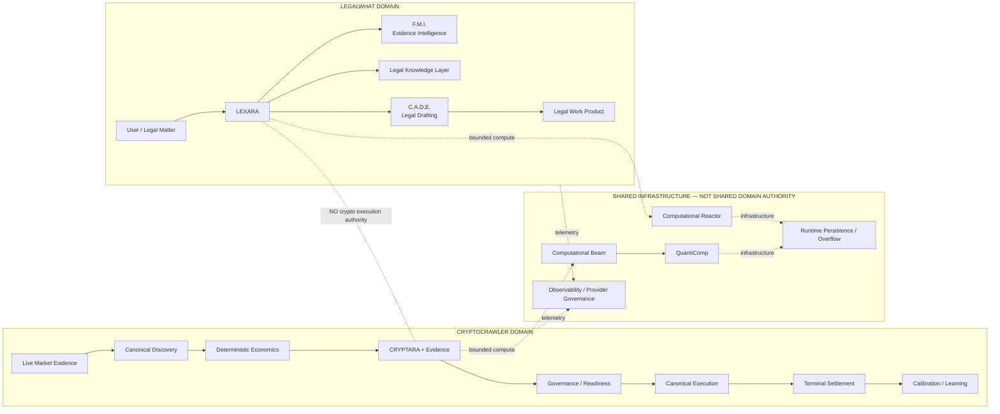
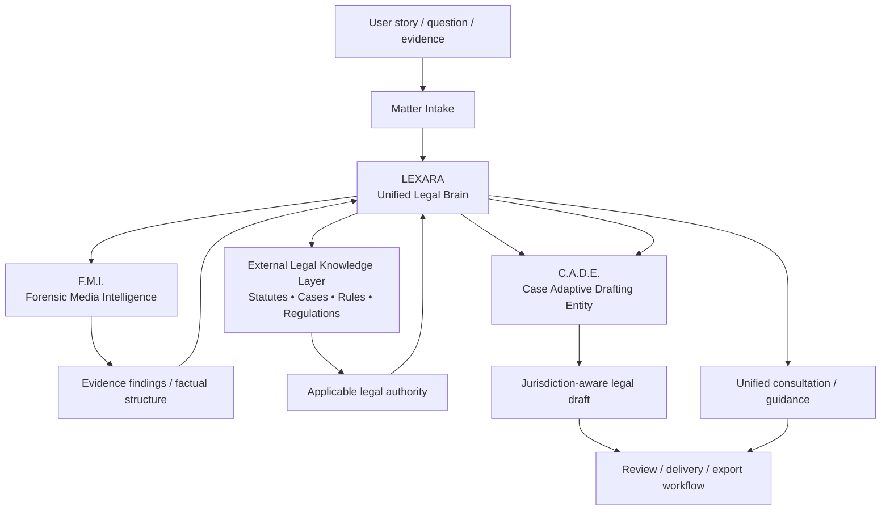
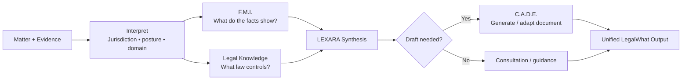
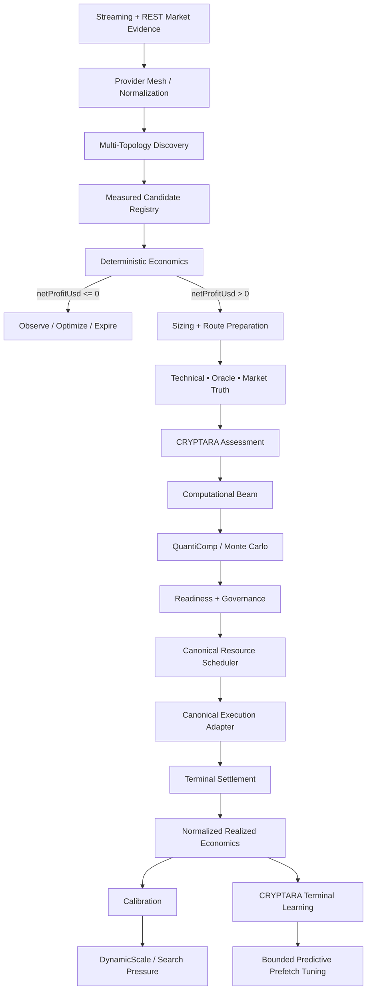
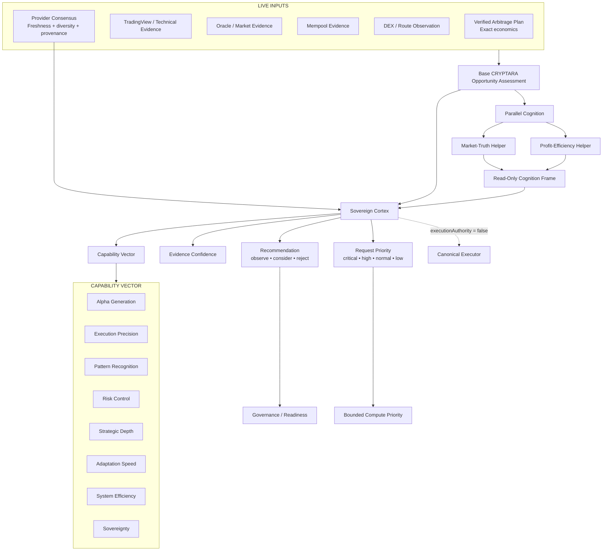
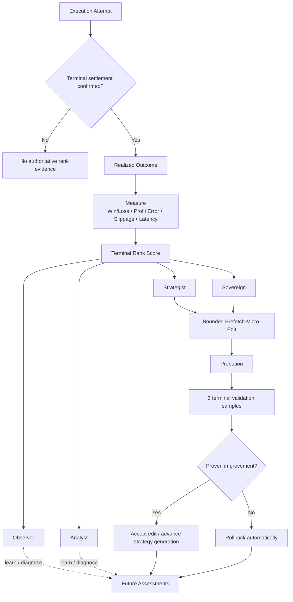
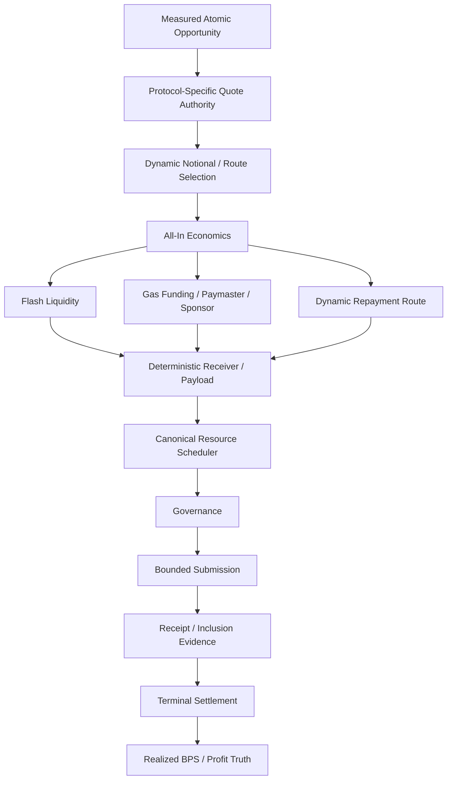
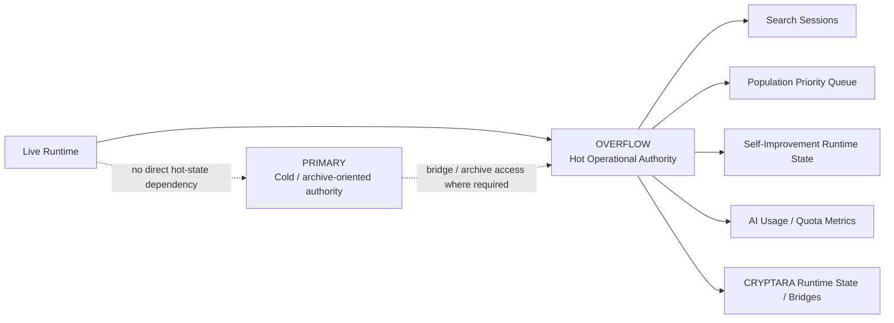

# Bad-Blue

### LegalWhat + CryptoCrawler

**Two distinct product systems. One governed intelligence codebase.**

Legal intelligence • Evidence analysis • Legal drafting • Public-record research  
Market intelligence • Multi-topology arbitrage • Adaptive cognition • Verified execution

---

## Repository at a Glance

Bad-Blue contains **two primary product systems that are intentionally separated by domain authority**:

| System | Purpose | Primary intelligence | Critical boundary |
|---|---|---|---|
| **LegalWhat** | Legal assistance, evidence analysis, legal research, drafting, public-record/accountability workflows | **LEXARA / ALEXARA**, F.M.I., C.A.D.E. | Legal intelligence does **not** receive crypto/blockchain execution authority |
| **CryptoCrawler** | Market observation, arbitrage discovery, deterministic economics, probabilistic assessment, governance, execution, settlement, learning | **CRYPTARA**, CryptoCrawler canonical runtime, QuantiComp/Monte Carlo | Market intelligence does **not** receive legal-data authority |

They may reuse shared infrastructure—compute routing, persistence, provider governance, observability, and orchestration—but they are **not one blended application**.

> **Engineering status**
>
> This is an actively integrated and hardened codebase. Some components are production-oriented, some require external credentials or deployed infrastructure, and some remain experimental or compatibility-oriented. Architectural descriptions below describe implemented responsibilities and authority boundaries; they are not a claim that every optional integration is currently live or production-certified.

---

## Navigation

- [Architecture: Two Systems, Shared Infrastructure](#architecture-two-systems-shared-infrastructure)
- [LegalWhat](#legalwhat)
- [LEXARA Legal Brain](#lexara-legal-brain)
- [CryptoCrawler](#cryptocrawler)
- [CRYPTARA](#cryptara)
- [CRYPTARA Sovereign Cortex](#cryptara-sovereign-cortex)
- [How CRYPTARA Learns](#how-cryptara-learns)
- [Zero-Initial-Capital Architecture](#zero-initial-capital-architecture)
- [Hot-State / Overflow Architecture](#hot-state--overflow-architecture)
- [Recent Hardening and Optimization](#recent-hardening-and-optimization)
- [Shared Computational Systems](#shared-computational-systems)
- [Extended Intelligence Systems](#extended-intelligence-systems)
- [Engineering Principles](#engineering-principles)
- [Repository Guide](#repository-guide)
- [Glossary](#glossary)

---

# Architecture: Two Systems, Shared Infrastructure

The architecture follows a simple rule:

> **Infrastructure may be shared. Domain authority is not.**

LegalWhat can use common compute and persistence without becoming a trading system. CryptoCrawler can use common compute and persistence without gaining access to legal matters, legal research, or legal-document authority.

---

# LegalWhat

**LegalWhat** is the legal-assistance and workflow side of Bad-Blue. It combines conversational legal intelligence, evidence analysis, legal research, document drafting, domain routing, public-record/accountability workflows, and commercial application infrastructure.

Its core design is **one user-facing legal intelligence layer coordinating specialized internal legal subsystems** rather than exposing every subsystem as a separate, disconnected tool.

## LegalWhat System Flow

## Core LegalWhat Components

### LEXARA

**Legal Expert eXamination And Resource Advisor** — the unified legal brain and primary legal persona.

LEXARA interprets the matter, coordinates evidence analysis, retrieves applicable legal knowledge, determines when drafting is needed, and returns the user-facing legal response.

### F.M.I.

**Forensic Media Intelligence** — LEXARA's internal evidence-analysis engine.

F.M.I. is responsible for converting uploaded or supplied evidence into structured findings that can be used by the legal reasoning and drafting layers.

### C.A.D.E.

**Case Adaptive Drafting Entity** — LEXARA's internal legal-document drafting engine.

C.A.D.E. is designed to produce context-aware, jurisdiction-aware legal work product from the factual and legal record assembled by LEXARA.

### Legal Knowledge Layer

The legal knowledge layer is the retrieval/research side of the legal brain: statutes, regulations, precedent, procedural authority, and other legal reference material.

### Domain Routing

LegalWhat supports many areas of law through domain-specific routing rather than treating “law” as one undifferentiated prompt. The architectural objective is to vary research, questioning, evidence requirements, drafting behavior, and workflow according to the legal domain and jurisdiction.

## LegalWhat Authority Boundary

The legal brain is explicitly isolated from the crypto domain:

- no crypto exchange authority;
- no blockchain transaction authority;
- no CryptoCrawler execution authority;
- no market-execution decision authority.

That separation is intentional. Legal work and financial-market execution use different evidence standards, permissions, risks, and terminal truth.

## Legal / Accountability / Research Surfaces

The repository also contains or supports adjacent legal/research surfaces including:

- law-enforcement-accountability workflows;
- public-record request support;
- complaint and petition drafting;
- authority/contact routing;
- People Finder / public-record research;
- inmate/corrections search;
- geospatial evidence and reconstruction tooling;
- document and evidence ingestion;
- Square-based commercial/payment infrastructure;
- email and workflow-delivery infrastructure.

These surfaces may support LegalWhat, but they do not collapse the LegalWhat and CryptoCrawler domains into one authority model.

---

# LEXARA Legal Brain

### Why LEXARA is structured this way

A legal assistant becomes harder to validate when evidence extraction, legal research, factual inference, drafting, and user conversation are all performed by one opaque step. LEXARA separates these responsibilities so the system can preserve provenance and distinguish:

- **what the user supplied**;
- **what evidence analysis found**;
- **what legal authority says**;
- **what the system inferred**;
- **what C.A.D.E. drafted**.

---

# CryptoCrawler

**CryptoCrawler** is the cryptocurrency market-intelligence and execution side of Bad-Blue.

It is not merely a price-difference scanner. It is a multi-topology architecture for:

- market evidence ingestion;
- opportunity discovery;
- candidate normalization;
- exact deterministic economics;
- fee and liquidity evidence;
- dynamic sizing;
- probabilistic/tail-risk analysis;
- technical and oracle evidence;
- CRYPTARA cognition;
- staged governance;
- execution readiness;
- bounded resource scheduling;
- venue/protocol execution;
- terminal settlement;
- realized-profit accounting;
- calibration and bounded adaptation.

## Canonical CryptoCrawler Flow

## Supported Opportunity Topologies

The measured-candidate architecture distinguishes materially different opportunity types instead of pretending they share identical execution mechanics:

- `CEX_CEX`
- `DEX_ATOMIC`
- `ZERO_CAPITAL_ATOMIC`
- `CROSS_CHAIN`
- `MEMPOOL_BACKRUN`
- `MAKER_CEX`
- `FUNDING_ARBITRAGE`
- prediction-market opportunities where the corresponding discovery/execution authority is wired

## Deterministic Economics First

The canonical economic rule is intentionally simple:

> **`netProfitUsd > 0` after all known verified costs.**

Known costs can include:

- exchange fees;
- DEX fees;
- flash-loan premium;
- gas;
- sponsored-gas reimbursement/provider billing;
- relay/builder cost;
- slippage;
- market impact;
- bridge cost;
- funding/borrow cost;
- route-specific repayment cost.

Monte Carlo, technical analysis, ranking, or CRYPTARA cannot make a deterministically negative route positive by assertion.

## BPS Integrity

CryptoCrawler uses basis points for high-resolution economics:

- **1 BPS = 0.01%**
- **100 BPS = 1%**

The current architecture preserves exact strictly positive economics even when profit is **below one whole basis point**. Integer truncation is not allowed to convert a genuinely positive route into zero or vice versa.

Important telemetry includes:

- gross profit BPS;
- all-in cost BPS;
- flash-loan fee BPS;
- gas cost BPS;
- relay cost BPS;
- expected slippage BPS;
- break-even BPS;
- BPS to break even;
- expected net-profit BPS;
- realized net-profit BPS.

---

# CRYPTARA

**CRYPTARA** is CryptoCrawler's adaptive market-intelligence and decision-support brain.

She is not the exchange, the wallet, the scheduler, the canonical executor, or the settlement authority. Her job is to **turn market evidence and realized outcomes into better assessments, priorities, and bounded predictive preparation without silently acquiring transaction authority.**

## Why CRYPTARA Exists

Raw price differences do not answer the questions an execution system actually needs answered:

- Is the evidence fresh and diverse enough to trust?
- Is a candidate economically real or merely a data artifact?
- Does current market structure resemble conditions that previously executed well or poorly?
- How much confidence should be placed in the route?
- Is latency or slippage degrading the expected edge?
- Which information should be prefetched before the next similar candidate arrives?
- Did the prediction match the terminal financial result?

CRYPTARA exists to connect those questions **without replacing deterministic economics, governance, resource scheduling, or settlement truth**.

---

# CRYPTARA Sovereign Cortex

The current CRYPTARA architecture includes a **Sovereign Cortex** that evaluates each opportunity in the context of current evidence quality and a history of terminal confirmed outcomes.

## CRYPTARA Brain — Functional Schematic

### Cortex evidence discipline

The cortex can **downgrade** an otherwise favorable recommendation when evidence quality is weak. Examples in the current wiring include:

- stale or missing provider consensus can reduce `consider` to `observe`;
- single-source evidence can require stronger Monte Carlo confidence;
- evidence confidence adjusts execution-confidence/ranking telemetry;
- provider provenance is retained rather than discarded.

The cortex does not fabricate missing truth.

## CRYPTARA Decision Priority

The current decision-priority order is deliberately economic and evidence-first:

1. **Market truth**
2. **Profitability / BPS**
3. **Latency / slippage**
4. **Notional**
5. **Exploration**

That ordering prevents exploratory intelligence from outranking the facts required to prove an executable opportunity.

## Parallel Cognition

CRYPTARA can prewarm parallel helper lanes for:

- **market truth**; and
- **profit efficiency**.

These lanes are deliberately bounded:

- read-only;
- no execution authority;
- no write authority over canonical trade state;
- zero-retry on the latency-sensitive cognition path;
- stale frames cannot substitute for the current observation;
- a negative deterministic plan is not rescued by helper cognition.

---

# How CRYPTARA Learns

CRYPTARA's rank and adaptive behavior are driven by **terminal confirmed external settlement**, not by simulation success, shadow trades, or self-reported confidence.

## Learning and Rank Schematic

## What Can Raise CRYPTARA's Rank?

Authoritative rank evidence requires terminal settlement with measured realized economics. Rank quality considers dimensions including:

- realized win rate;
- expected-vs-realized profit error;
- realized slippage control;
- execution latency control;
- sample depth.

**Simulations cannot raise rank. Shadow trades cannot raise rank. Strategy projections cannot raise rank.**

The current rank ladder is:

`observer → analyst → strategist → sovereign`

Promotion requires both quality and sufficient terminal samples. The minimum promotion sample count is configurable; the current default cortex configuration uses a promotion baseline of 20 terminal samples.

## What Can CRYPTARA Adapt?

The current persistent adaptive surface is intentionally narrow:

- editable parameter: **predictive prefetch aggression**;
- minimum shared-edit rank: **Strategist**;
- each edit enters **probation**;
- terminal outcomes must prove improvement;
- failed edits are **rolled back**;
- no source-code write authority;
- no execution-strategy mutation authority;
- no direct execution authority.

This gives CRYPTARA a real learn/adapt loop without allowing “adaptive” to become an unrestricted permission to rewrite trading economics or governance.

---

# Zero-Initial-Capital Architecture

`ZERO_CAPITAL_ATOMIC` describes an execution topology where trade notional and/or transaction resources are obtained within the execution path instead of requiring the operator to pre-position the full trading notional.

It does **not** mean execution has no economic cost.

Current architecture includes concepts such as:

- flash-loan liquidity;
- deterministic receiver contracts;
- sponsored/paymaster execution where verified;
- dynamic gas-funding policy;
- protocol-specific route quoting;
- atomic repayment;
- dynamic repayment-path selection;
- bounded multi-block builder validity;
- receipt and balance verification;
- realized cost attribution.

A sponsored transaction can satisfy **zero-upfront-capital** requirements while still carrying a real provider/billing liability. Provider-fronted gas is therefore not treated as free money: realized economics must still charge the corresponding gas liability/cost.

---

# Hot-State / Overflow Architecture

Recent hardening moved hot runtime state away from cold/legacy database authority and into the dedicated **Overflow runtime database**.

The purpose of this split is operational:

- hot services query the hot authority;
- cold/archive storage is not placed under normal runtime query pressure;
- missing Overflow prerequisites fail visibly rather than silently falling back to Primary;
- runtime schemas are versioned and verified;
- internal public-schema tables can retain RLS without granting unintended public policies.

---

# Recent Hardening and Optimization

The current `develop` branch includes a substantial September 8, 2026 hardening sequence. Highlights include:

| Area | Current hardening / optimization |
|---|---|
| **Live market evidence** | Concurrent provider mesh with shared normalization across CoinGecko, CoinMarketCap, CoinCap, and Coinbase paths; route/request-local cooldown behavior; incomplete live-price results are not promoted into long-lived complete-cache truth |
| **Provider resilience** | Healthy providers remain usable when another provider is rate-limited or degraded; failures are isolated instead of globally poisoning unrelated routes |
| **Exact economics** | Strictly positive sub-one-BPS opportunities remain representable without integer truncation |
| **Candidate integrity** | Preparation is prevented from mutating canonical opportunity economics; rejected preparation does not contaminate later attempts; valid evidence is preserved across preparation cycles |
| **Zero-capital discovery** | Ethereum zero-capital discovery restored without making Ethereum the mandatory cold-start dependency |
| **Protocol coverage** | Route-local PancakeSwap V2 / BSC and Trader Joe V1 / Avalanche execution paths added; protocol quote authority aligned with the routers used by payload construction |
| **Repayment routing** | Repayment selection expanded from a single direct-WETH assumption to a router × path mesh including supported stablecoin intermediates |
| **Builder submission** | Validity expanded from next-block-only behavior to a bounded multi-block window with clearer inclusion/ambiguity handling |
| **Gas sponsorship** | Hosted paymaster sponsorship can satisfy zero-upfront-capital funding while provider-fronted gas remains explicit in realized economics |
| **Execution truth** | Confirmed execution, settlement, reconciliation, payout, and exception states are kept distinct instead of allowing telemetry/reconciliation failure to erase on-chain execution truth |
| **Kalshi evidence** | Event-fee authority, cache/single-flight behavior, request-local backoff, and exact strictly-positive event admission strengthened |
| **Overflow runtime** | SearchSessionManager, PopulationPriorityQueue, SelfImprovementEngine, and AI quota metrics moved to Overflow runtime authority with schema prerequisites and verifier coverage |
| **Runtime isolation** | Canonical runtime components can degrade and retry independently without granting the failed component global-shutdown authority over unrelated components |
| **Cost governance** | Paid filtered-Alchemy pending-stream behavior is explicit opt-in rather than starting merely because an API key exists |

The important pattern is **capability monotonicity**: repairs are expected to preserve previously proven behavior unless an older behavior is intentionally replaced by a stronger canonical authority.

---

# Canonical Runtime and Authority Model

CryptoCrawler deliberately separates responsibilities that are easy to accidentally merge in an automated market system.

## Discovery Authority

Finds and normalizes measured opportunities. Discovery may be broad and aggressive, but it does not authorize execution.

## Candidate Registry

Provides a common lifecycle for measured opportunities and tracks enrichment, missing information, blocking reasons, expiry, and topology.

## Deterministic Economics Authority

Calculates known costs and establishes whether the candidate is strictly positive after verified costs.

## CRYPTARA / Intelligence Authority

Assesses market context, evidence confidence, pattern quality, and learned execution performance. It can prioritize or downgrade; it does not own canonical transaction submission.

## Governance Authority

Controls whether the system is allowed to progress from analysis toward execution.

## Resource / Nonce / Rate Authority

Ensures scarce runtime resources are reserved rather than independently guessed by competing executors.

## Canonical Executor

Owns the actual venue/protocol transaction or order submission path.

## Terminal Settlement Authority

Determines what actually happened financially from receipts, fills, balances, fees, gas, repayment, and other terminal evidence.

## Learning Authority

Consumes normalized terminal truth. Submission, simulation, and partial execution are not allowed to masquerade as realized learning evidence.

---

# Market Evidence and Provider Mesh

CryptoCrawler treats data-provider availability as a routing problem rather than a single-provider dependency.

Key design properties include:

- streaming-first ingestion where available;
- REST fallback/augmentation;
- shared symbol/value normalization;
- request-local and route-local cooldowns;
- in-flight deduplication/single-flight behavior;
- partial-result cache safety;
- source provenance;
- freshness tracking;
- provider consensus;
- provider health/circuit-breaker behavior;
- fail-closed execution when required truth remains unknown.

A provider outage should reduce evidence quality for the affected route—not quietly convert missing information into a favorable assumption.

---

# Multi-Topology Discovery

The **MultiTopologyDiscoveryController** coordinates opportunity families with different execution requirements. The shared registry makes them comparable at the lifecycle level without pretending they are mechanically identical.

Examples:

- CEX ↔ CEX spread;
- atomic DEX route;
- flash-liquidity / zero-upfront-capital route;
- cross-chain route;
- maker opportunity;
- derivatives funding/carry opportunity;
- mempool backrun evidence;
- prediction-market opportunities.

---

# Monte Carlo and QuantiComp

Monte Carlo is a **robustness and uncertainty layer**, not an alternative accounting system.

The sequence is:

> **Known costs → deterministic positive economics → probabilistic analysis → governance/readiness → execution**

Monte Carlo/QuantiComp can evaluate concepts such as:

- probability of profitable execution;
- confidence intervals;
- partial-fill risk;
- tail outcomes;
- Value at Risk;
- Expected Shortfall;
- execution horizon;
- empirical calibration residuals;
- adaptive simulation depth.

Simulation does not become realized truth merely because it is statistically persuasive.

---

# Terminal Settlement and Realized Truth

Terminal settlement is where predictions are replaced by measured facts.

Authoritative evidence may include:

- transaction receipt;
- order/fill status;
- pre/post balances;
- flash-loan repayment;
- gas actually consumed or economically owed;
- exchange/protocol fees;
- realized output;
- realized slippage;
- realized net profit;
- terminal revert/failure state.

> **Submitted is not settled. Predicted is not realized. Simulated is not settled.**

Only normalized terminal outcomes are eligible to become authoritative calibration/learning evidence.

---

# Shared Computational Systems

The two product domains reuse infrastructure where reuse is safe and semantically correct.

## Computational Reactor

Centralized workload queue, concurrency controller, and compute-resource scheduler for expensive or asynchronous jobs.

## Computational Beam

Shared workload-routing/compatibility facade. Beam routes work; it is not intended to become a second competing heavy-compute authority.

## QuantiComp

Authoritative heavy quantitative-computation engine for workloads such as Monte Carlo, tail-distribution analysis, scenario expansion, and other statistically intensive operations.

> **Beam routes; QuantiComp computes.**

## Neural Spine / Persistent Learning Infrastructure

Shared memory abstractions preserve useful experience and relationships while maintaining domain boundaries and requiring verified outcomes before they become authoritative learning truth.

## Provider Governance

Rate limits, health, cooldowns, request pressure, capability readiness, and optional integrations are treated as governed runtime resources.

---

# Extended Intelligence Systems

Bad-Blue contains a broader research and orchestration ecosystem beyond the two primary product surfaces.

<strong>Show extended architecture vocabulary</strong>

| Name | Plain-English engineering role |
|---|---|
| **4JI** | Top-level multi-domain orchestration/policy layer |
| **PANTHEON** | Specialized crawler/extraction orchestration platform |
| **Razors** | Narrow-purpose PANTHEON extraction modules |
| **People Finder** | Public-record research, entity resolution, relationship mapping, report assembly |
| **GeoConsole** | Geospatial evidence fusion, reconstruction, visualization, and probabilistic path analysis |
| **TSHPE** | Multi-source positioning, smoothing, and confidence-estimation engine |
| **Cain** | Crawler/swarm population and lifecycle management |
| **Reaper** | Retirement, quarantine, cleanup, and unhealthy-agent control |
| **Eden** | Persistent swarm/strategy memory |
| **GENESIS** | Controlled strategy-evolution laboratory |
| **Tree of Knowledge** | Outcome/strategy knowledge repository |
| **Six Cane** | Multi-perspective market-intelligence ensemble |
| **Babel** | Experimental identity/trust/meaning transformation architecture |
| **Light Language** | Experimental machine vocabulary/translation abstraction |
| **Googolplex Neural Lattice** | Experimental sparse/procedural representation architecture |
| **3D Geiger** | Provider pressure/health/rate-limit scoring |
| **Evolution Lock / Geiger** | Controlled adaptation permission and adaptation-risk gating |
| **Disco-Ball Environmental Mirror** | Experimental high-dimensional environment/state representation |
| **Faucet / Faucet Mesh** | Governed strategy-flow and experimental multi-node market-operation abstractions |

These names are project vocabulary. Their value is in the engineering responsibility behind them, not in the metaphor itself.

---

# Engineering Principles

## 1. One Authority Per Critical Responsibility

Discovery, economics, nonce allocation, scheduling, execution, settlement, and learning should not each have multiple competing production authorities.

## 2. Deterministic Before Probabilistic

Known economics are calculated before stochastic analysis is allowed to influence a candidate.

## 3. Observation Is Not Execution

A crawler, oracle, indicator, mempool feed, ranking model, or CRYPTARA helper can provide evidence without receiving transaction authority.

## 4. Capability Is Not Permission

A configured wallet, key, RPC, venue account, or receiver proves capability—not current authorization.

## 5. Submission Is Not Settlement

A transaction hash, accepted bundle, or submitted order is an intermediate state.

## 6. Learning Requires Terminal Truth

Realized learning is downstream of terminal settlement and is recorded without allowing simulation or partial state to become canonical truth.

## 7. Fail Closed on Missing Critical Facts

Unknown fees, liquidity, gas economics, repayment conditions, permissions, balances, or settlement state remain unknown until proven.

## 8. Preserve Proven Capability

Repairs should remove the root cause without casually regressing previously verified capability elsewhere in the system.

## 9. Route-Local Failure Isolation

A degraded provider, chain, venue, or optional component should not unnecessarily halt unrelated healthy routes.

## 10. Domain Isolation

Legal intelligence and market-execution intelligence may cooperate through safe infrastructure but do not inherit each other's authority.

---

# Repository Guide

Major repository areas include:

- **`client/`** — React/TypeScript application surfaces.
- **`server/`** — API, orchestration, providers, persistence, workers, and backend services.
- **`server/services/alexara/`** — LEXARA legal brain, F.M.I., C.A.D.E., and legal research integration.
- **`server/services/cryptara/`** — CRYPTARA market-surveillance/assessment intelligence.
- **`server/services/cryptocrawl/`** — CryptoCrawler discovery, economics, validation, governance, execution, settlement, capital-free, runtime, scaling, and integration systems.
- **`server/services/computationalBeam/`** — shared compute-routing facade.
- **`server/migrations/overflow/`** — Overflow hot-state schema evolution.
- **`scripts/cryptocrawl/`** — structural and runtime invariant verifiers for CryptoCrawler hardening.
- **database / migration modules** — persistence schema and state evolution.
- **tests / verifier assets** — regression, integration, authority, economic, and runtime validation.

Because the repository contains multiple generations of some concepts, canonical runtime wiring and structural verifiers are important for preventing older compatibility paths from regaining unintended authority.

---

# Deployment and Verification Philosophy

A successful build is necessary but not sufficient.

Production verification should establish, as applicable:

- compile/type correctness;
- schema/migration readiness;
- provider health;
- database authority/routing;
- discovery heartbeat;
- evidence freshness;
- candidate lifecycle health;
- deterministic economics;
- governance state;
- resource/nonce/rate readiness;
- execution capability;
- receipt/fill observation;
- terminal settlement;
- realized accounting;
- payout/reconciliation state;
- calibration/learning integrity;
- regression/invariant verifier results.

The canonical runtime is designed so a degraded optional component can retry independently rather than obtaining global shutdown authority over unrelated components.

---

# Production / Handoff Perspective

Bad-Blue is best understood as a **large active codebase with two distinct product systems and a substantial shared intelligence/runtime architecture**.

For engineering handoff or technical diligence, the important value is not merely the number of modules. It is the implemented separation and composition of:

- legal reasoning and legal workflow;
- evidence analysis and drafting;
- public-record research;
- multi-provider market data;
- multi-topology opportunity formation;
- exact economic validation;
- adaptive market cognition;
- bounded probabilistic analysis;
- staged governance;
- resource-controlled execution;
- terminal settlement;
- realized-evidence learning;
- hot/cold state separation;
- regression-protected canonical authority.

The continued engineering priority is **proof, canonicalization, observability, and end-to-end realization**—not simply adding more named subsystems.

---

# Glossary

| Term | Meaning |
|---|---|
| **LegalWhat** | Legal-assistance and workflow product system |
| **LEXARA** | Unified legal brain / primary legal persona |
| **ALEXARA** | Legal/strategic service architecture associated with the LEXARA domain |
| **F.M.I.** | Forensic Media Intelligence evidence-analysis subsystem |
| **C.A.D.E.** | Case Adaptive Drafting Entity |
| **CryptoCrawler** | Multi-topology market discovery, validation, governance, execution, settlement, and learning system |
| **CRYPTARA** | Adaptive crypto-market assessment and execution-feedback intelligence |
| **Sovereign Cortex** | CRYPTARA evidence-quality, capability-vector, rank, and bounded-adaptation layer |
| **Capability Vector** | Eight-axis CRYPTARA assessment of alpha, precision, pattern recognition, risk, depth, adaptation, efficiency, and sovereignty |
| **Measured Candidate Registry** | Shared opportunity lifecycle and missing-information authority |
| **Deterministic Economics** | Exact known-cost profitability authority |
| **BPS** | Basis points; 100 BPS = 1% |
| **ZERO_CAPITAL_ATOMIC** | Atomic route using internally acquired liquidity/resources rather than pre-funded trade notional |
| **Paymaster / Sponsorship** | Mechanism that can remove upfront gas funding while preserving real gas liability in economics |
| **Canonical Scheduler** | Resource-leasing authority for execution-ready candidates |
| **Nonce Authority** | Exclusive nonce-allocation responsibility for a wallet/chain lane |
| **Rate Authority** | Bounded provider/exchange request-capacity authority |
| **Terminal Settlement** | Verified final execution outcome and realized financial truth |
| **Normalized Realized Execution** | Common schema for terminal outcomes across execution topologies |
| **Calibration** | Prediction-vs-realized comparison used to improve uncertainty estimates |
| **Predictive Prefetch** | Bounded advance acquisition/preparation of likely-needed market evidence |
| **Overflow** | Hot operational runtime-state authority |
| **Primary** | Cold/archive-oriented database authority where retained by architecture |
| **Computational Reactor** | Shared job queue/concurrency/resource scheduler |
| **Computational Beam** | Workload-routing and compatibility facade |
| **QuantiComp** | Heavy quantitative-computation authority |
| **Monte Carlo** | Probabilistic robustness/tail-risk analysis downstream of deterministic economics |
| **DynamicScale** | Adaptive discovery/search-pressure and bounded resource controller |
| **Fail Closed** | Required unknown facts block execution instead of being guessed favorable |

---

# The Architectural Idea

Bad-Blue's defining characteristic is not simply that it combines legal AI and crypto automation in one repository. It is that the repository attempts to keep **different forms of intelligence explainable, bounded, and governed** while still allowing them to reuse serious infrastructure.

**LegalWhat asks:**

> What happened, what law applies, what evidence matters, and what legal work product should be created?

**CryptoCrawler asks:**

> What market condition exists, is the opportunity economically real, is execution permitted and resourced, what actually settled, and what did that realized outcome teach the system?

**CRYPTARA asks:**

> Given the evidence and what terminal outcomes have proven so far, how should CryptoCrawler interpret and prepare for the next opportunity—without confusing intelligence with execution authority?

That separation is intentional.
